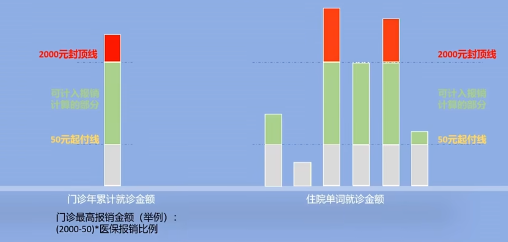

# 医疗保险

## 医疗保险的种类

### 社会医疗保险

这是政府为保障公民基本医疗权益而设立的医疗保险体系，通常具有普惠性和强制性。主要包括：

-   **城镇职工基本医疗保险** ：主要面向城镇就业人员和退休人员，费用由用人单位和职工共同缴纳。
-   **城乡居民基本医疗保险**：原城镇居民医保和新型农村合作医疗（新农合）合并而来。面向无业居民、学生、儿童等，保障相对基础。

### 补充医疗保险

用于补充基本医保不能完全覆盖的部分，包括：

-   **企业补充医疗保险**：部分企业为员工购买，保障额度比基本医保高。一些企业的六险一金的第六险就是企业补充医疗保险。
-   **政府补充保险**：如公务员补充医疗保险。

### 商业医疗保险

由保险公司承保，保障灵活、额度较高，适合希望获得更全面医疗保障的人群，包括：

-   **住院医疗保险**：针对住院期间的费用补偿。
-   **重大疾病保险**：确诊重大疾病后提供保险金。
-   **门诊医疗保险**：覆盖普通门诊治疗费用。
-   **高端医疗保险**：提供私立医院、VIP 病房、国际医疗等服务。

## 城乡居民基本医疗保险（城乡居民医保）

城乡居民基本医疗保险是由国家建立，覆盖 未就业城乡居民（包括农民、学生、儿童、老年人等） 的一种基本医疗保障制度。它是 **原新型农村合作医疗** 和 **城镇居民基本医疗** 保险 合并而来的。

### 参保对象

未就业城乡居民（包括农民、学生、儿童、老年人等）。

### 缴费方式

-   **政府补贴为主，个人缴费为辅**
    -   政府为参保人提供财政补贴（中央和地方财政共同承担）。
    -   个人按规定缴纳一定费用，一年一缴，次年生效，金额相对职工医保较低。

### 保障范围

-   **住院费用** ：报销比例较高（一般在 50%~70%，具体按各地政策）。
-   **门诊费用** ：部分地区将普通门诊纳入报销范围。
-   **重大疾病** ：设有大病保险，进一步提高报销比例。

### 报销比例与起付线

-   每个地区根据经济水平和医疗政策设定不同。
-   起付线（免赔额）通常较低，封顶线（最高支付限额）比职工医保低。

### 特点

1. 覆盖人群广（面向未就业城乡居民）

2. 保费低（政府补贴较多）

3. 保障范围基础（主要保障基本医疗需求）

4. 自愿参保，按户为单位登记缴费

5. 每年需缴费一次，缴费后次年生效

### 注意事项

1. 未成年人和学生的保险有政府补贴，所以金额相对较低。
2. 大学生可以选择是缴纳生源地的城乡居民医保，还是求学地的城乡居民医保。虽然学生医保有补贴，但是不同地区的医疗水平和报销比例不同的，要仔细对比选择。
3. 城乡居民医保每年需缴费一次，缴费后次年生效，但是交一年管一年，退休后没有终身待遇。

## 职工基本医疗保险（职工医保）

职工基本医疗保险（简称“职工医保”）是面向 **城镇就业人员** （包括企业职工、机关事业单位人员及其退休人员）的医疗保障制度。它是 **社会医疗保险体系** 的重要组成部分，保障水平较高，覆盖范围较广。

### 参保对象

**城镇就业人员** （包括企业职工、机关事业单位人员及其退休人员）

### 缴费方式

-   **单位和个人共同缴纳** ：
    -   单位按职工工资总额的一定比例缴费（如 6%-10%）， 进入统筹账户。
    -   个人按本人工资的一定比例缴费（如 2%） 进入个人账户。
-   缴费后，形成 **统筹基金** 和 **个人账户** ：
    -   统筹基金主要用于住院和大病报销。
    -   个人账户用于普通门诊费用支付（目前部分地区已将个人账户改为门诊统筹）。

### 保障范围

-   **住院费用** ：报销比例较高，起付线和封顶线因地而异。
-   **门诊费用** ：可以用个人账户支付部分费用，部分地区门诊费用也有统筹报销。
-   **大病保险** ：大额医疗费用可通过大病保险进一步报销。
-   **特殊病种和慢性病** ：部分地区对特殊慢性病提供门诊报销。

### 报销比例与起付线

-   **起付线** ：超过起付线后开始报销。
-   **报销比例** ：一般在 70%~90%之间，封顶线较高（几十万元以上）。

### 保障特点

-   **保障力度强** ：报销比例通常在 70%-90%，封顶线高达几十万元以上。起付线和封顶线都比城乡居民医保高。
-   **缴费负担合理** ：单位和个人共同承担，个人压力较小。
-   **覆盖范围广** ：涵盖门诊、住院、慢病及重大疾病。
-   **退休后免缴** ：参保人缴满规定年限（一般男 25 年，女 20 年）后，退休后不再缴费，继续享受医保待遇。

### 如果缴费未满年限怎么办？

-   部分地区允许 一次性补缴，补足年限后即可享受终身医保待遇。
-   如果不补缴，退休后需 **继续缴费** ，直到缴满年限。

### 灵活就业医疗保险

灵活就业人员医疗保险本质上也是“职工医疗保险”，只是缴费方式更为灵活，一般按社会平均工资基数计算缴费。**有挡位**。

### 离职医保缴纳

|          | 灵活就业 | 城乡居民医保 |
| -------- | -------- | ------------ |
| 费用     | 有挡位   | 几百块       |
| 报销比例 | 70%-90%  | 40-80%       |
| 终身待遇 | 20-25 年 | 交一年保一年 |

### 医保断缴

医保断缴了，重新缴纳后有等待期，这期间无法使用医保。

| 断缴时长     | 等待期 |
| ------------ | ------ |
| 断缴         | 3 个月 |
| 断缴一年     | 4 个月 |
| 断缴四年以上 | 6 个月 |

## 医保报销方式

起付线以上封顶线的范围一下按比例报销。

