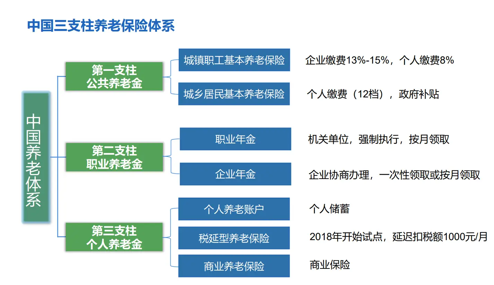

# 养老

## 中国养老体系

## 养老的来源

1. **基本养老保险:**这是由国家法律规定的，企业和职工共同缴纳，用于支付退休者的基本养老金。\*\*\*\*
2. **个人养老金:**个人自愿参加，通过开立个人养老金账户，购买符合规定的金融产品，实现养老保险补充。\*\*\*\*
3. **企业年金:**部分企业为员工设立的补充养老金制度，由企业和员工共同缴纳。\*\*\*\*
4. **家庭代际抚养:**也就是“养儿防老”，子女承担父母的养老费用。\*\*\*\*
5. **个人储蓄:**个人在工作期间通过储蓄积累养老金。\*\*\*\*
6. **政府财政补贴:**政府会根据政策，为特定的群体或地区提供养老金补贴。\*\*\*\*
7. **商业养老保险:**个人可以购买商业养老保险，作为养老保障的补充。\*\*\*\*

中国养老

养老金

个人养老金

养老金有可以抵制通胀的风险

## 职工社保

## 居民社保

要注意 职工和居民社保只能 拿其一，退回其中的一个。
