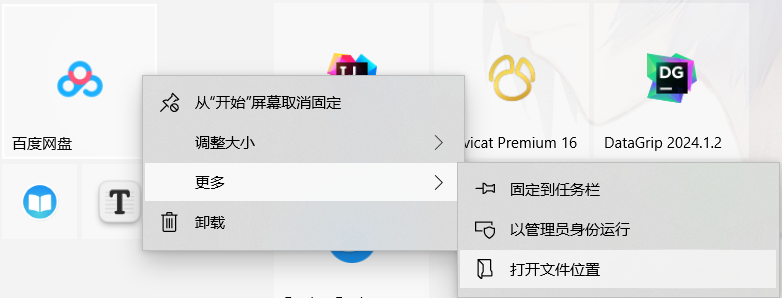

# 设置

## OOBE 开箱体验

### 地区选择

一定要选择 `美国` . 否则 Microsoft Store 就会出现 `应用宝` 这个狗皮膏药。

### 跳过联网

一点要跳过这一联网，因为直接登录微软作为系统账户，系统会自动截取账户邮箱的前 5 位作为用户数据的文件夹名。

### 创建系统账户

取一个喜欢的用户名并设置密码。

### 登录 Microsoft 账号。

登录账号同步一些数据，保证重要数据的安全。

## 磁盘管理

为保证 C 盘空间富足，把整个 500G 的硬盘做系统盘。最少也要 200G.

## 资源管理器

### 更改临时文件的保存位置

**用户临时文件**

系统临时文件

### 更改 OneDrive 的保存位置

登录 oneDrive 账号后，注意左下角的更改位置。

### 更改库文件夹的地址

避免系统故障重装导致的数据丢失。

### 对下载库进行应用级的隔离

### 关闭 显示最近使用过的文件

隐私文件被别人看到也挺尴尬。

### 显示隐藏文件 & 文件扩展名

掌控全局，自由修改。

## 时间和语言

### 编码格式

## 个性化

### 关闭开机音效

不是老人机，不需要开机音效

### [Win10] 磁贴

磁贴图标背景灰色问题。

windows 系统会自动检测应用 icon 图片的边缘的颜色。对于边缘时白色的图标 windows 吧背景改成灰色来让图片更显眼。

解决方法就是替换图标。

## 其他

### 解除 Windows 环回豁免（Loopback Exemption）

最方便的方法是 使用 Fiddler Classic 的 WinConfig 解除。

### 未知用户(S-1-5-21-XXXX-XXXX-XXXX-XXXX)

打开文件夹的 【属性】>【安全】

在组或用户名你会发现一个类似 `未知用户(S-1-5-21-XXXX-XXXX-XXXX-XXXX)` 的一项。

这个未知账户就是上一个系统里的账户。现在 Windows 任何帐户都会在 SID(Security identifiers) 中插入三串随机数字。比如说原本的内置管理员可能是 S-1-5-21-501，现在就是 S-1-5-21-xxxxx-xxxxx-xxxxx-501，任何激活的帐户都会自动生成相应数字串，除了系统管理的帐户比如 S-1-5-18（Local System 帐户）。这就确保了系统重装后，原系统的帐户无法被新系统读取，保证了 NTFS 下文件系统权限的安全。

## 厂商设置

### 联想(lenovo)

#### 关闭浏览器保护

【联想电脑管家】> 【工具箱】>【浏览器保护】> 点击关闭按钮

#### 关闭联想病毒防护

第一步、先更新 windows 系统（如果没有这一步可能会导致无法进入 windows 安全中心）

第二步、关闭联想电脑管家病毒防护

#### 卸载联想自带的应用

1. 联想应用商城
2. 联想电脑管家
3. LISFService.exe， Lsf.exe 等等。
