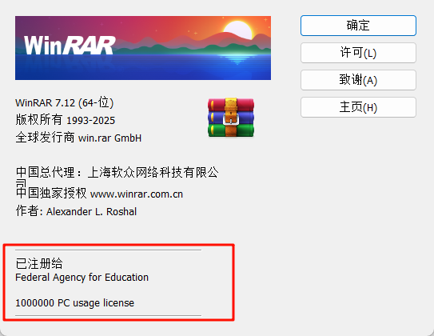

# 软件列表

## 前言

记录部分需软件的安装方式、注意事项及配置要点，便于日后查阅和节省时间。

## 软件分发和安装方式

### Installer (Setup Executable)

软件的安装程序 / 安装包。指需要运行安装过程的程序。通常是 .exe 或 .msi。

安装过程会把程序文件写到系统目录或用户目录。根据权限和范围分为机器级安装和用户级安装。


### Machine-wide Installer

机器级安装程序，通过它安装的软件对 **所有系统用户可用**。

-   程序文件写到：
    -   `C:\Program Files` 或 `C:\Program Files (x86)`
    -   注册表 `HKEY_LOCAL_MACHINE`
-   需要 **管理员权限** 才能安装，安装时会弹出的 UAC 窗口。
-   卸载也会影响所有用户。
-   数据保存在 `C:\ProgramData` 或 `C:\Users\{Username}\AppData`。

### Per-user Installer

用户级安装程序，通过它安装的软件 **只对当前 Windows 用户可用**。

-   程序文件写到：
    -   `C:\Users\{Username}\AppData\Local\Programs`
    -   注册表 `HKEY_CURRENT_USER`
-   不需要 **管理员权限**，安装时不会弹出 UAC 窗口。
-   数据保存在 `C:\Users\{Username}\AppData`。

### Portable Application

便携应用（又称免安装软件、绿色软件），无需安装，可直接放在 USB 驱动器或其他存储设备上运行，便于携带和迁移。

-   通常不修改注册表，或仅写入极少量配置
-   所有程序文件集中在一个目录下
-   可直接在移动存储设备上运行
-   配置和数据一般保存在程序目录，也有部分软件会写入 `C:\Users\{Username}\AppData`

由于便携应用不会在注册表或系统目录中写入完整信息，Windows 的【Win + S】搜索通常无法检索到它们。因此，建议手动为便携应用创建快捷方式，放置于：

-   **开始菜单**（`C:\ProgramData\Microsoft\Windows\Start Menu`）
-   **桌面**

这样可方便启动和管理。

## 安装位置

### `C:\Program Files`

这是 Windows 系统默认的安装目录。

-   Machine-wide Installer

### `C:\Program Files (x86) `

这是 Windows 系统默认的 32 位程序安装目录，同 `C:\Program Files`。

### `C:\Application`

-   Portable Application
-   Per-user Installer

通过把程序文件存放在公共目录下，可以将用户级程序转化为系统级程序。记得把快捷方式放到开始菜单。

> [!NOTE]
>
> 为什么要创建一个 `C:\Application` 文件夹，而不直接用管理员权限启动 `Installer`，再把安装位置自定义到 `C:\Program Files` ？
>
> 1. 因为有些安装程序，你无法自定义安装位置到 `C:\Program Files`。 TorBrowser 的安装程序不支持自定义到 `C:\Program Files`。
> 2. 方便与 Machine-wide Installer 的程序区分开来。统一创建快捷方式到开始菜单和桌面。
> 3. 部分程序的数据写入位置无法更改，在非管理员运行时没有权限写入导致无法启动。

### `C:\Development`

专用于开发环境（如 Python、Node 等）。

## 其他说明

### 程序组

就是在开始页添加一个文件夹，然后在里面加入多个点击选项。


### Windows 环回豁免（Loopback Exemption）

Windows 环回豁免（Loopback Exemption）是指在 Windows 系统中，对于某些应用程序（尤其是 UWP 应用）网络访问的限制。默认情况下，UWP 应用被禁止访问本地回环地址（即“localhost”或“127.0.0.1”），以增强安全性。如果开发者需要调试或测试与本地服务器通信的应用，就需要解除这种限制，允许应用访问本地回环地址。

当你开启代理时，打开 Microsoft store 会无法联网。可以使用 Fiddler Classic 解除限制。

## Emoji 含义

| Emoji | 说明                                         |
| ----- | -------------------------------------------- |
| 💲    | 收费                                         |
| 👤    | 用户级安装（User Setup）                     |
| 👜    | 便携应用（Portable Application）             |
| 👿    | 有恶意行为（如捆绑、篡改设置），安装时需警惕 |

## 📋️ Runtime libraries

### VC++

### DirectX

和 vc++一样用 [DirectX 修复工具](https://www.zysoftware.top/post/9.html) 安装运行库

### .Net Framework

有些软件需要的.net 版本没有可以去[微软官网](https://dotnet.microsoft.com/)下载。

### ffmpeg

视频

### CUDA Nvidia

还是租服务器用 Docker 吧，自己的电脑装 CUDA 还要给驱动降级。

## 📋️ Development

### PowerShell7

PowerShell 7 是专为云、本地和混合环境设计的，它包含增强功能和新功能。可以和 PowerShell5.1 并存。比 PowerShell5 好用。

**安装**

```powershell
winget install --id Microsoft.Powershell --source winget
```

**命令行历史保存位置**

```powershell
%USERPROFILE%\AppData\Roaming\Microsoft\Windows\PowerShell\PSReadLine\ConsoleHost_history.txt
```

### Windows Terminal

Windows Terminal 是一个现代化的终端应用程序，支持多标签页、主题和自定义配置。

win11 应该是自带的，win10 要自己安装。推荐用 Microsoft Stores 安装，这样方便更新。

### Git

版本管理工具

### Navicat Premium💲

老牌的数据库客户端，支持多种数据库。

### Microsoft Visual Studio

宇宙第一 IDE

### Microsoft Visual Studio Code

插件丰富的编辑器，支持多种编程语言和扩展。

**安装**

官网上默认下载的是 `Per-User Installer` 版本。我们需要找到 `Machine Installer` 的版本，打开 默认下载按钮下的[other platforms](https://code.visualstudio.com/Download),点击 System Installer。


### Cursor

根据 vscode 改造的 AI 编辑器。但是 vscode 有些插件不支持。

### JetBrains💲

JetBrains 系列的 IDE，如 IntelliJ IDEA、PyCharm、WebStorm 等。

### WSL2

Windows Subsystem for Linux，允许在 Windows 上运行 Linux 环境。

```powershell
# 安装
wsl --install

# 彻底移除wsl

Get-AppxPackage MicrosoftCorporationII.WindowsSubsystemForLinux | Remove-AppxPackage

# 修改默认用户
ubuntu config --default-user <用户名>
```

### Docker

Docker 是一个开源的应用容器引擎，允许开发者打包应用及其依赖到一个可移植的容器中，并在任何支持 Docker 的 Linux 系统上运行。

### PostgreSQL

打开电脑的服务管理器，找到 postgresql-x64-`<version>` 服务改成手动启动。

```powershell
# 假设 PostgreSQL 版本是 17，那么服务名就是 postgresql-x64-17

# 启动 PostgreSQL 服务
net start postgresql-x64-17
# 停止 PostgreSQL 服务
net stop postgresql-x64-17
```

### Fiddler Classic

抓包工具

**配置**

打开 WinConfig 解除 Windows 环回豁免（Loopback Exemption）。

## 📋️ Tool

### Clash-verge-rev

代理软件。

### Microsoft PowerToys

Microsoft PowerToys

**配置**

设置 纯文本粘贴快捷键为 【Win + Ctrl + V】

### WinRAR 💲

**安装**

WinRAR 通常有多个版本：中国特供免费版，开发版（rrlb）、正式版（wrr）。中国特供版免费版有弹窗广告，推荐安装正式版（wrr）。

百度贴吧 [WinRAR 吧]()


**安装配置**


**破解**

新建一个 `rarreg.txt` 文件，复制以下内容到文件中，然后更改文件名为 `rarreg.key`，放到 WinRAR 的安装目录下 (通常是 `C:\Program Files\WinRAR` )。

```
RAR registration data
Federal Agency for Education
1000000 PC usage license
UID=b621cca9a84bc5deffbf
6412612250ffbf533df6db2dfe8ccc3aae5362c06d54762105357d
5e3b1489e751c76bf6e0640001014be50a52303fed29664b074145
7e567d04159ad8defc3fb6edf32831fd1966f72c21c0c53c02fbbb
2f91cfca671d9c482b11b8ac3281cb21378e85606494da349941fa
e9ee328f12dc73e90b6356b921fbfb8522d6562a6a4b97e8ef6c9f
fb866be1e3826b5aa126a4d2bfe9336ad63003fc0e71c307fc2c60
64416495d4c55a0cc82d402110498da970812063934815d81470829275
```

> [!NOTE]
> 这个注册码有作用的地方是 UID 的部分。其它部分可以随意修改。

打开 WinRAR, 点击 【帮助】->【关于 WinRAR】。出现下图就说明破解成功。



### 7zip

### DAEMON Tools Ultra

虚拟光驱软件

### Microsoft ToDo

### Microsoft Whiteboard

### PixPin

截图软件

### jijiDown 👿

bilibili 视频下载工具。注意捆绑安装！注意捆绑安装！注意捆绑安装！

### qBittorrent

磁力下载工具

### LocalSend

跨平台文件传输

### PotPlayer

**安装配置**

1. 注意取消掉该程序视频文件的关联。

### PowerDvD

### Gridplayer

### OBS Studio

录制工具

### NeatReader

### Folo

原名 follow , RSS 订阅工具

### Tor Browser

### Adobe

Acrobat DC， Adobe Photoshop 等软件

目前就 (@vposy 搬运或破解的？)2023 版的破解最好用，后面更新的破解版要阻止其联网，极其麻烦。

## 📋️ Manager

### HiBit Uninstaler

### SpaceSniffer

### Dism++

### ContextMenuManager

### Dashboard

### TrafficMonitor

## 📋️Devices

### BIGBIG WON Assistants

手柄驱动

### KTC-Monitor Control Center

KTC 显示器 mcc

### 鼠标驱动

## 📋️Tool2

### ToDesk

### BKliveREC

直播源录制工具

## 📋️ Life

### 百度网盘

> [!NOTE] 吐槽
>
> 一个百度网盘要占一个多 G 的硬盘空间，还在你电脑上各种形式拉屎，盘符，右键，悬浮窗，智能看图。百度这个公司真是烂完了。

**安装**

注意捆绑文件打开方式

自动定义安装位置时，会出现 【系统权限限制】的字样, 把 `C` 大写的盘符改成小写的 `c` 就可以了。


**程序设置**

关闭盘符，浮球

关闭文件右键菜单的百度网盘的选择项。

**删除附带的 "智能看图" 程序**

注册表项

```
HKEY_CLASSES_ROOT\BaiduNetdiskImageViewerAssociations
HKEY_CURRENT_USER\Software\Baidu\BaiduNetdiskImageViewer
HKEY_CURRENT_USER\Software\RegisteredApplications\BaiduNetdiskImageViewer
```

程序文件位置

```
%APPDATA%\baidu\BaiduNetdisk\module\ImageViewer
```

快捷删除脚本

```bat
@echo off
echo ==========================================
echo ○○网盘“智能看图”功能卸载脚本
echo ==========================================
echo.
echo 此脚本将删除○○网盘捆绑的“智能看图”软件
echo 请确保以管理员身份运行此脚本
echo.
pause
echo 正在删除注册表项...
echo.
:: 删除注册表项1：HKEY_CLASSES_ROOT\BaiduNetdiskImageViewerAssociations
echo [1/3] 删除 HKEY_CLASSES_ROOT\BaiduNetdiskImageViewerAssociations
reg delete "HKEY_CLASSES_ROOT\BaiduNetdiskImageViewerAssociations" /f >nul 2>&1
if %errorlevel% equ 0 (
    echo     ? 删除成功
) else (
    echo     ? 删除失败或项目不存在
)
:: 删除注册表项2：HKEY_CURRENT_USER\Software\Baidu\BaiduNetdiskImageViewer
echo [2/3] 删除 HKEY_CURRENT_USER\Software\Baidu\BaiduNetdiskImageViewer
reg delete "HKEY_CURRENT_USER\Software\Baidu\BaiduNetdiskImageViewer" /f >nul 2>&1
if %errorlevel% equ 0 (
    echo     ? 删除成功
) else (
    echo     ? 删除失败或项目不存在
)
:: 删除注册表项3：HKEY_CURRENT_USER\Software\RegisteredApplications\BaiduNetdiskImageViewer
echo [3/3] 删除 HKEY_CURRENT_USER\Software\RegisteredApplications 中的 BaiduNetdiskImageViewer
reg delete "HKEY_CURRENT_USER\Software\RegisteredApplications" /v "BaiduNetdiskImageViewer" /f >nul 2>&1
if %errorlevel% equ 0 (
    echo     ? 删除成功
) else (
    echo     ? 删除失败或项目不存在
)
echo.
echo 正在删除程序文件...
:: 删除程序目录
set "imageviewer_path=%APPDATA%\baidu\BaiduNetdisk\module\ImageViewer"
if exist "%imageviewer_path%" (
    echo 找到程序目录: %imageviewer_path%
    echo 正在删除程序文件...
    rmdir /s /q "%imageviewer_path%" >nul 2>&1
    if %errorlevel% equ 0 (
        echo     ? 程序文件删除成功
    ) else (
        echo     ? 程序文件删除失败，可能文件正在使用中
        echo     请手动删除: %imageviewer_path%
    )
) else (
    echo     程序目录不存在或已被删除
)
echo.
echo ==========================================
echo 卸载完成！
echo ==========================================
echo.
echo 建议重启计算机以确保所有更改生效
echo 如果问题仍然存在，
echo 请检查以下路径是否还有残留文件：
echo %APPDATA%\baidu\BaiduNetdisk\module\ImageViewer
echo.
echo 按任意键退出...
pause >nul
```

### QQ 音乐

### 微信

### QQ

### Telegram

Telegram 是一个跨平台的即时通讯软件，支持多种设备和操作系统。

### Discord

Discord 是一个专为游戏玩家设计的语音、视频和文本聊天平台，支持多种设备和操作系统。

### Google Drive

### Google play 游戏

在 pc 上也可以玩手机游戏

### MuMu 模拟器

Android 模拟器
