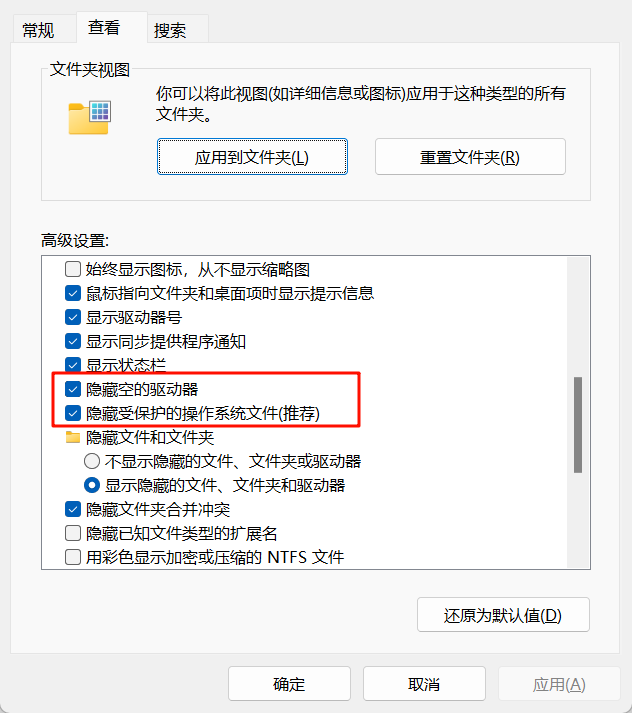
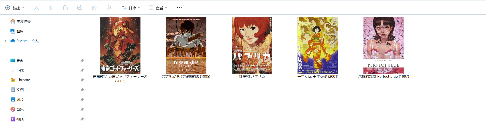

# 用法

## desktop.ini

`desktop.ini` 是 Windows 系统中一个特殊的隐藏配置文件，用于自定义文件夹的显示行为，比如**图标、提示信息、文件夹名称本地化**等。

打开【资源管理器】，【查看更多】，【选项】，【查看】，取消勾选【隐藏受保护的操作系统文件(推荐)】。就可以看到桌面文件夹的 desktop.ini 文件



### 自定义文件夹图标

人对图像的敏感程度是远远高于文字的。设置文件夹图标，可以快速识别文件夹内容。

我可以依靠 desktop.ini 和自动化脚本非常快速的创建一个简单的媒体库。



**制作图标 ico 文件**

可以用电影的海报，图书的封面来制作文件夹图标文件

```python
# 任意图片转化成 256 * 256 的正方形 ico

from PIL import Image
import os

def convert_to_ico(input_path, output_path=None, size=(256, 256), add_padding=True):
    """
    将任意图片转换为 ICO 图标格式（可选是否自动添加透明边补齐为正方形）

    :param input_path: 输入图片路径
    :param output_path: 输出 ICO 图标路径（默认同目录同名）
    :param size: 最终图标尺寸，默认 256x256
    :param add_padding: 是否自动添加透明边以补齐为正方形
    """
    img = Image.open(input_path).convert("RGBA")
    w, h = img.size

    if add_padding and w != h:
        max_side = max(w, h)
        new_img = Image.new("RGBA", (max_side, max_side), (0, 0, 0, 0))  # 透明背景
        offset = ((max_side - w) // 2, (max_side - h) // 2)
        new_img.paste(img, offset)
        img = new_img

    img = img.resize(size, Image.LANCZOS)

    if output_path is None:
        base = os.path.splitext(input_path)[0]
        output_path = base + ".ico"

    img.save(output_path, format="ICO")
    print(f"转换完成：{output_path}")

# 示例用法：
convert_to_ico(
    r"example.jpg",
    add_padding=True,
)
```

**定义好目录结构**

```
东京教父 東京ゴッドファーザーズ (2003)
├───.meta           # 元数据文件夹
│   ├───东京教父 東京ゴッドファーザーズ (2003).ico              # 图标文件
│   ├───东京教父 東京ゴッドファーザーズ (2003).img.main.webp    # 主海报
│   ├───东京教父 東京ゴッドファーザーズ (2003).img.smp1.jpg     # 样例图片，用于预览
│   └───东京教父 東京ゴッドファーザーズ (2003).metadata.yaml    # 元数据文件，记录出版时间、制作人员等信息
└───desktop.ini     # 自定义文件夹配置文件
```

**设置目录和 desktop.ini 文件的属性**

```python
import os
import ctypes

def create_desktop_ini(target_dir, icon_name="", info_tip=""):
    """
    为指定目录创建 desktop.ini 并设置必要的隐藏/系统属性

    :param target_dir: 目标文件夹路径
    :param icon_name: 图标文件名，相对于该文件夹路径
    :param info_tip: 鼠标悬停提示信息
    """
    # 确保路径是绝对路径
    target_dir = os.path.abspath(target_dir)

    if not os.path.isdir(target_dir):
        print(f"目录不存在：{target_dir}")
        return

    # 1. 写入 desktop.ini 内容
    ini_path = os.path.join(target_dir, "desktop.ini")
    content = f"""[.ShellClassInfo]
IconResource={icon_name}
InfoTip={info_tip}
"""
    with open(ini_path, "w", encoding="utf-8") as f:
        f.write(content)

    # 2. 设置 desktop.ini 文件属性为隐藏 + 系统
    FILE_ATTRIBUTE_HIDDEN = 0x2
    FILE_ATTRIBUTE_SYSTEM = 0x4
    ctypes.windll.kernel32.SetFileAttributesW(ini_path, FILE_ATTRIBUTE_HIDDEN | FILE_ATTRIBUTE_SYSTEM)

    # 3. 设置目录本身为系统文件夹（+s）
    FILE_ATTRIBUTE_DIRECTORY = 0x10
    ctypes.windll.kernel32.SetFileAttributesW(target_dir, FILE_ATTRIBUTE_SYSTEM | FILE_ATTRIBUTE_DIRECTORY)

    print(f"desktop.ini 创建成功，目录已设为系统文件夹：{target_dir}")


dir_path = r"example folder"

# 示例用法
create_desktop_ini(
    dir_path,
    icon_name=rf""".meta\{os.path.basename(dir_path)}.ico""",
)
```
