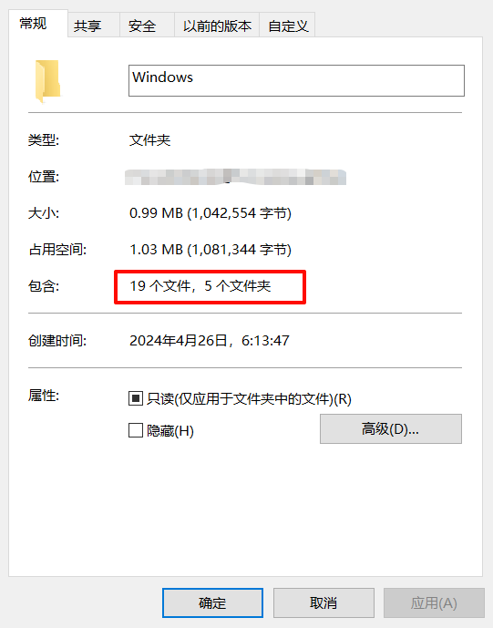
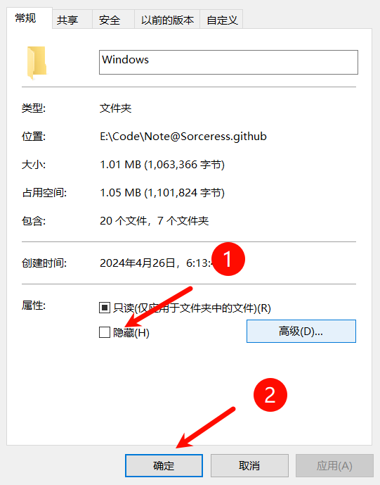
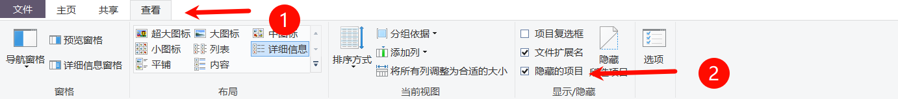
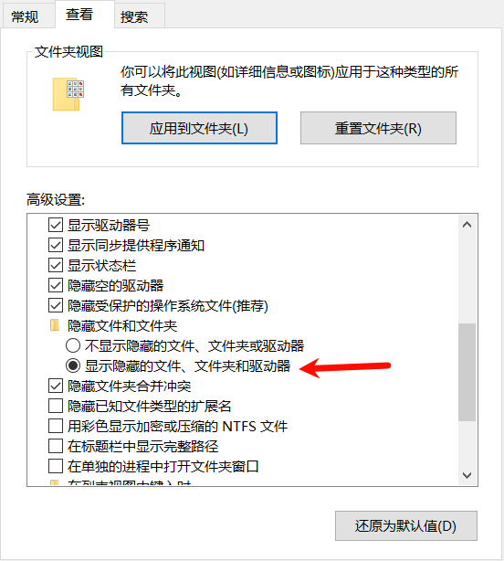
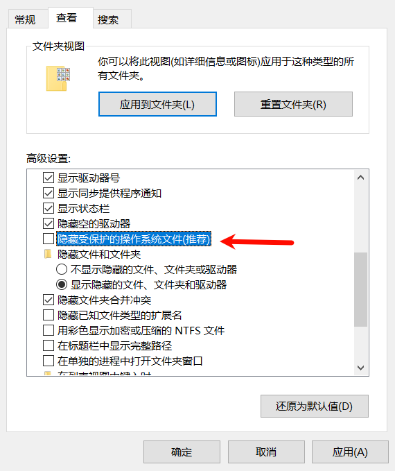

# WindowsInfo

## desktop.ini

## 隐藏文件

不管什么隐藏方法，查看被隐藏文件的父文件夹的属性时依然可以统计这些被隐藏文件。

### 普通隐藏法

选中要隐藏的文件或者文件夹，右键 → 属性 → 隐藏 → 确定。

**显示方法 1：**

**显示方法 2：**

查看 → 选项

然后进行下图操作

**显示方法 1：**

把 `隐藏受保护的操作系统文件(推荐)` 取消勾选即可.

> 用途

比如 `desktop.ini` 文件就依靠这种方法隐藏

可以在文件夹隐藏自定义的 folder Icon 和 `desktop.ini` 来自定义文件夹.让该文件夹可以跟方便被辨识和查看.

