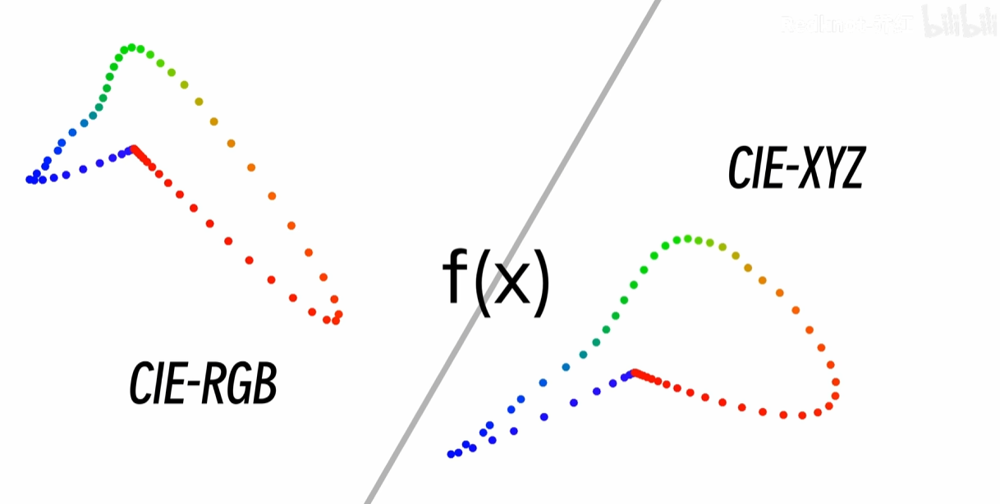

# 图像

## 颜色

### 品色图

色域，人类可见光

人眼可见颜色

CIE 色彩空间

色域马蹄图片

SRGB

### 色彩表达方式

#### RGB

> [【硬核】色品图是怎么来的？完整推导色品图！](https://www.bilibili.com/video/BV1E2421c7NM) - [@Redknot-乔红](https://space.bilibili.com/38154792)

把 转化成 cie 坐标

#### HSL

#### HSB(HSV)

HSL 和 HSB 是从 RGB 推导出的感性友好的颜色表达方式。

### 色深/位深

颜色的细腻程度。把一段颜色分成 x 份。x 越多，颜色过度的越平滑。

单位是 bit

位深 就是 2^n 个 颜色

256 色 = 2^8 = 8 位色

10 bit/30 位色（RGB）

### 色度采样

444

422

420

## 像素

图片的尺寸。

当图片在显示器上 100%大小显示时，图片的每一个像素刚好对应一个显示器的一个像素颗粒。

## Alpha 通道

8bit / 32 位深/(RGBA)

## HDR

把亮度直接表示出来

## 格式

### jpg / jpeg

### PNG

### WebP

## XMp

元数据

exif
