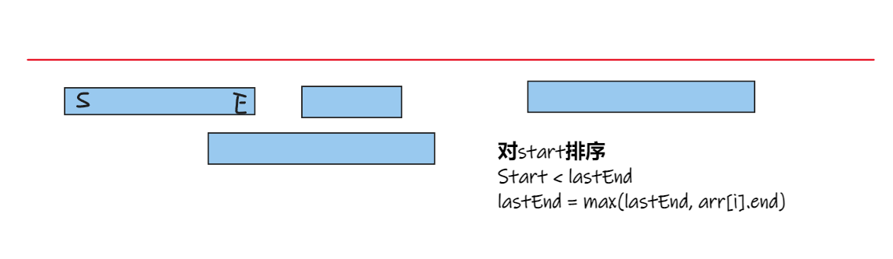
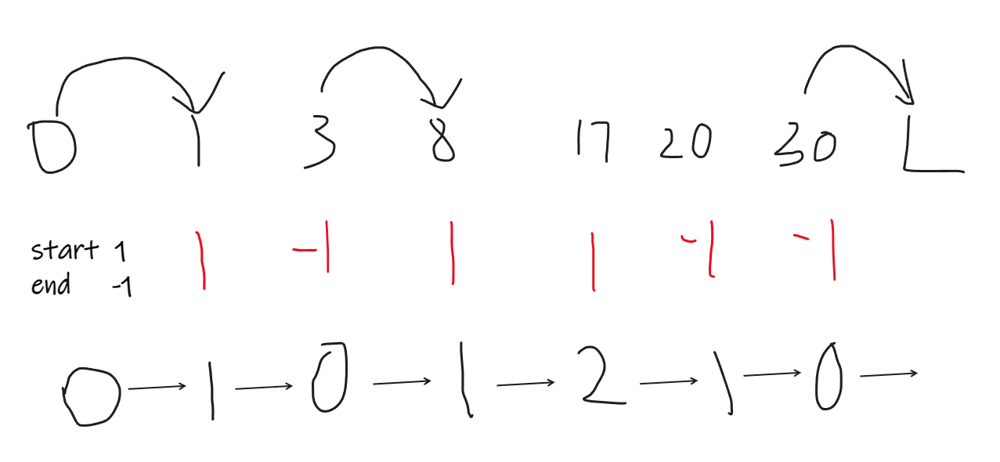

## 前缀和 & 差分

#### 差分数组求原数组

```cpp
// 对数组从 right 到 left 加 k;
delat[right] + k;
delat[left + 1] - k;

origin[i] = origin[i -1] + delat[i];	//差分数组求原数组
```

## 区间合并 & 离散化

#### [NC24636 值周](https://ac.nowcoder.com/acm/problem/24636)

> 法一:区间合并
> 对start排序
> 如果这个区间的start在上一个区间之内，
> 则合并区间， lastEnd = max(lastEnd, arr[i].end)
> 

```cpp
#include <iostream>
#include <algorithm>
#include <string>
using namespace std;

class Ruby {
public:
	int start, end;
	bool operator()(const Ruby &T, const Ruby &N) {
		return T.start < N.start;
	}
};

int main() {
	int L, M, start, end;
	while (cin >> L >> M) {
		Ruby arr[M];
		for (int i = 0; i < M; i++) {
			cin >> arr[i].start >> arr[i].end;
		}
		sort(arr, arr + M, Ruby());
		int lastStart = arr[0].start, lastEnd = arr[0].end;
		for (int i = 1; i < M; i++) {
			if (arr[i].start <= lastEnd) {
				lastEnd = max(arr[i].end, lastEnd);
			}
			else {
				L = L - lastEnd + lastStart - 1;
				lastStart = arr[i].start;
				lastEnd = arr[i].end;
			}
		}
		L = L - lastEnd + lastStart - 1;    //最后一个块，跳出去了，要减去。
		cout << L + 1 << endl;
	}
	return 0;
}
```

> 法二:离散化
> 遇到一个start(1)，计数器加一;遇到end(-1)，计数器减一。
> 计数器代表这个区域要挖掉，重叠的次数。 计数器为0的区域代表没有被挖掉。
> 

## 中位点 & 带权中位数

#### 中位点

* 找一个点到其他点的距离之和最小

> 法一:
> X1, Xn之间任意一个点都是最小; X1, Xn到某点的距离和为Xn - X1。
> X2, Xn-1之间任意一个点都是最小; X2, Xn-1到某点的距离和为Xn2 -Xn-1。
> 依次类推 把结果相加

```cpp
sort(nums.begin(), nums.end());
int result=0;
for (int i = 0; i < nums.size() / 2; i++)
{
	result += (nums[nums.size() - 1 - i] - nums[i]);
}
```

> 法二:
> 取中位点是 (n + 1) / 2。
> 计算所有点到 (n + 1) / 2 的距离和。

```cpp
sort(nums.begin(), nums.end());
int result = 0;
for(int i = 1;i <= n; i++)
{
	result += abs(c[i] - c[(n + 1) / 2]);
}
```

#### 带权中位点

* 若干个点在一条只直线上，每个点有若干个人，找一个点使所有人移到改点消耗的代价最小

> 人数和刚刚过半的点就是最优点。
> 证明: 设最优解的点为P(x)，其左边的一个点为P(x-1), 所有人走到P(x)的距离为dist[x], 走到P(x-1)的距离为dist[x-1].
> 从P(x-1)变为P(x)，x-1和前面所有的人要多走sum(1 ~ x-1) * len的长度，x和后面的人要少走sum(x ~ n) * len的长度.
> dist[x - 1] = dist[x] - len * (sum(1 ~ X-1) + sum(x ~ n)), len = (P(x)-P(x-1))
>
> 如果dist[x - 1]为最优解，sum(1 ~ X-1) < sum(x~n), 由上式可知 dist[x-1] > dist[x], 与dist[x-1] 为最优解矛盾，
> 所以在人数刚刚过半的点为最优解，及路程最小。

```cpp

```
