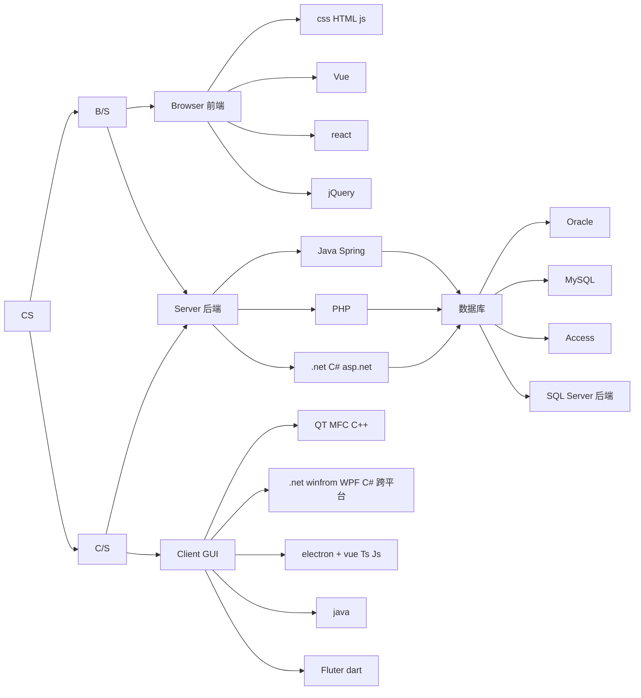
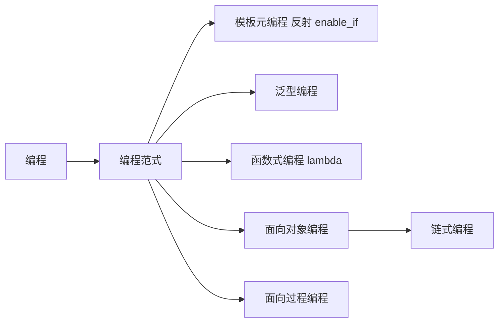

```mermaid
graph LR;
    a0[CS] --> a0-b0[B/S]
    a0[CS] --> a0-b1[C/S]


    a0-b0[B/S] --> a0-b0-c0[Browser 前端]
    a0-b0[B/S] --> a0-b-c0[Server 后端]
    a0-b1[C/S] --> a0-b1-c0[Client GUI]
    a0-b1[C/S] --> a0-b-c0[Server 后端]

    a0-b0-c0[Browser 前端] --> a0-b0-c0-d0[css HTML js]
    a0-b0-c0[Browser 前端] --> a0-b0-c0-d1[Vue]
    a0-b0-c0[Browser 前端] --> a0-b0-c0-d2[react]
    a0-b0-c0[Browser 前端] --> a0-b0-c0-d3[jQuery]
    a0-b-c0[Server 后端] --> a0-b-c0-d0[Java Springboot cloud]
    a0-b-c0[Server 后端] --> a0-b-c0-d1[PHP Laravel]
    a0-b-c0[Server 后端] --> a0-b-c0-d2[.net C# asp.net]
    a0-b1-c0[Client GUI] --> a0-b1-c0-d0[QT MFC C++]
    a0-b1-c0[Client GUI] --> a0-b1-c0-d1[.net winfrom WPF C# 跨平台]
    a0-b1-c0[Client GUI] --> a0-b1-c0-d2[electron + vue Ts Js]
    a0-b1-c0[Client GUI] --> a0-b1-c0-d3[java]
    a0-b1-c0[Client GUI] --> a0-b1-c0-d4[Fluter dart]

    a0-b-c0-d0[Java Spring] --> a0-b-c0-d-e0[数据库]
    a0-b-c0-d1[PHP] --> a0-b-c0-d-e0[数据库]
    a0-b-c0-d2[.net C# asp.net] --> a0-b-c0-d-e0[数据库]
    a0-b-c0-d-e0[数据库] --> a0-b-c0-d1-e0[Oracle]
    a0-b-c0-d-e0[数据库] --> a0-b-c0-d1-e1[MySQL]
    a0-b-c0-d-e0[数据库] --> a0-b-c0-d1-e2[Access]
    a0-b-c0-d-e0[数据库] --> a0-b-c0-d1-e3[SQL Server 后端]

```

```mermaid
graph LR;
    a0[编程] --> a0-b0[编程范式]

    a0-b0[编程范式] --> a0-b0-c0[模板元编程 反射 enable_if]
    a0-b0[编程范式] --> a0-b0-c1[泛型编程]
    a0-b0[编程范式] --> a0-b0-c2[函数式编程 lambda]
    a0-b0[编程范式] --> a0-b0-c3[面向对象编程 class]
    a0-b0[编程范式] --> a0-b0-c4[面向过程编程]
    
    a0-b0-c3[面向对象编程] --> a0-b0-c3-d0[链式编程]
```

docker
wsl2
MVC模式
ssm框架
git
svn
