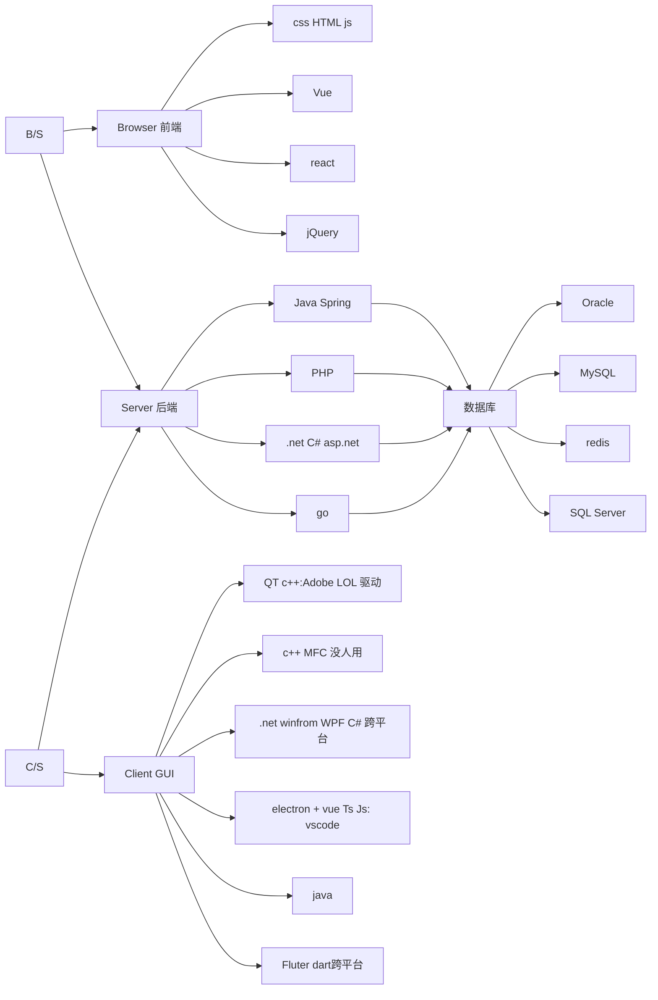

# 解释型和编译型语言

解释型的程序不需要在运行前编译，在运行程序的时候再翻译成机器码。

编译型语言是先把所以代码翻译成机器码，在运行；

# 方向

```mermaid
graph LR;
    a0-b0[B/S] --> a0-b0-c0[Browser 前端]
    a0-b0[B/S] --> a0-b-c0[Server 后端]
    a0-b1[C/S] --> a0-b1-c0[Client GUI]
    a0-b1[C/S] --> a0-b-c0[Server 后端]

    a0-b0-c0[Browser 前端] --> a0-b0-c0-d0[css HTML js]
    a0-b0-c0[Browser 前端] --> a0-b0-c0-d1[Vue]
    a0-b0-c0[Browser 前端] --> a0-b0-c0-d2[react]
    a0-b0-c0[Browser 前端] --> a0-b0-c0-d3[jQuery]
    a0-b-c0[Server 后端] --> a0-b-c0-d0[Java Springboot cloud]
    a0-b-c0[Server 后端] --> a0-b-c0-d1[PHP Laravel]
    a0-b-c0[Server 后端] --> a0-b-c0-d2[.net C# asp.net]
    a0-b-c0[Server 后端] --> a0-b-c0-d3[go]
    a0-b1-c0[Client GUI] --> a0-b1-c0-d0[QT c++:Adobe LOL 驱动]
    a0-b1-c0[Client GUI] --> a0-b1-c0-d1[c++ MFC 没人用]
    a0-b1-c0[Client GUI] --> a0-b1-c0-d2[.net winfrom WPF C# 跨平台]
    a0-b1-c0[Client GUI] --> a0-b1-c0-d3[electron + vue Ts Js: vscode]
    a0-b1-c0[Client GUI] --> a0-b1-c0-d4[java]
    a0-b1-c0[Client GUI] --> a0-b1-c0-d5[Fluter dart跨平台]

    a0-b-c0-d0[Java Spring] --> a0-b-c0-d-e0[数据库]
    a0-b-c0-d1[PHP] --> a0-b-c0-d-e0[数据库]
    a0-b-c0-d2[.net C# asp.net] --> a0-b-c0-d-e0[数据库]
    a0-b-c0-d3[go] --> a0-b-c0-d-e0[数据库]
    a0-b-c0-d-e0[数据库] --> a0-b-c0-d1-e0[Oracle]
    a0-b-c0-d-e0[数据库] --> a0-b-c0-d1-e1[MySQL]
    a0-b-c0-d-e0[数据库] --> a0-b-c0-d1-e2[redis]
    a0-b-c0-d-e0[数据库] --> a0-b-c0-d1-e3[SQL Server]

```

docker
rust
wsl2
MVC模式
ssm框架
svn
