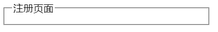
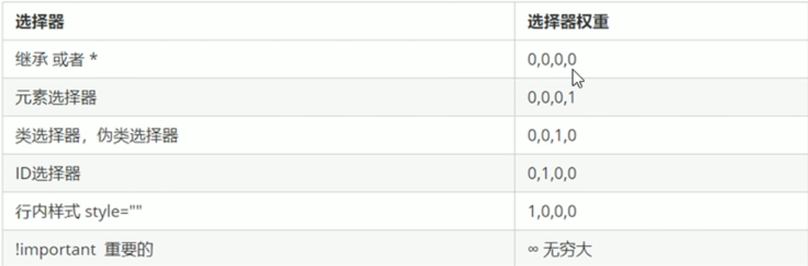
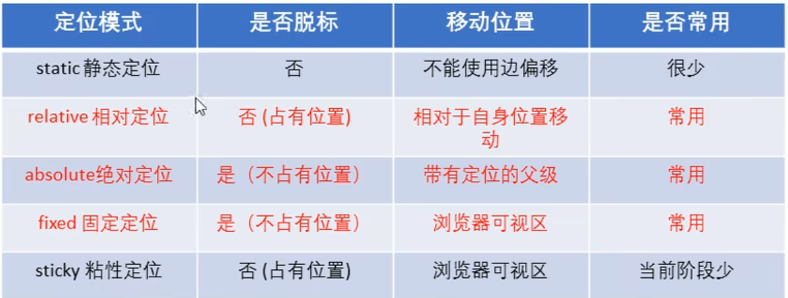
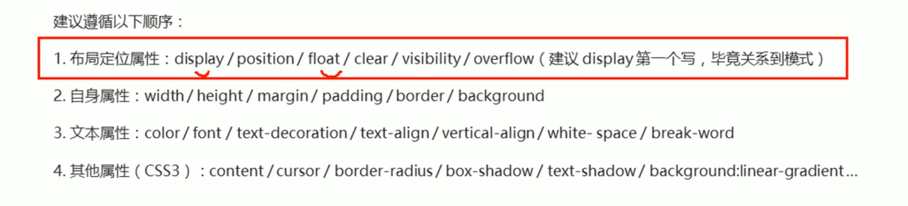
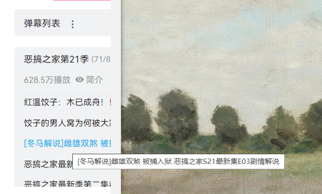
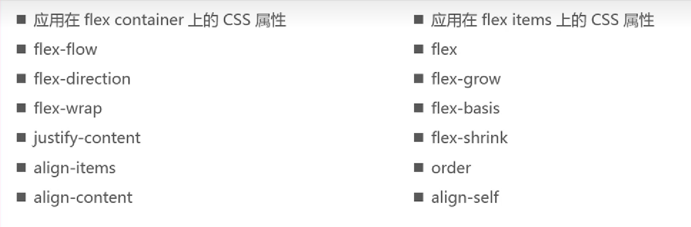

## 交集选择器 和 子类选择器

```html
<!-- 交集选择器 -->
p:nth-child(n){

}
<!-- 子类选择器 -->
p :nth-child(n){

}
```

## 伪元素

```html
<!--- ::伪元素 -->

```

## fieldset & legend

```html

    <fieldset>
        <legend>注册页面</legend>

  
    </fieldset>
```



## 表单

> input:radio 在提交后，用value 来分辨 是哪个的

> method属性 get和post请求
> get请求是有大小限制的，他直接把数据往url拼接
> 而post请求没有大小限制。他把数据放在请求体里。

## 伪元素

```css
::first-line
::first-letter
::before
::after
```

## 选择器 权重(很重要)

* 父元素的优先级再高，子元素继承后优先级永远为零
* 优先级会叠加，但是不会进位



## z-index

默认值为0， 改变div层级

## css x和y谁先

> margin padding  先y 后x

> background 先x后y

## 清除浮动

> 额外标签发(隔离法) 一定要是块元素缺点添加无意义结构

```css
.clearfix{
    clear:both;
}
```

> 父级overflow:hidden; 缺点：溢出隐藏

```css

```

> 父级after伪元素

```css
.clearfix:after{
    content:"";
    display: block;
    height:0;
    clear:both;
    visibility:hidden;
}
```

> 父级双伪元素

```css
.clearfix:before,
.clearfix:after{
    content:"";
    display:table;
}
.clearfix:after{
    clear:both;
}
.clearfix{      //IE
    *zoom:1;
}
```

## 定位



## css书写顺序



# HTML

### title属性



## 自定义属性

data-

[详解和自定义属性的调用](Js+Ts.md)


# CSS

## display和visibility

display:none 		消失，但是不占空间

visibility:hidden	消失，但是原本占用的空间还占着

## overflow:hidden缺点

当需要定位 position: absolute; right: -5px; 时, overflow会隐藏掉要突出的部分

## vertical-align

它就是设置一行里高度不一样的元素，数值方向的对齐方式，

1. middle 把所有元素的中心线窜成一条线
2. bottom 把所有元素的底线窜成一条线

## 图片缝隙

> 为什么图片会有缝隙？

因为图片和文字默认是基线对其，那个白边是文字的基线到底线的距离

> 解决

1. 给图片添加vertical-align: middle | top | bottom ;	(它默认是baseline所以有白边)
2. 把图片转化为 display:  block

## 表单新属性

> placeholder

提示文本

```css
<!-- 改placeholder 样式 -->
input::placeholder {
    color: pink;
}
```

> multiple

input:flie 可以选多个文件提交

> autocomplete off/on

是否保存输入记录

## 属性选择器

```css
<!-- type属性为text的input -->
input[type=text] {
    ...
}
```

## CSS滤镜 filter

```css
filter : blur(5px)	// 模糊度, 越大越模糊
```

## calc()  函数

width: calc(100% -30px);	// 永远比父盒子小30像素

## transition过渡

transition: 属性 过度时长 运动曲线 何时开始

1. 属性：默认是all所有变化都加过度，可以设置那些不过度，那些过度
2. 运动曲线：匀速，先快后慢，先慢后快等等

> 改多个属性,用逗号分隔

transition： width .5s , height .5s

## 动画

@keyframe  动画名{

// 节点

0%{
}

}

## 3D

### perspective 透视

加在父盒子上，子元素在跳转translateZ()时，就有透视的效果，近大远小

1. translate3D(x, y, x)
2. rotate3D(x, y, z)

### transform-style

用来写在父盒子中，控制子元素是否一样始终保存立体空间

transform-style: preserve-3d;

```css
<!-- 对比 -->
    <style>
        .box {
            width: 200px;
            height: 200px;
            margin: 50px auto;
            transition: 2s;
            transform-style: preserve-3d;
        }

        .box:hover {
            transform: rotateY(60deg);
        }

        #div1,
        #div2 {
            position: absolute;
            width: 200px;
            height: 200px;

        }

        #div1 {
            background: pink;
        }

        #div2 {
            transform: rotateX(60deg);
            background: green;
        }
    </style>

<body>
    <div class="box">
        <div id="div1"></div>
        <div id="div2"></div>
    </div>
</body>
```

> 实战

https://www.bilibili.com/video/BV14J4114768/?p=386

## 私有前缀

-moz- ：firefox

-ms：ie

-webkit-：chrome safari

-0-：opera

## flex



### flex-direction

设置主轴方向

### align-items

设置交叉轴的对齐方式和vertical-align差不多

区别在于baseline

vertical-align 的baseline是

align-items 的baseline是box里的文字在一条线。

### flex-wrap

默认是nowrap不换行

wrap是换行

### flex-float

flex-direction 和 flex-wrap 的复合写法，可以写一起

### align-content

在多行item在交叉轴的排列方式，就是行怎么排

### align-self

某个盒子像搞特殊，可以用align-self来覆盖掉flex-container的设置的justify-content

### flex-grow 增长

> 当值 大于 1

flex-item的尺寸权重

把所有flex-item的权重相加，它占的百分比宽度

> 当值 小于 1

就是100% * .x 的宽度

### flex-shrink 收缩

1. flex-item 在一行放不下时，默认（flex-shrink : 1）的每个子元素都会收缩来挤在一行里
2. 也可以用来设置收缩比例，有的收缩的大，有的收缩的小

### flex-basis

设置元素在主轴上的大小

优先级：

{max | min }{width | height} > flex-basis > width/height

### flex

缩写属性 flex-grow , flex-shrink, flex-basis

## em 和rem

1. rem是root em 它是相对于根元素(`html{ font-size: 30px }`)的文字大小来的
2. em是相对于夫元素的文字大小来的

## Grid

# 媒体查询

@media 监听名字 and  (条件)

## 引入样式

<link rel="stylesheet" href="style320.css" media="媒体查询">

# 响应式开发

# CSS 样式模板

## CSS reset

```css
* {
    margin: 0;
    padding: 0
}

em,
i {
    font-style: normal
}

li {
    list-style: none
}

img {
    border: 0;
    vertical-align: middle
}

button {
    cursor: pointer
}

a {
    color: #666;
    text-decoration: none
}

a:hover {
    color: #c81623
}

button,
input {
    font-family: Microsoft YaHei, Heiti SC, tahoma, arial, Hiragino Sans GB,
        "\5B8B\4F53", sans-serif
}

body {
    -webkit-font-smoothing: antialiased;
    background-color: #fff;
    font: 12px/1.5 Microsoft YaHei, Heiti SC, tahoma, arial, Hiragino Sans GB,
        "\5B8B\4F53", sans-serif;
    color: #666
}

.hide,
.none {
    display: none
}

.clearfix:after {
    visibility: hidden;
    clear: both;
    display: block;
    content: ".";
    height: 0
}

.clearfix {
    *zoom: 1
}
```

## 取消一些元素的原始样式

> textarea 取消变行，resize

resize = none

> appearance:  none;

## 图片显示

> 图片铺满div元素不变形，超出部分隐藏，保留中心部分

```css
.div {
    width: 200px;
    height: 200px;
    overflow: hidden;
}
.div img {
    width: 100%;
    height: 100%;
    /* 重要 */
    object-fit: cover;
}
```

> 显示图片全部不变形，不超出div

```css
img {
    max-width: 100%;
    max-height: 100%;
}
```

## 小三角

> △型

```css
div {
    width: 0;
    height: 0;
    border: 10px solid transparent;
    border-left-color: pink;
}
```

> ◢型

```css
div {
    width: 0;
    height: 0;
    border-color: transparent blue transparent transparent;
    border-style: solid;
    border-width: 30px 20px 0 20px;
}
```

## 溢出省略号

> 单行溢出省略号

```css
div {
    white-space: nowrap;	// 一行显示
    overflow: hidden;		// 溢出隐藏
    text-overflow: ellipsis；// 超出了用ellipsis号代替
}
```

> 多行溢出省略号

```css
div {
    overflow: hidden;
    text-overflow: ellipsis;
    display: -webkit-box;		// 弹性伸缩盒子模型显示
    -webkit-line-clamp: 3;		// 最多显示的行数
    -webkit-box-orient: vertical;	// 伸缩盒对象子元素排列方式
}
```

## 用margin负值 消除重叠边框

```css
div {
    border: 1px solid #000;
    margin: -1px;	// 利用margin负值覆盖掉重叠的边框
}
// hover改边框是可以提高盒子的层级来显示被压住的边框
div:hover {
    z-index: 20;
    border-color: pink;
}
```

## [重要]动态盒子怎么溢出滚动

```html
<head>
    <style>
        * {
            margin: 0;
            padding: 0;
        }

        html,
        body {
            width: 100vw;
            height: 100vh;
        }

        #a {
            display: grid;
            width: 100%;
            height: 100%;
            grid-template-columns: 200px auto;
        }

        .sideBar {
            display: grid;
            backgroud: pink;
            grid-template-rows: 60px auto 30px;
            /* 父盒子一定也要加上overflow-y: auto否则不起作用 */
            overflow-y: auto;
        }

        #groupList {
            /* 动态大小的盒子 */
            backgroud: blue;
            overflow-y: auto;
        }

        #item {
            background-color: pink;
        }
    </style>
</head>

<body>
    <div id="a">
        <div class="sideBar">
            <div id="logo">
                echo
            </div>
            <div id="groupList">
                <p>fdhfdf</p>
                <p>fdhfdf</p>
                <p>fdhfdf</p>
                <p>fdhfdf</p>
                <p>fdhfdf</p>
                <p>fdhfdf</p>
                <p>fdhfdf</p>
                <p>fdhfdf</p>
                <p>fdhfdf</p>
                <p>fdhfdf</p>
                <p>fdhfdf</p>
                <p>fdhfdf</p>
                <p>fdhfdf</p>
            </div>
            <div></div>
        </div>
    </div>
</body>

</html>
```

### minHeigth=0&minwidth=0的妙用

重新计算盒子的高度。让布局变正常，

white-space-nowrap-breaks-flexbox-layout

用minwidth给white-space元素的父节点添加minwidth：0,每次窗口大小变化时变化都会重新计算盒子在flex布局下是应该的大小，让显示正常

minheith解决嵌套flex：1，flex-dri colmu布局时盒子高度计算错误

```html
 <div style="display: flex; overflow: hidden;">
        <!-- siderbar -->
        <div style="width: 200px; display:flex"></div>
        <!-- right-content -->
        <div style="flex: 1; display: flex; flex-direction: column; overflow: hidden; min-height: 0;">
            <!-- header1 -->
            <div style="height: 50px;display: flex;"></div>
            <!-- flexbox -->
            <div style="flex:1; display: flex; flex-direction: column;">
                <!-- header2 -->
                <div></div>
                <!-- scroll box -->
                <div style="flex: 1; display: flex; overflow-y: scroll;"></div>
            </div>
        </div>
    </div>
<!-- scroll box 在嵌套的flexbox下滚动会失效 -->
<!-- 在right-content加上min-height让盒子在flex下重新计算高度 -->
```

就是解决页面高宽的bug,
