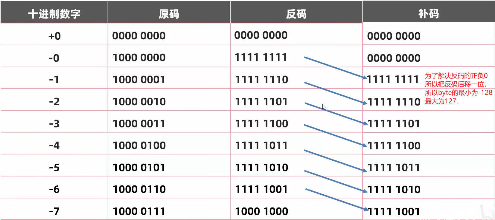
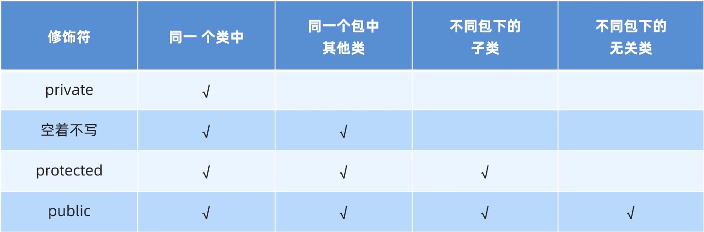
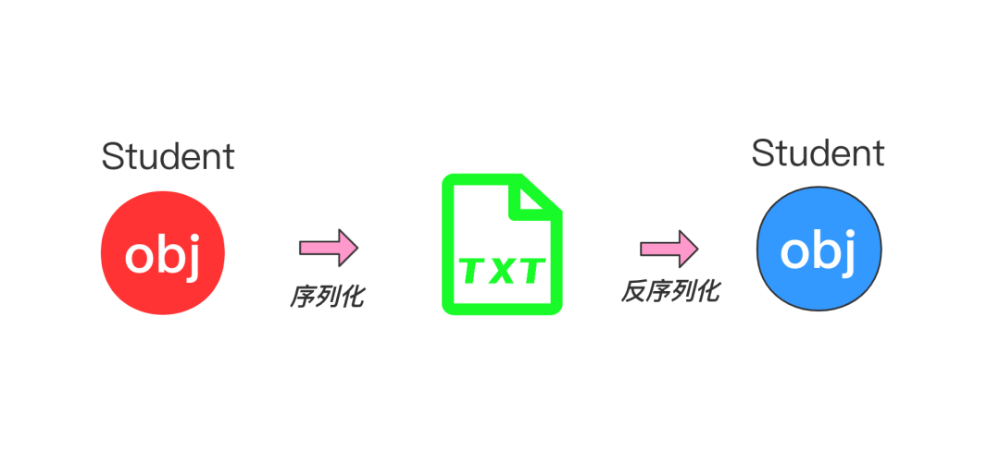

# Java语言的特点

1. java的非基本数据类型就是引用数据类型，传递的都是地址。自定义类在函数间传递为引用传递，传的是地址。不想C++一样new一个新对象（我猜java是new了一个新地址）。所有标准类库都是直接复制地址的浅拷贝，但是String类很特殊；
2. 因为是很多标准类库是引用类型，但是int ，double是值类型；所以他们在传入时有一个装箱(*装箱是将值类型装换成引用类型的过程*)的操作;int --> Integer,double-->double;
3. java 的普通函数就是C++的虚函数
4. java 没有C++的类选择器(::)，不支持多继承
5. 给常量起名字用下划线
6. java继承多态实现原理和C++差不多。[C++继承多态原理](./C++语法.md)

# 好文章

[java string 深拷贝_探讨java深拷贝](https://blog.csdn.net/weixin_31477659/article/details/114247840)

# 小技巧

1. %s 是原始 %S是全大写、
2. jdk自带的javap 可以反编译class文件

# Java易错和易忘点

## 注意换行符。

再使用input.nextInt()、input.nextDouble()时，后面还有换行符没有吸收
如果后面要用input.nextLine(), 则要吸收掉换行符。


## 关键词书写顺序

\1. Annotations

\2. public

\3. protected

\4. private

\5. abstract

\6. static

\7. final

\8. transient

\9. volatile

\10. synchronized

\11. native

\12. strictfp

# 内置函数使用注意事项

> Integer.parseInt(string, radix)

传入的字符 `不能为空`和 `不合格的字符`否则报错

## 隐式转换的规则

> 取值范围小的，和取值范围大的运算，小的会先提升为大的，在进行运算
> byte > short > int > long > float > double

```java
public static void main(String[] args) {
    int a = 10;
    double b = 12.3;
    c = a + b; // c 为 double 类型
}

public static void main(String[] args) {
    long a = 1999999L;
    int b = 5；
    c = a + b;  // c 为 long 类型
}
```

> byte short char 三种类型在运算时，都是先生int再运算

```java
public static void main(String[] args) {
    byte a = 10, b = 20;
    c = a + b; // c 为 int 类型
}
```

## 原码 反码 补码

> 在计算机中所以数据都是用补码的形式储存的, -128只有补码。



## Java 常量池

```java
在Java语言中，String类型变量直接赋值和使用new方式新建String对象是完全不同的两种方式，产生的结果也不一样，需要了解其中的差别。

概念：

Java常量池

类在加载完成之后，会在内存中存储类中的一些字面量(本身即是值如10，“abc”)，对于字符串常量来说，Java会保证常量池中的字面量不会有多个副本，也就是说在常量池中的字符串不可能有两个字符串是相同的，但是Java代码中可能不同的变量的值是相同的，那么在编译期间，这两个变量值所在地址是相同的。而且Java在编译期间会对字符串进行一定的处理，如果一个字符串采用拼接的方式，并且拼接的内容都是字面量的话，那么会自动将字符串先拼接完再赋值，如果常量池中已经有了拼接完成之后的字面量，那么此变量的值的地址就是常量池中的完整字符串的地址。需要注意的是，String在赋值完成之后修改，是会产生新的变量的。比如：

String str = "reeves";

str = "abc";

那么实际上在常量池中存储了"reeves"和"abc"两个字面值，在字符串变量赋予新的值的时候并不会改变原先存储的值，它会再新建一个字符串，而在栈中变量存储的值的地址是变了的。

使用：

例子1：

String str1 = "reeves";

String str2 = "reeves";

System.out.println(str1==str2); // 结果：true

例子中新建了两个变量str1和str2，值相同，在编译期间变量str1和str2值得地址都可以确定，因为两个变量的值相同，指向常量池中的地址也相同，因此使用“==”符号来判断两者值得地址是否相同时，返回的是true。

例子2：

String str1 = "reeves";

String str2 = "ree"+"ves";

System.out.println(str1==str2); // 结果：true

Java语言在编译期间，对于字符串拼接且拼接元素都是字面量的情况，会自动将拼接字符串拼接完整之后再赋值，因此 String str2 = "ree"+"ves"; 就相当于 String str2 = "reeves"; 而“reeves”字面量在常量池中存在，因此str2的引用地址和str1相同。

例子3：

String str1 = "aaa";

String str2 = new String(str1);

String str3 = new String("aaa");

String str = new String("reeves");

System.out.println(str1 == str2);	//结果为false

System.out.println(str1 == str3);	//结果为false


使用new关键字新建String对象时，会在堆中新创建一个字符串对象，值为“reeves”，同时，Java也会监测常量池中是否有“reeves”字面量，如果没有，那么在常量池中再新建一个“reeves”的字面量。

String str1 = "你好";
String you = "你";
String hi = "好";
String str2 = you + hi;
System.out.println(str1 == str2);	// 结果为false;
String str3 = you + hi;
System.out.println(Str2 == str3)	// 结果为true;
```

# String

## String

1. String是 `常量`,常量不可变的。它的每一次改变都是重新申请一块内存，保存改后的字符串，因此内存消耗很大；
2. java中使用赋值操作符的都属于浅拷贝，但是String表现出了非常奇怪的深拷贝特点；因为String提供的方法只要是设计到内部数据的变动都会new一个新的对象出来。所以一个String的操作不会影响到其原先指向的内存

## StringBuilder

String是 `常量`不可变的，每次拼接都会产生一个新字符串。会浪费很多内存空间。String在拼接的时候是调用StringBuilder 在toString 返回。

eg: s1 + s2 + s3 + s4 > s1s2 + s3 + s4 > s1s2s3 + s4 > s1s2s3s4

而StringBuilder是可变的，一个容器。拼接时不会产生其他新字符串。

StringBuilder常用函数：

1. append()
2. reverse()
3. length()
4. toString()  变回字符串

> StringBuilder没有重写equals()方法所以用的时Object的equals(),比较的是地址；

## StringBuffer

StringBuffer是线程安全型

> StringBuffer没有重写equals()方法，所以用的时Object的equals(),比较的是地址；

## StringJoiner

类似于Python的join

把字符串通过StringJoiner来分隔。

> 语法

```java
初始化
StringJoiner sj = new StringJoiner(分隔符, 前缀符, 后缀符);
添加
sj.add("iijij").add("iji");
```

# 包装类/装箱

在ArrayList、Map、vector、这些标准类库放基本变量时，要用对应的 `包装类`

因为是很多标准类库是引用类型，说以int ，double 在传入时有一个装箱(*装箱是将值类型装换成引用类型的过程*)的操作

> 装箱

1. int Integer	ArrayList `<Integer>`
2. char Character	ArrayList `<Character>`
3. double Double	ArrayList `<Double>`

# 类

## 注意事项

> 一个java文件里只能有一个public类

开发中一个文件建议一个类

> javaBean类和测试类

javaBean类没有main函数

## 类 数组

> 类数组再创建后每个子元素都要初始化

```java
Type t new Type[n];		// 只是创建了n个Type指针。n个值为null的type指针。
for(int i = 0; i < n; i++) {
    t[i] = new Type();	// 把创建的type的地址复制个t[i];
}
```

## 权限修饰符



## 代码块

> 构造代码块

每次构造就会被调用一次；

```java
class c {
    {
        sout("构造代码块");
    }
}
```

> 静态代码块 static{}

```java
class c {
    static {
        sout("静态代码块");
	}
}
```

可以用来对类进行一些初始化操作，只想被调用一次；

好处：https://www.bilibili.com/video/BV17F411T7Ao?p=134 31:14

## this

对象的地址

## static

> static 函数

1. 静态方法只能访问静态变量和静态方法。
2. 非静态方法可以访问静态变量或静态方法，也可以访问非静态变量和非静态方法。
3. 静态方法没有this关键字。

## final

**1、修饰变量**

当final修饰一个变量的时候一般把他作为常量。

**2、修饰方法**

当一个方法被final修饰后。表示该方法不能被子类重写。final方法有一个优点是比非final方法要快，由于在编译时已经静态绑定了，不须要在执行时在动态绑定。C++ 的普通函数

**3、修饰类**

当一个类被final修饰后，表示该类是完整的，不能被继承。比如Java中String、Integer类都是final类

# 深拷贝与浅拷贝

> java 的自定义类在函数间是引用传递。

并不是和C++ 一样new 一个新的对象。所以java的一些类库都是浅拷贝。拷贝构造不会再函数传值时被调用。

```java
import java.util.ArrayList;

public class Main {
    public static void main(String[] args) {
        ArrayList<Course> cs = new ArrayList<Course>();
        Course a = new Course("fefe", 8, 0);
        System.out.println(a);
        test(a);
    }

    public static void test(Course c) {
        System.out.println(c);
    }
}

class Course {
    private String name;
    private int grade;
    private double points;

    public Course(String name, double points, int grade) {
        this.name = name;
        this.grade = grade;
        this.points = points;
    }

    public Course(String name, double points) {
        this.name = name;
        this.grade = -1;
        this.points = points;
    }
}
// 运行结果为
/*
Course@16b98e56
Course@16b98e56
*/
```

## 想到的一个深拷贝的思想

就是给每一个类提供一个clone()方法, 该方法返回一个new出来的对象。其new时传入的参数是也是成员变量的clone()new出来的；本质就是用clone()实现了深拷贝的 `递归`，一直递归到java的基本数据类型；

```java
class Main {
    public static void main(String[] args) {
        A textA = new A("he", 12);

        B textB1 = new B(textA);
        System.out.println(textB1.bA.aString + textB1.bA.aInt);

        B textB2 = textB1.clone();
        System.out.println(textB2.bA.aString + textB2.bA.aInt);

        textA.aInt = 21;
        textA.aString = "jun";
        System.out.println();
        System.out.println(textB1.bA.aString + textB1.bA.aInt);
        System.out.println(textB2.bA.aString + textB2.bA.aInt);
    }
}

class B {
    A bA;

    public B(A bA) {
        this.bA = bA;
    }

    public B(B b) {
        this.bA = new A(b.bA);
    }

    public B clone() {
        return new B(bA.clone());
    }
}

class A {
    String aString;
    int aInt;

    public A(String aString, int aInt) {
        this.aString = aString;
        this.aInt = aInt;
    }

    public A(A a) {
        this.aString = new String(a.aString);
        this.aInt = a.aInt;
    }

    public A clone() {
        return new A(aString, aInt);
    }
}
```

## 实现Cloneable实现深拷贝

clone()实现了深拷贝的 `递归`，一直递归到java的基本数据类型；

```java
public class AddressClone implements Cloneable{
    private String address1;
    private String address2;
    public AddressClone() {
    }
    public AddressClone(String address1, String address2) {
        this.address1 = address1;
        this.address2 = address2;
    }
    @Override
    protected AddressClone clone() throws CloneNotSupportedException {
        return (AddressClone) super.clone();
    }
}

public class UserClone implements Cloneable{
    private String userName;
    private AddressClone address;
    public UserClone() {
    }
    public UserClone(String userName, AddressClone address) {
        this.userName = userName;
        this.address = address;
    }

    @Override
    protected UserClone clone() throws CloneNotSupportedException {
        // 需要注意的是，super.clone()其实是浅拷贝，
        // 所以在重写UserClone类的clone()方法时，address对象需要调用address.clone()重新赋值
        // 调用父类的clone;
        UserClone userClone = (UserClone) super.clone();
        userClone.setAddress(this.address.clone());
        return userClone;
    }
  
  
public static void main(String[] args) throws CloneNotSupportedException {
        AddressClone address = new AddressClone("小区1", "小区2");
        UserClone user = new UserClone("小李", address);
        UserClone copyUser = user.clone();
        user.getAddress().setAddress1("小区3");
        // false
        System.out.println(user == copyUser);
        // false
        System.out.println(user.getAddress().getAddress1().equals(copyUser.getAddress().getAddress1()));
    }
}
```

# 继承

## Java与C++在继承多态上的异同

1. 在java 中所有类的祖先都是Object类，当一个类没有父类时，java会自动加一个object父类
2. java的默认函数是c++ 的虚函数。java函数加了final就是c++的普通函数
3. C++ 纯虚函数(抽象函数) == Java 抽象函数
4. C++ 抽象类	 == java 抽象类   (有一个抽象函数的的类就是抽象类)
5. C++ 虚基类	 == Java 接口

## 继承规则

1. 父类的一切变量都能被继承。
2. 构造函数都不能被继承
3. 私有 方法不能被继承，非私有方法能被继承

## 方法的重写

方法的重写就是把父类的 `虚方法表`中的方法覆盖，换上自己的。

注意父类的方法和子类的方法必须完全一模一样，参数列表不能变；

## super和this

```java
public classc (type a, type b, type c) {
    super(a, b);
    this.c = c;
}
```

# 多态 Polymorphism

同类型的对象，表现出的不同形态，特点子传父类

## 注意事项

> 子传父类的调用规则

```java
class Animal {
    String name = "动物";
    public void speak() {
        System.out.println("Animal speak");
    }
}
class Dog extends Animal {
    String name = "狗";
    public void speak() {
         System.out.println("Dog speak")
    }
}

Animal a = new Dog();
```

1. 调用成员变量，java调用的是父类的变量，如果没有编译失败。无法调用子类的变量

```java
System.out.println(a.name);
// 输出为：动物
/*
调用成员变量时，使用父类来调用的，变量无法被覆盖。所有没有权限调用子类的变量
*/
```

2. 调用成员函数，调用的是子类的函数，如果没有编译失败。

```java
a.speak();
// 输出为：Dog speak
/*
因为java的普通函数就是虚函数。所有函数放在一个表里，函数表是可以被覆盖的。
在创建Dog时候，Dog的speak()直接把Animal的speak()给覆盖率(重写)。
*/
```

## 变量强转

> 由于子传父类不能调用子类独有的功能。父类可以被强制传化成子类。

```java
Animal a = new Dog();
Dog d = (Dog)a;
d.speak();
((Dog)a).speak();
```

## instanceof	判断变量的type

```java
class a;
class dog extends a;
class cat extends a;
// 子类instanceof父类都是true
new dog() instanceof a; // true
new cat() instanceof a;	// true
// 子类instanceof子类是false
new dog() instanceof cat;	// false
new cat() instanceof dog;	// false

// 判断变量a是不是Dog类型
if(a instanceof Dog ){
    Dog d = (Dog)a;
    d.speak();
}
else  {
    sout("不是Dog类型，无法强转");
}

// jdk14, 直接如果是直接复制给d
if(a instanceof Dog d){
    d.speak();
}
else  {
    sout("不是Dog类型，无法强转");
}
```

## 包 package

全类名是：包名.类名、

```java
包名.类名 a = new 包名.类名();
```

引入包 import 包名。

> 在同一个包(同一个文件夹)内是不需要导包的。

## final

> final 修饰方法

final 修饰的方法相当于变回了 C++ 的普通函数，

它不会被加到虚函数表里，无法被子类重写。

> final 修饰类

final 修饰的类无法被继承，不能有子类。

> final 修饰量。

final 修饰变量 只能赋值一次

1. 修饰基本数据类型

```java
final int a;	// a 不可更改
const int a;	// 等价
```

2. 修饰引用数据类型

```java
class C{
}
final C c;	// c的指向的对象不能更改,但对象的值可以被更改；
int * const ptr;	// 等价

private final // 不设置set函数,且私有。则实现了引用类型的数据不可更改。
```

# 抽象类 abstractclass

为了然你强制重写

## 注意事项

1. 只要有一个抽象方法的类，就是必须为抽象类；
2. 抽象类不一定要有抽象方法；
3. 抽象类无法实例化对象，但是可以有构造函数；
4. 抽象方法( 纯虚函数)就是父类不定义函数体，要求子类必须重写的方法,否则无法实例化对象；

```java
// 抽象函数语法
abstract class c {
	public abstract void func();
}
// C++ 纯虚函数   C++纯虚函数 == java抽象方法
virtual void func() = 0;
```

# 接口 Interface

接口侧重与一个功能(行为)，对功能的抽象，把这个功能通过implements 加在各个类上

eg： 狗，青蛙会游泳，但是兔子，羊不会游泳，所以游泳这个功能就不能放在animal这个父类里面，所以就把游泳这个行为设置成接口；继承到狗，青蛙上；

## 接口和类

1. 特点，接口可以多继承；
2. 接口也不可以实例化对象；
3. 接口类似于，C++的虚继承；
4. 接口不能有普通方法

```java
/* java */
class Animal {
    public abstract void speak();
}
interface swim {
    public void swim(){
        sout("游泳");
	}
}
interface house {
    public void house(){
        sout("看家");
    }
}
// 继承animal,扩展swim，house功能，
class Dog extends Animal implements swim, house {
  
}
```

```C++
/* C++ */
class Animal {
public:
    virtual void speak() = 0;
};
class swim {	// 虚基类
public:
    void swin() {
    }
};
class house {
public:
    void house() {
    }
};

class Dog : public Animal, virtual public swim, virtual public house {
  
}
```

## 接口的成员特点

1. 只能是常量，默认修饰符为public static final；
2. 没有构造方法，无法实例化对象；
3. 成员方法

jdk7以前：接口只能是抽象方法；

默认修饰符为：public abstract，所以接口的所有方法必须重写；

jdk8新特性：接口可以定义方法体；

public default void fun(){

}

如果类继承了两个接口，两个接口有同名的default的方法，这子类必须重写；

jdk9新特性：接口可以定义私有方法体

## 接口和接口

1. 接口可以多继承接口

# 内部类

ArrayList 的迭代器iterator就是内部类；

当 innerClass是outerClass的一部分，但是innerClass单独存在没意义，就可以设计出内部类；

## 语法格式

```java
class OuterClass{
    // ...
    class InnerClass {
        // ...
    }
}
```

## 特点&注意

1. 内部类可以直接访问外部类的所有成员
2. 外部类要访问内部类必须要创建对象；
3. 在jdk16后内部类才可以定义静态对象；

## 成员内部类

成员内部类是外部类的属性(field, mysql 叫字段)

```java
public class ArrayList {
    private int a = 10;
  
    public class inner {
        private int a = 20;
        public void show() {
            int a = 30;
            sout(Outer.this.a);	// 10
            sout(this.a);	// 20
            sout(a);	// 30
        }
    }
  
    private class iterator {
    }
  
    public iterator iterator(){
        return new iterator();
    }
}
/* 创建内部类 */
ArrayList.inner in = new ArrayList().new inner();

ArrayList arr = new ArrayList();
object a = arr.iterator();


```

## 静态内部类

## 局部内部类

## 匿名内部类

> 语法

```java
/* 实现接口 */
public interface Swim{
    public abstract void swim();
}
new Swim(){
    @Override
    public void swim(){
        sout("重写游泳方法");
    }
}
// 翻译就是 new 了一个实现了Swim接口的类的对象
public class_name implements Swim {
    @Override
    // 构造函数
    public void class_name(){
    }
    public void swim() {
        sout("重写游泳方法");
    }
}
Swim s = new class_name();


/* 继承类 */
public class Animal {
    public void speak(){
        sout("动物说话");
    }
}
new Animal() {
    @Override
    public void speak() {
        sout("重写说话方法");
    }
}
// 翻译就是 new 了一个继承了Animal类的类的对象
public class_name extends Animal {
    @Override
    // 构造函数
    public void class_name(){
    }
    public void speak() {
        sout("重写说话方法");
    }
}
Animal a = new class_name();
// 这些类就可以传入父类;
```

> 讲解
>
> 视频讲解：https://www.bilibili.com/video/BV17F411T7Ao?p=143

```java
public class Main {
	public static main() {
        method(new Animal(){
            // 匿名内部类的内容
           @Override
           void speak(){
               sout("继承了动物类的匿名对象 说话");
           }
        })
    }
    void method(Animal a){
    	a.speak();
	}
}
class Animal{
    void speak(){
        sout("动物说话");
    }
}
```

在上面的实例中，匿名内部类包含了类的实现，方法重写，创建对象，被创建的匿名类对象被传入了其父类Aniaml中。由于匿名类重写了speak()方法，method在调用speak()时就实现了多态；

匿名内部类的作用是当你像实现 `多态`而 `重写`传入参数的方法且这个 `重写的方法`只被使用一两次时(因此你不需要一个名字来分辨它)，帮你快速的创建一个继承了你要重写方法的所在类的类，并new一个对象；

> 在对ArrayList 排序时使用的 Comparator `<E>`典型使用了匿名内部内；

```java
Collections.sort(shapes, new Comparator<>() {
    @Override
    public int compare(Shape o1, Shape o2) {
        return o1.getArea() > o2.getArea() ? 1 : -1;
        // 是负数-1说明小，要放在前面，正数1说明大，要放在后面；
    }
});
/* 自定义类Shape要排序时，就要重写Comparator<>的compare方法来定义Shape的排序规则，但是排序规则只要被使用一次，所以用匿名内部类来继承comparator<>接口，并重写compare,利用多态来实现Shape的排序;
*/
Collections.sort()

```

# 序列化、反序列化

## 什么是序列化

> 详细解释 https://mp.weixin.qq.com/s/0EfIUB9E-0Oh_Clwuxswuw

假如我们要对 `Student`类对象序列化到一个名为 `student.txt`的文本文件中，然后再通过文本文件反序列化成 `Student`类对象：



## Serializable

```java
public class Student implements Serializable {

    private String name;
    private Integer age;
    private Integer score;
  
    @Override
    public String toString() {
        return "Student:" + '\n' +
        "name = " + this.name + '\n' +
        "age = " + this.age + '\n' +
        "score = " + this.score + '\n'
        ;
    }
    // ... 其他省略 ...
}
// 序列化
public static void serialize(  ) throws IOException {

    Student student = new Student();
    student.setName("CodeSheep");
    student.setAge( 18 );
    student.setScore( 1000 );

    ObjectOutputStream objectOutputStream = 
        new ObjectOutputStream( new FileOutputStream( new File("student.txt") ) );
    objectOutputStream.writeObject( student );
    objectOutputStream.close();
  
    System.out.println("序列化成功！已经生成student.txt文件");
    System.out.println("==============================================");
}

// 反序列化
public static void deserialize(  ) throws IOException, ClassNotFoundException {
    ObjectInputStream objectInputStream = 
        new ObjectInputStream( new FileInputStream( new File("student.txt") ) );
    Student student = (Student) objectInputStream.readObject();
    objectInputStream.close();
  
    System.out.println("反序列化结果为：");
    System.out.println( student );
}
```

## Gson 序列化实现深拷贝

Gjsonb把 object --> json 序列化 json --> object 反序列化

因为反序列化，要把数据重写到内存，对象的所有元素都要重新申请一快内存，这就实现了深拷贝；

# Lamdba表达式

> 语法

```java
(参数列表)-> {
    // 方法体
}
```

> 注意要点

1.Lambda表达式可以简化匿名内部类的书写，但是只能简化 `函数式接口`的匿名内部类的写法;`函数式接口`就是有且仅有一个抽象方法的接口；接口上方可以加@FunctionalInterface注解；

因为lambda没有名字，如果有多个抽象方法编译器不知道要重写哪个方法；

# 常用API

## comparable<> 和comparator

默认排序

自定排序

## foreach()方法

contain.foreach(s->sout(s))

## object

object的默认toString返回的是地址

当自定义类没有定义toString方法时，返回的就是地址；

## Collection和Collections

> 在contain(),是调用equals()方法来判断的，所以要重写equals()方法

Collection是

> collections

collections是工具类 给继承lCollection

## LinkedList

本质双向链表

> list.forEach(s->sout(s))

## HashSet

必须重写equals()方法；

本质是链式哈希表

当哈希表的长度大于等于64时,且一个哈希值的链表长度大于8时，哈希值挂的链表会自动转化为红黑树；

## LinkedHashSet

本质 链式哈希表，

但是每一个元素都会添加它前面和后面元素的地址，来记录顺序；本质是一个双向链表；

## TreeSet

本质二叉排序数

# map

## String put(K, V)

put方法有加入数据的功能也有覆盖数据的功能，当Key不存在时，加入Key和Value,当Key存在时，会覆盖掉原来的Value，并返回被覆盖的值；

> bool containsKey(K)，bool containsValue(V)

## 键值对象 Entry<K , V>

类似与c++的pair

> 调用方式

```java
// 1.
import java.util.Map;
Map<String, String> map = new HashMap()
Set<Map.Entry<String, String>> entries = map.entrySet();

// 2.
import java.util.Map;
import java.util.Map.Entry;
Map<String, String> map = new HashMap()
Set<Entry<String, String>> entries = map.entrySet();
```

## map遍历方式

```java
Map<Integer, String> stud = new HashMap<>();
stud.put(1, "a");
stud.put(2, "b");
stud.put(3, "c");
stud.put(4, "d");
stud.put(5, "e");
stud.put(6, "f");

/* 键值集合遍历 */
Set<Integer> studKey = stud.keySet();
for (int i : studKey) {
    System.out.println(stud.get(i));
}
Iterator<Integer> it = studKey.iterator();
while (it.hasNext()) {
    System.out.println(stud.get(it.next()));
}

/* 键值对象Entry */
Set<Map.Entry<Integer, String>> entrys = stud.entrySet();
for (Map.Entry<Integer, String> entry : entrys) {
    System.out.println(entry.getKey() + "=" + entry.getValue());
}

/* forEach */
// lambda
stud.forEach((k, v) -> {
            System.out.println(v);
        });

// 匿名内部类
stud.forEach(new BiConsumer<Integer, String>() {
            @Override
            public void accept(Integer integer, String s) {
                System.out.println(s);
            }
        });
```

## HashMap

和HashSet一样本质是链式哈希表

当哈希表的长度大于等于64时,且一个哈希值的链表长度大于8时，哈希值挂的链表会自动转化为红黑树；

# 泛型

## 泛型类

```java
class animal<E> {
}
```

## 泛型方法

```java
public static <E1> method(E1) {
}
```

## 泛型的通配符 ?

泛型不具备继承性的，在遇到下面的情况是会报错

```java
class GradeFather {
}
class Father extends GradeFather {
}
class Son extends Father {
}
ArrayList<GradeFather> listGradeFather = new ArrayList<>();
ArrayList<Father> listFather = new ArrayList<>();
ArrayList<Son> listSon = new ArrayList<>();
// ArrayList 是泛型的，但是它不具备继承;
method(listGradeFather);	// 没问题
method(listFather);			// 报错,
method(listSon);			// 报错

// 只能传递ArrayList<GradeFather>
public static void method(ArrayList<GradeFather> list){}
```

就可以用泛型的通配符来实现继承；

```java
class GradeFather {
}
class Father extends GradeFather {
}
class Son extends Father {
}
ArrayList<GradeFather> listGradeFather = new ArrayList<>();
ArrayList<Father> listFather = new ArrayList<>();
ArrayList<Son> listSon = new ArrayList<>();

// <? extends Father> 表示继承了Father的任意类
public static void method(ArrayList<? extends Father> list){}
// <? super Father> 表示Father的所有父类
public static void method(ArrayList<? super Father> lilst){}
// <?> 表示任意类
public static void method(ArrayList<?> list){}
```

# 异常处理

## try{}catch(){}finally{}

> 当try里面的代码出现异常，程序会直接跳到catch，出错代码后面的代码都不会被运行

```java
int[] arr = {1, 2, 3, 4, 5};
try {
    System.out.println(arr[10]);
    System.out.println(2 / 0);
} catch (ArrayIndexOutOfBoundsException ex1) {
    System.out.println("下标越界");
} catch (ArithmeticException ex2) {
    System.out.println("除数不能为零");
}
// 输出为：下标越界
/*
 * arr[10]出错程序直接跳到catch{...},出错后的代码不会被执行
 * */
```

> 只有 `抛出的错误`和要 `捕获的错误`是一致的程序才会继续，否则依然会退出程序

```java
try {
    System.out.println(2 / 0);
} catch (ArrayIndexOutOfBoundsException ex1) {
    System.out.println("下标越界");
}
// 代码抛出的异常是数学异常，而catch捕获的是数组下标异常，所有程序会退出

/* jdk7后可以通过catch() 来捕获多个异常 */
try {
    System.out.println(2 / 0);
} catch (ArrayIndexOutOfBoundsException ex1) {
    System.out.println("下标越界");
} catch (ArithmeticException ex2) {
    System.out.println("除数不能为零");
}
```

> 要捕获的异常有多个，且有父子关系的话，那么父类一定要写在下面；

```java
try {
    System.out.println(arr[10]);
    System.out.println(2 / 0);
    String s = null;
    System.out.println(s.equals("abc"));
} catch (ArrayIndexOutOfBoundsException ex1) {
    System.out.println("下标越界");
} catch (ArithmeticException ex2) {
    System.out.println("除数不能为零");
} catch (NullPointerException ex3) {
    System.out.println("空指针异常");
} catch (Exception ex) {
    System.out.println("Exception");
}
```

### finally

无条件执行语句，无论try有没有异常，finally都要执行, 经常用来关闭一些链接，一些资源，防止占用

```java
try {
} catch (Exception e) {
} finally {
     // 
}
```

### throwable方法

> ex.getMessage()

返回异常的简单描述

> ex.toString()

返回异常的名字，描述

> ex.printStackTrace()

在控制台打印异常信息（异常的名字，描述，错误位置），包含的信息是最多的

## throws & throw

throws: 写在方法定义外，表示声明一个异常，告诉调用者本方法可能会有那些异常，其中编译时异常必须要写，运行是异常可以不写

throw ：写在方法内，结束方法，手动抛出异常对象，交给调用者，方法下面的代码不在执行

```java
 // throws 提示方法的调用者该方法可能会抛出的异常
 public static int getMax(int[] arr) throws NullPointerException, ArrayIndexOutOfBoundsException {
     if (arr == null) {
         // 手动创建对象，把异常交给方法的调用者
         // 此时方法就会结束，下面的的代码就不会执行了
         throw new NullPointerException();
     }
     if (arr.length == 0) {
         throw new ArrayIndexOutOfBoundsException();
     }
     int max = arr[0];
     for (int i = 1; i < arr.length; i++) {
         if (arr[i] > max) {
             max = arr[i];
         }
     }
     return max;
 }
```

## 自定义异常

```java
// 运行时异常 ： 继承 RuntimeException
// 编译时异常 ： 继承 Exception
class NameFormatException extends RuntimeException {
    public NameFormatException() {
    }

    public NameFormatException(String message) {
        super(message);
    }
}
```

# 反射

# 锁
