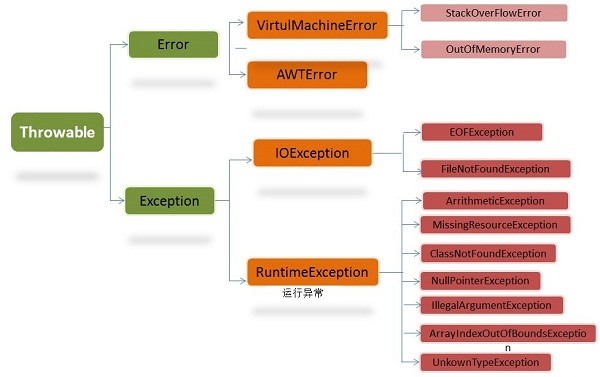
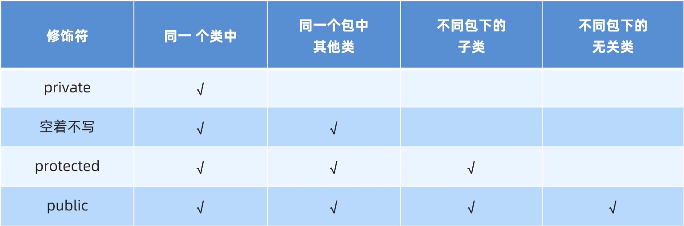

## Java 项目的结构

project > module > package > class

> [!NOTE]

> module 的构建系统不同，其构建结构也会不同，package 的位置也会不同。

## 包

全类名是：包名.类名、

```java
包名.类名 a = new 包名.类名();
```

引入包 import 包名。

> 在同一个包(同一个文件夹)内是不需要导包的。

## 修饰符

### 书写顺序

1. Annotations
2. public
3. protected
4. private
5. abstract
6. static
7. final
8. transient
9. volatile
10. synchronized
11. native
12. strictfp

### 权限修饰符



### static

> static 函数

1. 静态方法只能访问静态变量和静态方法。
2. 非静态方法可以访问静态变量或静态方法，也可以访问非静态变量和非静态方法。
3. 静态方法没有 this 关键字。

### final

**1、修饰变量**

当 final 修饰一个变量的时候一般把他作为常量。

**2、修饰方法**

当一个方法被 final 修饰后。表示该方法不能被子类重写。final 方法有一个优点是比非 final 方法要快，由于在编译时已经静态绑定了，不须要在执行时在动态绑定。C++ 的普通函数

**3、修饰类**

当一个类被 final 修饰后，表示该类是完整的，不能被继承。比如 Java 中 String、Integer 类都是 final 类

## 运算

### 运算时隐式转换的规则

取值范围小的，和取值范围大的运算，小的会先提升为大的，在进行运算
byte > short > int > long > float > double

```java
public static void main(String[] args) {
    int a = 10;
    double b = 12.3;
    c = a + b; // c 为 double 类型
}

public static void main(String[] args) {
    long a = 1999999L;
    int b = 5；
    c = a + b;  // c 为 long 类型
}
```

byte short char 三种类型在运算时，都是先生 int 再运算

```java
public static void main(String[] args) {
    byte a = 10, b = 20;
    c = a + b; // c 为 int 类型
}
```

## 方法 method

### 方法重载(静态多态)

同一个类中，方法名相同拳数不同（个数与类型不同）的方法。与返回值无关。

## String

1. String 是 `常量`,常量不可变的。它的每一次改变都是重新申请一块内存，保存改后的字符串，因此内存消耗很大；
2. java 中使用赋值操作符的都属于浅拷贝，但是 String 表现出了非常奇怪的深拷贝特点；因为 String 提供的方法只要是设计到内部数据的变动都会 new 一个新的对象出来。所以一个 String 的操作不会影响到其原先指向的内存

### StringBuilder

String 是 `常量`不可变的，每次拼接都会产生一个新字符串。会浪费很多内存空间。String 在拼接的时候是调用 StringBuilder 在 toString 返回。

eg: s1 + s2 + s3 + s4 > s1s2 + s3 + s4 > s1s2s3 + s4 > s1s2s3s4

而 StringBuilder 是可变的，一个容器。拼接时不会产生其他新字符串。

StringBuilder 常用函数：

1. append()
2. reverse()
3. length()
4. toString() 变回字符串

> StringBuilder 没有重写 equals()方法所以用的时 Object 的 equals(),比较的是地址；

### StringBuffer

StringBuffer 是 StringBuilder 的线程安全型

### StringJoiner

把字符串通过 StringJoiner 来分隔。

> 语法

```java
初始化
StringJoiner sj = new StringJoiner(分隔符, 前缀符, 后缀符);
添加
sj.add("iijij").add("iji");
```

## 类 class

### Object 类

Object 类时 java 的顶级父类，所有类都继承于 object

### this

对象本身的地址

### 类代码块

> 构造代码块

每次构造就会被调用一次；

```java
class c {
    {
        sout("构造代码块");
    }
}
```

> 静态代码块 static{}

```java
class c {
    static {
        sout("静态代码块");
	}
}
```

可以用来对类进行一些初始化操作，只想被调用一次；

好处：https://www.bilibili.com/video/BV17F411T7Ao?p=134 31:14

### 类数组

> 类数组再创建后每个子元素都要初始化

```java
Type t new Type[n];		// 只是创建了n个Type指针。n个值为null的type指针。
for(int i = 0; i < n; i++) {
    t[i] = new Type();	// 把创建的type的地址复制个t[i];
}
```

## 抽象类 abstractclass

为了然你强制重写

### 注意事项

1. 只要有一个抽象方法的类，就是必须为抽象类；
2. 抽象类不一定要有抽象方法；
3. 抽象类无法实例化对象，但是可以有构造函数；
4. 抽象方法( 纯虚函数)就是父类不定义函数体，要求子类必须重写的方法,否则无法实例化对象；

```java
// 抽象函数语法
abstract class c {
	public abstract void func();
}
// C++ 纯虚函数   C++纯虚函数 == java抽象方法
virtual void func() = 0;
```

## 接口 Interface

接口侧重与一个功能(行为)，对功能的抽象，把这个功能通过 implements 加在各个类上

eg： 狗，青蛙会游泳，但是兔子，羊不会游泳，所以游泳这个功能就不能放在 animal 这个父类里面，所以就把游泳这个行为设置成接口；继承到狗，青蛙上；

### 接口和类

1. 特点，接口可以多继承；
2. 接口也不可以实例化对象；
3. 接口类似于，C++的虚继承；
4. 接口不能有普通方法

```java
/* java */
class Animal {
    public abstract void speak();
}
interface swim {
    public void swim(){
        sout("游泳");
	}
}
interface house {
    public void house(){
        sout("看家");
    }
}
// 继承animal,扩展swim，house功能，
class Dog extends Animal implements swim, house {

}
```

```C++
/* C++ */
class Animal {
public:
    virtual void speak() = 0;
};
class swim {	// 虚基类
public:
    void swin() {
    }
};
class house {
public:
    void house() {
    }
};

class Dog : public Animal, virtual public swim, virtual public house {

}
```

### 接口的成员特点

1. 只能是常量，默认修饰符为 public static final；
2. 没有构造方法，无法实例化对象；
3. 成员方法

jdk7 以前：接口只能是抽象方法；

默认修饰符为：public abstract，所以接口的所有方法必须重写；

jdk8 新特性：接口可以定义方法体；

public default void fun(){

}

如果类继承了两个接口，两个接口有同名的 default 的方法，这子类必须重写；

jdk9 新特性：接口可以定义私有方法体

### 接口和接口

1. 接口可以多继承接口

## 继承

### Java 与 C++在继承多态上的异同

1. 在 java 中所有类的祖先都是 Object 类，当一个类没有父类时，java 会自动加一个 object 父类
2. java 的默认函数是 c++ 的虚函数。java 函数加了 final 就是 c++的普通函数
3. C++ 纯虚函数(抽象函数) == Java 抽象函数
4. C++ 抽象类 == java 抽象类 (有一个抽象函数的的类就是抽象类)
5. C++ 虚基类 == Java 接口

### 继承规则

1. 父类的一切变量都能被继承。
2. 构造函数都不能被继承
3. 私有 方法不能被继承，非私有方法能被继承

### 方法的重写

方法的重写就是把父类的 `虚方法表`中的方法覆盖，换上自己的。

注意父类的方法和子类的方法必须完全一模一样，参数列表不能变；

### super 和 this

```java
public classc (type a, type b, type c) {
    super(a, b);
    this.c = c;
}
```

## 多态 Polymorphism

同类型的对象，表现出的不同形态，特点子传父类

### 注意事项

> 子传父类的调用规则

```java
class Animal {
    String name = "动物";
    public void speak() {
        System.out.println("Animal speak");
    }
}
class Dog extends Animal {
    String name = "狗";
    public void speak() {
         System.out.println("Dog speak")
    }
}

Animal a = new Dog();
```

1. 调用成员变量，java 调用的是父类的变量，如果没有编译失败。无法调用子类的变量

```java
System.out.println(a.name);
// 输出为：动物
/*
调用成员变量时，使用父类来调用的，变量无法被覆盖。所有没有权限调用子类的变量
*/
```

2. 调用成员函数，调用的是子类的函数，如果没有编译失败。

```java
a.speak();
// 输出为：Dog speak
/*
因为java的普通函数就是虚函数。所有函数放在一个表里，函数表是可以被覆盖的。
在创建Dog时候，Dog的speak()直接把Animal的speak()给覆盖率(重写)。
*/
```

### 变量强转

> 由于子传父类不能调用子类独有的功能。父类可以被强制传化成子类。

```java
Animal a = new Dog();
Dog d = (Dog)a;
d.speak();
((Dog)a).speak();
```

### instanceof 判断变量的 type

```java
class a;
class dog extends a;
class cat extends a;
// 子类instanceof父类都是true
new dog() instanceof a; // true
new cat() instanceof a;	// true
// 子类instanceof子类是false
new dog() instanceof cat;	// false
new cat() instanceof dog;	// false

// 判断变量a是不是Dog类型
if(a instanceof Dog ){
    Dog d = (Dog)a;
    d.speak();
}
else  {
    sout("不是Dog类型，无法强转");
}

// jdk14, 直接如果是直接复制给d
if(a instanceof Dog d){
    d.speak();
}
else  {
    sout("不是Dog类型，无法强转");
}
```

## 内部类

ArrayList 的迭代器 iterator 就是内部类；

当 innerClass 是 outerClass 的一部分，但是 innerClass 单独存在没意义，就可以设计出内部类；

### 语法格式

```java
class OuterClass{
    // ...
    class InnerClass {
        // ...
    }
}
```

### 特点&注意

1. 内部类可以直接访问外部类的所有成员
2. 外部类要访问内部类必须要创建对象；
3. 在 jdk16 后内部类才可以定义静态对象；

### 成员内部类

成员内部类是外部类的属性

```java
public class ArrayList {
    private int a = 10;

    public class inner {
        private int a = 20;
        public void show() {
            int a = 30;
            sout(Outer.this.a);	// 10
            sout(this.a);	// 20
            sout(a);	// 30
        }
    }

    private class iterator {
    }

    public iterator iterator(){
        return new iterator();
    }
}
/* 创建内部类 */
ArrayList.inner in = new ArrayList().new inner();

ArrayList arr = new ArrayList();
object a = arr.iterator();


```

### 静态内部类

### 局部内部类

### 匿名内部类

> 语法

```java
/* 实现接口 */
public interface Swim{
    public abstract void swim();
}
new Swim(){
    @Override
    public void swim(){
        sout("重写游泳方法");
    }
}
// 翻译就是 new 了一个实现了Swim接口的类的对象
public class_name implements Swim {
    @Override
    // 构造函数
    public void class_name(){
    }
    public void swim() {
        sout("重写游泳方法");
    }
}
Swim s = new class_name();


/* 继承类 */
public class Animal {
    public void speak(){
        sout("动物说话");
    }
}
new Animal() {
    @Override
    public void speak() {
        sout("重写说话方法");
    }
}
// 翻译就是 new 了一个继承了Animal类的类的对象
public class_name extends Animal {
    @Override
    // 构造函数
    public void class_name(){
    }
    public void speak() {
        sout("重写说话方法");
    }
}
Animal a = new class_name();
// 这些类就可以传入父类;
```

> 讲解
>
> 视频讲解：https://www.bilibili.com/video/BV17F411T7Ao?p=143

```java
public class Main {
	public static main() {
        method(new Animal(){
            // 匿名内部类的内容
           @Override
           void speak(){
               sout("继承了动物类的匿名对象 说话");
           }
        })
    }
    void method(Animal a){
    	a.speak();
	}
}
class Animal{
    void speak(){
        sout("动物说话");
    }
}
```

在上面的实例中，匿名内部类包含了类的实现，方法重写，创建对象，被创建的匿名类对象被传入了其父类 Aniaml 中。由于匿名类重写了 speak()方法，method 在调用 speak()时就实现了多态；

匿名内部类的作用是当你像实现 `多态`而 `重写`传入参数的方法且这个 `重写的方法`只被使用一两次时(因此你不需要一个名字来分辨它)，帮你快速的创建一个继承了你要重写方法的所在类的类，并 new 一个对象；

> 在对 ArrayList 排序时使用的 Comparator `<E>`典型使用了匿名内部内；

```java
Collections.sort(shapes, new Comparator<>() {
    @Override
    public int compare(Shape o1, Shape o2) {
        return o1.getArea() > o2.getArea() ? 1 : -1;
        // 是负数-1说明小，要放在前面，正数1说明大，要放在后面；
    }
});
/* 自定义类Shape要排序时，就要重写Comparator<>的compare方法来定义Shape的排序规则，但是排序规则只要被使用一次，所以用匿名内部类来继承comparator<>接口，并重写compare,利用多态来实现Shape的排序;
*/
Collections.sort()

```

## Lamdba 表达式

> 语法

```java
(参数列表)-> {
    // 方法体
}
```

> 注意要点

1.Lambda 表达式可以简化匿名内部类的书写，但是只能简化 `函数式接口`的匿名内部类的写法;`函数式接口`就是有且仅有一个抽象方法的接口；接口上方可以加@FunctionalInterface 注解；

**lamdba 代替 匿名内部类**

```java
Collections.sort(shapes, (o1, o2) -> {
	return o1.getArea() > o2.getArea() ? 1 : -1;
});
```

## 方法引用

和 lamdba 使用方式一样。

```java
public class Main {

    private int age;


    public Main(int age) {
        this.age = age;
    }

    public static void main(String[] args) {
        Main[] mans = {};
        Main m = new Main(2);

        Arrays.sort(mans, m::com);
    }

    public int com(Main a, Main b) {
        return a.age - b.age;
    }
}
```

## 泛型

### 泛型类

```java
class animal<E> {
}
```

### 泛型方法

```java
public static <E1> method(E1) {
}
```

### 泛型通配符 ?

泛型不具备继承性的，在遇到下面的情况是会报错

```java
class GradeFather {
}
class Father extends GradeFather {
}
class Son extends Father {
}
ArrayList<GradeFather> listGradeFather = new ArrayList<>();
ArrayList<Father> listFather = new ArrayList<>();
ArrayList<Son> listSon = new ArrayList<>();
// ArrayList 是泛型的，但是它不具备继承;
method(listGradeFather);	// 没问题
method(listFather);			// 报错,
method(listSon);			// 报错

// 只能传递ArrayList<GradeFather>
public static void method(ArrayList<GradeFather> list){}
```

就可以用泛型的通配符来实现继承；

```java
class GradeFather {
}
class Father extends GradeFather {
}
class Son extends Father {
}
ArrayList<GradeFather> listGradeFather = new ArrayList<>();
ArrayList<Father> listFather = new ArrayList<>();
ArrayList<Son> listSon = new ArrayList<>();

// <? extends Father> 表示继承了Father的任意类
public static void method(ArrayList<? extends Father> list){}
// <? super Father> 表示Father的所有父类
public static void method(ArrayList<? super Father> lilst){}
// <?> 表示任意类
public static void method(ArrayList<?> list){}
```

## 异常 throwable


### 运行时异常 RuntimeExeption

代码在运行是才能出现的异常。

### 编译时异常

在编译阶段就要处理的异常（如：日期解析异常）。

它的作用更多的是提醒程序员检查本地信息。

### throws & throw

**throws**：写在方法定义外，表示声明一个异常，告诉调用者本方法可能会有那些异常，其中编译时异常必须要写，运行是异常可以不写

**throw**：写在方法内，结束方法，手动抛出异常对象，交给调用者，方法下面的代码不在执行

```java
 // throws 提示方法的调用者该方法可能会抛出的异常
 public static int getMax(int[] arr) throws NullPointerException, ArrayIndexOutOfBoundsException {
     if (arr == null) {
         // 手动创建对象，把异常交给方法的调用者
         // 此时方法就会结束，下面的的代码就不会执行了
         throw new NullPointerException();
     }
     if (arr.length == 0) {
         throw new ArrayIndexOutOfBoundsException();
     }
     int max = arr[0];
     for (int i = 1; i < arr.length; i++) {
         if (arr[i] > max) {
             max = arr[i];
         }
     }
     return max;
 }
```

### try catch finally 语法

> 当 try 里面的代码出现异常，程序会直接跳到 catch，出错代码后面的代码都不会被运行

```java
int[] arr = {1, 2, 3, 4, 5};
try {
    System.out.println(arr[10]);
    System.out.println(2 / 0);
} catch (ArrayIndexOutOfBoundsException ex1) {
    System.out.println("下标越界");
} catch (ArithmeticException ex2) {
    System.out.println("除数不能为零");
}
// 输出为：下标越界
/*
 * arr[10]出错程序直接跳到catch{...},出错后的代码不会被执行
 * */
```

> 只有 `抛出的错误`和要 `捕获的错误`是一致的程序才会继续，否则依然会退出程序

```java
try {
    System.out.println(2 / 0);
} catch (ArrayIndexOutOfBoundsException ex1) {
    System.out.println("下标越界");
}
// 代码抛出的异常是数学异常，而catch捕获的是数组下标异常，所有程序会退出

/* jdk7后可以通过catch() 来捕获多个异常 */
try {
    System.out.println(2 / 0);
} catch (ArrayIndexOutOfBoundsException ex1) {
    System.out.println("下标越界");
} catch (ArithmeticException ex2) {
    System.out.println("除数不能为零");
}
```

> 要捕获的异常有多个，且有父子关系的话，那么父类一定要写在下面；

```java
try {
    System.out.println(arr[10]);
    System.out.println(2 / 0);
    String s = null;
    System.out.println(s.equals("abc"));
} catch (ArrayIndexOutOfBoundsException ex1) {
    System.out.println("下标越界");
} catch (ArithmeticException ex2) {
    System.out.println("除数不能为零");
} catch (NullPointerException ex3) {
    System.out.println("空指针异常");
} catch (Exception ex) {
    System.out.println("Exception");
}
```

**finally** 句块

无条件执行语句，无论 try 有没有异常，finally 都要执行, 经常用来关闭一些链接，一些资源，防止占用。

```java
try {
} catch (Exception e) {
} finally {
     //
}
```

### 异常 throwable 常用方法

1. ex.getMessage() : 返回异常的简单描述
2. ex.toString():返回异常的名字，描述
3. ex.printStackTrace(): 在控制台打印异常信息（异常的名字，描述，错误位置），包含的信息是最多的自定义异常

```java
// 运行时异常 ： 继承 RuntimeException
// 编译时异常 ： 继承 Exception
class NameFormatException extends RuntimeException {
    public NameFormatException() {
    }

    public NameFormatException(String message) {
        super(message);
    }
}
```

### 自定义异常

编译时异常继承 Exeption

运行时异常继承 RuntimeExeption

## 反射

### 获取类的 Class 对象

获取类的 Class 对象

```java
public class Main implements Serializable {
    @Serial
    private static final long serialVersionUID = -6324227767345989521L;

    public static void main(String[] args) throws ParseException, IOException, ClassNotFoundException {
        Class c1 = Main.class;
        System.out.println(c1.getName()); //
        System.out.println(c1.getSimpleName()); // Main

        Class c2 = Class.forName("com.xx.Main");
        System.out.println(c1 == c2);// True

        Main m = new Main();
        Class c3 = m.getClass();
        System.out.println(c3 = c2);

    }

```

### 反射的作用

-   通过配置信息调用类的方法
-   结合注解实现特殊功能
-   按需加载 jar 包或 class

可以把大量重复的代码注入到每一类里

## 注解

### 自定义注解

```java

public @interface MyTest {
    String name() default "test";

}
@MyTest(name = "test")


// 只有一个属性，就可以定义特殊属性名 value，使用就不需要指定属性名
public @interface MyTest {
    String value() default "test";

}
@MyTest("test")
```

### 注解的本质是接口

默认值保存在什么位置?

```java
public interface MyTest extends Annotation {
	public abstract String name();
}
```

### 元注解

修饰注解的注解

1. @Target
2. @Retention
3. @Documented
4. @Inherited

#### @Target

使用目标，标记注解可以使用在什么位置

```java
@Target({ElementType·TYPE, Element.FIELD})

TYPE ，类，接口
FIELD, 成员变量
METHOD, 成员方法
PARAMETER, 方法参数
CONSTRUCTOR, 构造器
LOCAL_VARIABLE, 局部变
```

#### @Retention

表示需要在什么级别保存该注释信息，用于描述注解的生命周期。

RetentionPolicy.SOURCE
RetentionPolicy.CLASS
RetentionPoilcy.RUNTIME

#### @Documented

用于描述其它类型的 annotation 应该被作为被标注的程序成员的公共 API，因此可以被例如 javadoc 此类的工具文档化。

Documented 是一个标记注解，没有成员。

#### @Inherited

@Inherited 阐述了某个被标注的类型是被继承的。

如果一个使用了@Inherited 修饰的 annotation 类型被用于一个 class，则这个 annotation 将被用于该 class 的子类。

@Inherited 元注解是一个标记注解

### 与反射配合

```java
Main m = new Main();

Class c1 = Main.class;

Method[]  methods = c1.getDeclaredMethods();

for (Method method : methods) {
	method.isAnnotationPresent(MyTest.class);
	method.invoke(m);
}
```

## 动态代理

```java
UserService userService = ProxyUtil.createProxy(new UserServie())


// 然后调用一些
```

UserService userService = ProxyUtil.createProxy(new )
