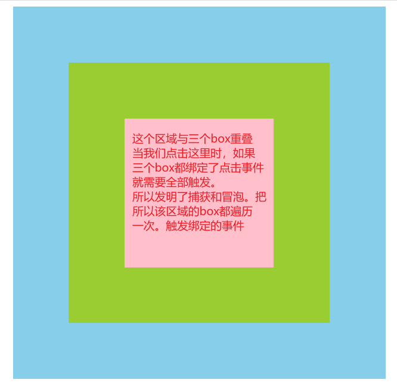
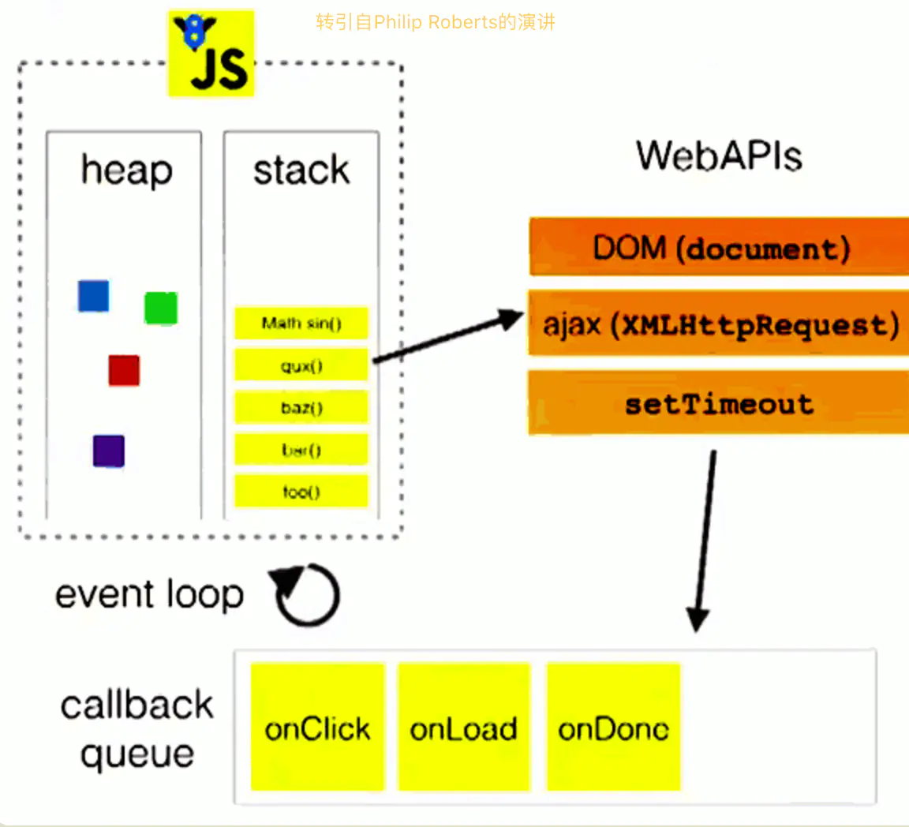
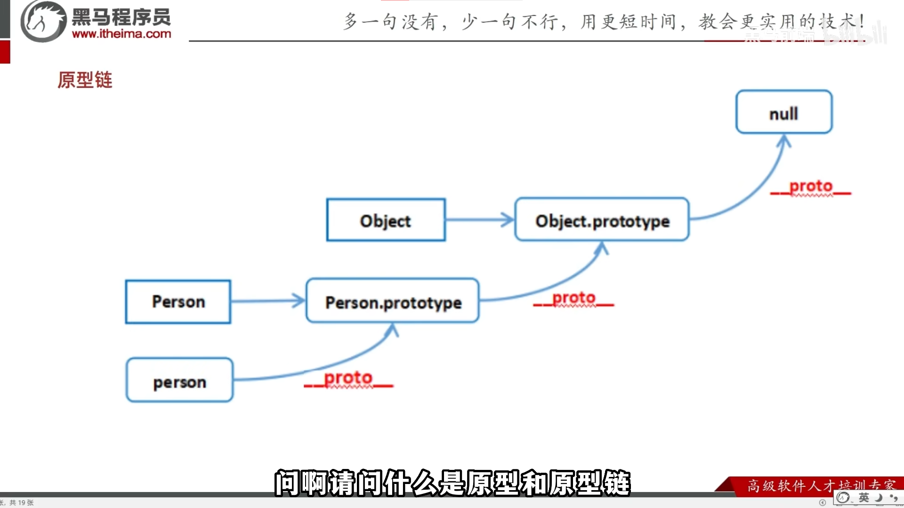

# JS基础语法

## argument

储存了传入函数的实参

```javascript
console.log(argument)
```

## 构造函数

```js
// 关键在this的使用
function a() {
    this.a = value;
}

let ele = new a()
```

## 对象

### 调用属性

1. obj.uname
2. obj['uname']

### 变例对象的属性

```javascript
for(var x in obj){
    console.log(x)
    console.log(obj[x])
}
```

## null

null是一个空对象;不是空的意思；

## let a = b || c

当b没有被定义是把c赋值给a

## +new Date()

js在某些数据类型前使用’+', 是为了将该数据类型转化为Number类型,如果类型转化失败, 则返回NaN

let time = +new Date();
有了+ 之后 有些对象会自动转换成数字

```js
// 所以
true === 1 // false
true+ true + true === 3 // true
```

## 闭包 计数器困境

好处：变量私有性

```javascript
// num变量没有私有,暴露在外，有被更改的风险
let num = 0;
function add(){
    return num++;
}

// 把num闭包在函数里面
// 本质是让num = 0只运行一次，然后再外部可以直接调用plus(),
function add() {
    let num = 0
    function plus() {
        num++
        return num
    }
    // 把plus函数传出去，让外部可以调用；
    return plus
}
// 用add()包住plus()和num,并且把plus()传到外部；
let one = add();
// 

// 写法二
var add = (function () {
    var counter = 0;
    return function () {return counter += 1;}
})();
// 立即执行函数
(function(){})()
```

# DOM

## this

this 指向的是事件函数的调用者

```javascript
btn.onclick = function () {
    // this只向的是btn
    this.disabled = true;
}
```

## 标签自定义属性

### 自定义属性

html5自定义属性规范 data-自定义属性

```html
<div data-index=""></div>
<div data-index-att=""></div>
```

### 自定义属性调用

div.dataset.index

div.dataset.indexAtt

div.dataset['index']

div.dataset['indexAtr']

### 属性操作

* 得到属性 getAttribute()
* 更改属性 setAttribute()
* 删除属性 removeAttribute()

## 节点操作

* 父节点

  element.parentNode() 一个节点；
* 子节点

  element.childNodes 所以孩子包含文本节点，一个集合

  element.children    不包含文本节点

element.appendChild() 给element里面添加节点

## 创建元素

> innerHTML +=

> document.createElement()

## 注册、移除事件

传统的btn.onclick 只能绑定一个函数。而addEventListenner同元素用事件可以添加多个执行函数。不会被覆盖。

```javascript
// 注册
eventTarget.addEventListener('监听事件', '执行函数', '捕获还是冒泡')
eg: btn.addEventListener('click', function(){ alert('hello world') })
// 移除
removeEventListenner('监听事件', '执行函数')
```

## 事件流 捕获和冒泡



> 事件流的三个阶段

1.捕获阶段 2.当前目标阶段 3.冒泡阶段

> js代码只能执行捕获或者冒泡其中的一个

> onclick()和只能是冒泡

> addEventListener('click', function(){}, true) ,第三个参数为true时，是捕获，false或不写为冒泡

> 有些事件是没有冒泡的eg: onblur,onfocus onmouseenter onmouseleave

## 事件对象 event

```javascript
div.addEventListener('click', function(event){
    // event 指向的是click事件,是一个事件对象
})
// 当用户点击时就会创建一个event对象出入执行函数里面；
```

## 阻止冒泡和默认事件

> 阻止冒泡

阻止事件冒泡

event.stopPropagation()方法

stopBubble(event)

> 阻止默认行为, 让链接不跳转

```javascript
a.addEventListener('click', function(event){
    event.preventDefault()
})
```

> 阻止事件冒泡也阻止默认事件

```javascript
a.addEventListener('click', function(event){
    return false 
})
```

## 事件委托 监听动态添加元素

```javascript
// 利用父节点来控制一群子节点，利用了冒泡的原理
// 子节点事件会冒泡到父节点。所以可以用父节点来控制子节点
// 点击li变粉色
let ul = document.querySelector('ul')
ul.addEventListener('click', function (e) {
    // e.target是点击的事件对象，就是子节点；
    e.target.style.backgroundColor = 'pink'
})
```

## 鼠标和键盘事件

鼠标的页面坐标，视窗坐标

# BOM

## 页面加载事件

> onload  页面所以内容加载完毕

window.onload 一个事件只能绑定一个执行函数

window.addEventListener() 一个事件能绑定很多个实行函数

> DOMcontentLoaded

 DOM加载完毕不用等图片等其他文件

## 视窗大小事件

## location对象

```javascript
location.href 		//整个url
location.host		//主机（域名）
location.search		//参数
location.path		//路径


```

## navigator对象

可以得到用户浏览器和操作系统信息

navigator.userAgent

## history对象

## offset

元素的

## scroll

# js异步

## 运行原理

异步

* setTimeout(callback, time) 中time是时间到后callback会被放到任务队列里等待执行，不是时间到后立马执行；
* 异步中不管是setTimeout,async\await都是等待主线程任务执行完了在看任务队列；

> 事件循环

当调用栈（call stack）被清空就要去任务队列看有没有任务，有就到放到调用栈(call stack)里，等调用栈（call stack）被运行完后，又去任务队列看看有没有任务，一直循环下去



## 计时器

time是放到任务队列的事件不是时间到后立马执行；

运行一次：let timer =  setTimeout(function callback(){} , time)

运行无数次 let timer = setInerval(function callback(){} , time)

清除计时器 clearTimeout(timer) clearInerval(timer)

# ES6~now

## const

```javascript
const a = 100;
// a不可改变

const a = ['aa', 'aaa', 'afdf']
a.push('fdfd')
// 这是可以的，a的指向不会改变，但是指向的内容会改变
```

## 模板字符串``

> 可以出现换行符

```javascript
let item = ``
```

> 内容拼接$()

```javascript
let b = 6;
console.log(`${b}`);

// 结果为6
```

## 变量的解构赋值

```javascript
const zhao = {
    name: '赵本山',
    age: '12',
    xiaopin: function(){
        console.log("xiaopin")
    }
}
// 原始的调用方法
zhao.name
zhao.age
zhao.xiaopin()

// 解构赋值
let [name, age, xiaopin] = zhao 或者 let {name, age, xiaopin} = zhao
	//调用
name
age
xiaopin()
```

> 应用

```js
// 在传递参数时使用
mysql = {
    host : '127.0.0.1',
    username : 'root',
    password : '123456'
}
function connect({host, username, password}) {
    // 不需要mysql.host;
    console.log(host);
}
connect(mysql)
```

## 语法简化

```js
const obj = {
    fun: function(){
  
    }
    // 可以直接简化；
    fun(){
  
    }
}
```

## 箭头函数

> 语法

```js
let fu = ( 参数列表 ) => {
    // 函数体
}
```

> 箭头函数和普通函数的区别

* 不能作为构造函数来使用
* 箭头函数不适合作为事件回调函数，因为this的指向不是事件的对象
* this 指向的问题

```js
// 普通函数的this是动态的，指向的是函数的调用者
btn.onclick(function(){
    // this指向btn
})

// 箭头函数的内部this都是由定义时外围最接近一层的非箭头函数的this决定其值的
	// 例一
let sum = () =>{
    console.log(this);
}
sum();	//打印结果为window对象
sum.call(school);	// call方法调用，打印结果为window对象


// 例二、箭头函数fn()的定义在obj里所以this的指向和obj一样，obj的this是windows
var a = 'outer';
let obj = {
    a: 'inner',
    fn: () =>{
        console.log(this.a); // 该箭头函数没有外围非箭头函数，this指向window
    }
}
obj.fn();	// 结果为outer


// 例三、箭头函数test()定义在了fn()里，this的指向和fn()一样，fn()的this指向的是它的调用者obj；
var a = 'outer';
let obj = {
    a: 'inner',
    fn(){
        test=()=>{
            console.log(this.a); //此时this指向了fn的this也就是obj对象
        };
        test();
    }
}
obj.fn();	// 结果为inner


// 例四、obj.fn的代码被复制给了bb,那么箭头函数test()就在bb里被创建了，test()的this就是bb的this指向他的调用者windows;
var a = 'outer'
var obj = {
    a: 'inner',
    fn() {
        let test = () => {
            console.log(this.a);
        }
        test()
    }
}
var bb = obj.fn;
bb();	// 结果为outer

/*
* var bb = obj.fn 等价于下面代码
* var bb = function () {
*     let test = () => {
*         console.log(this.a)
*     }
*     test()
* }
*/
```

> 箭头函数的妙用

* setTimeout

```javascript
// setTimeout是window对象里的一个方法，其this是指向window的
let myObj = {
    ms: 'hhhhh',
    fn(){
        setTimeout(function(){
            console.log(this.ms)
        }, 500);
    }
};
myObj.fn();//输出结果为undefined而非我们想要的hhhhh，因为setTimeout指向的this是window

// 普通的解决方法
let myObj = {
    ms: 'hhhhh',
    fn(){
        let that = this;//把fn的this赋给that,that此时指向fn的对象myObj
        setTimeout(function(){
            console.log(that.ms)
        }, 500);
    }
};
myObj.fn();//成功输出hhhhh，但是这样太麻烦了，事实上这样的写法就是ES6代码babel后的ES5写法

// 用箭头函数直接搞定
let myObj = {
    ms: 'hhhhh',
    fn(){
        setTimeout(() => {
            console.log(this.a)
        }, 500);
    }
};
myObj.fn();//成功输出hhhhh,利用了箭头函数this为外围非箭头函数fn的this
```

## rest 参数必须要放到参数最后

```js
function print(...args) {
    console.lgo(args)
}
print('a', 'b', 'c')
// 类似于java的可变参数
```

## ... 扩展运算符

将数组转换成逗号分隔的参数序列

```js
let key = ['a', 'b', 'c'];
function fun(){
    console.log(argument);
}
fun(...key) // 结果：'a','b','c'
```

> 应用

```js
// 数组合并
let arr1 = ['a', 'b']
let arr2 = ['c', 'd']
let mergeArr = [...arr1, ...arr2]

// 数组的克隆
let arr1 = ['a', 'b']
let arr2 = [...arr1]

// 把伪数组转为真正的数组
let divs = document.querySelectorAll('div')
let divArr = [...divs]
```

## Symbol数据类型

## 对象添加方法 up down

## for in/of

## 迭代器和自定义遍历

迭代器返回对象 {vlue, done} vlue:值 done:是否可以继续遍历

用Symbol.iterator()

## 生成器函数

```js
function* gen() {
    // 代码块1
    console.log('代码块1');
    yield '分隔1';
    // 代码块2
    console.log('代码块2');
    yield '分隔2';
    // 代码块3
    console.log('代码块3');
    yield '分隔3';
    // 代码块4
    console.log('代码块4');
}
let iterator = gen()
// next()运行代码块，iterator.next()返回分隔的符的标签
console.log(iterator.next());
console.log(iterator.next());
console.log(iterator.next());
console.log(iterator.next());

/* 运行结果
代码块1
{ value: '分隔1', done: false }
代码块2
{ value: '分隔2', done: false }
代码块3
{ value: '分隔3', done: false }
代码块4
{ value: undefined, done: true }
*/
```

> 生成器函数参数

```js
function* gen(argc) {
    // 代码块1
    console.log(argc);
    let nextParm = yield '分隔1';
    // 代码块2
    console.log(nextParm);
}
let iterator = gen('a')
console.log(iterator.next());
// 第二次调用next函数的参数是yield1的返回值
console.log(iterator.next('nextParm'));

/* 运行结果
a
{ value: '分隔1', done: false }
nextParm
{ value: undefined, done: true }
 */
```

> 应用

* 解决回调地狱

```js

```

## async await fetch

async 和await一起使用

await就是等待，他后面的代码被加入到了任务队列

```js
// async 标记的函数返回的是promise对象
// fetch 返回promise对象
// await 等待Promise成功
async fucntion f() {
    const promiseA = fetch('链接')
    const promiseB = fetch('链接')
    const [a, b] = await Promise.all([promiseA, promiseB])
}
```

## promise

为了解决回调地狱

```js
const p = new Promise(function(resolve, reject){
    // 执行成功 resolve(data)
  
    // 执行失败 reject(err)
})

p.then(value => {
    // value:成功的参数就是data
}, reason=> {
    // reason:失败的参数err
})
```

> all allSettled

都是用来做批量异步的场景

```js
const p1 = new Promise(function(resolve, reject){
  
})
const p2 = new Promise(function(resolve, reject){
  
})
// all() 当p1和p2都成功时，返回的Promise对象才成功，保存这p1，p2的返回值
pall = Promise.all([p1, p2])

// allSettled 不论p1,p2是否成功，返回的Promise对象都成功，保存着p1,p2的状态
pallSettled = promise.allSettled([p1, p2])
```

## class

参考java

构造函数为constructor();

静态成员为 static obj.prototype.

get set

## 数值扩展

## 模块化

> HTML使用模块化

```html
<script type="module">
    import * as m1 from "/path"
</script>
```

> 暴露模块数据

```js
// 分别暴露
export let name = 'name'
export function printName(name) {
    console.log(name);
}

// 统一暴露
let name = 'name'
function printName(name) {
    console.log(name);
}
export { name, printName }

// 默认暴露
export default {
    name: 'name',
    printName: function (name) {
        console.log(name);
    }
}
```

> 引入模块数据

```js
// as 取别名
// 通用引入
import * as m1 from './learn.js'

// 解构赋值
import { name, printName } from "./learn.js"
import { name as N, printName } from "./learn.js"
import { default as N } from "./learn.js"

// 针对默认暴露,只对默认暴露有用
import N from "./learn.js"
```

## prototype 原型 ,原型链


```js
函数都有一个原型 原型也是一个对象例如:
构造函数Array有原型 ，Array.prototype，在prototype上挂载了很多函数。

每一个实例化对象都有一个__proto__属性(包括prototype)，它指向着构造函数的Array.prototyped原型，所以实例可以使用原型的方法。
```


原型链



## globalThis

# Node

## 模块

## path模块

* path.join()	路径合并

推荐使用path.join()来进行路径拼接

* path.basename()

由路径获得文件名;

* path.extname()

由路径获得文件扩展名.mp4;

__dirname 文件当前路径

path.join(__dirname, '\dfda')

# TS

## 类型,和类型设置

```tsx
let a : boolen | string，
// a 可以是boolen类型也可以是string 类型

let a : "fmale" | "male" | 0
// a 只能是三个值中的一个

let a = false
// a 会自动变成boolen类型

let a : {name : string} & {age : number}
a = {name : "aa", age : 23}
```

### unknown

let e : unknown;

unknown 不能赋值给any 外任意变量

要先用typeof 来判断类型才能赋值

```tsx
if(typeof e === "string") {
     s = e;
}
```

或者用类型断言

```tsx
s = e as string
// 表明e一定是string
```

### any

any可以赋值给任意变量，很不安全

### never

与void 类似但不同

void是有对象但是类容为空，never连对象都没有

### object

```tsx
let b: {name : string, age?: number}4
// 表示name 是必要的， age？ 表示有没有都行
b = {name : "fdf"}


let c: {name :string [propName : strig] :any}

```

object 表示一个js对象

let a: object = {}

### type

```tsx
type mytype = 1 | 2 | 3 | 4 | 5
let k:mytype
// k可以被赋值 1，2，3， 4，5，
```

### enum

```tsx
ENUM gender {
    male = 0,female = 1
}

gender.male
gender.female
```

## 数组

number 数组

写法一: let e : number[]

写法二: let e : Array `<number>`

### 元组

固定长度的数组

let e : [number, number]

e = [ 2, 4]

## 函数

```tsx
function fn(): type {
  
}
// type 是返回值的类型，void, string, never

let d : (a:number, b:number)=>number(返回值);
```

## 类型声明文件

xxx.d.ts

在引入第三方js库时，ts不认识这些对象，所以要声明在文件中

```tsx
export interface IElectronAPI {
  loadPreferences: () => Promise<void>,
}

declare global {
  interface Window {
    electronAPI: IElectronAPI
  }
}
```
