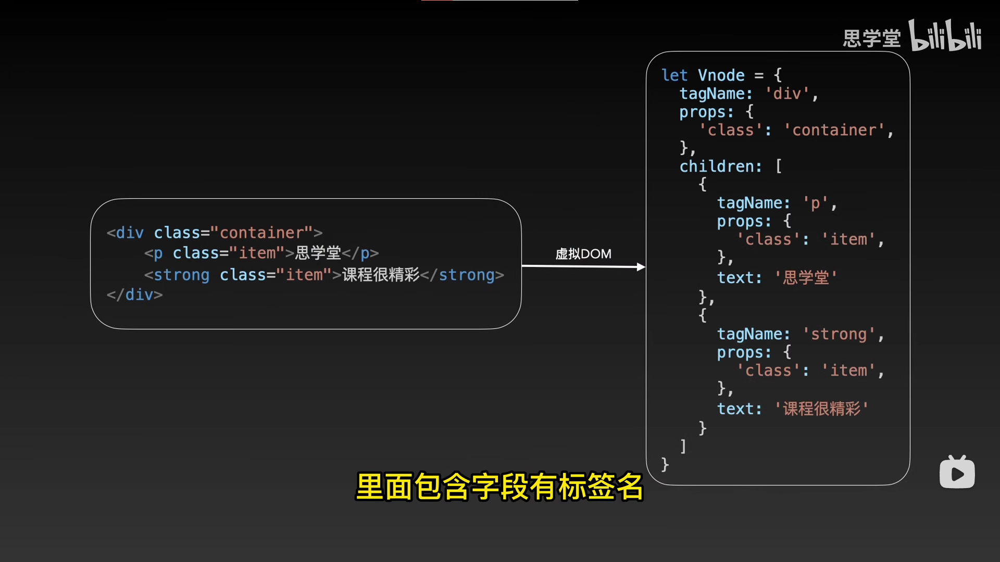

# 搭建环境

> vite 脚手架构建

```shell
npm init vite@latest
```

> vue 配置

```shell
npm init vue@latest
```

> npm 运行脚本

npm run 。。。

# 模板语法

## setup 函数模式

# vue 指令

## v-if= v-else-if= v-else=

条件，不符合调节会直接注释掉

```vue
<template>
    <div v-if="num == 1">1</div>
    <div v-else-if="num == 2">2</div>
    <div v-else>3</div>
</template>

<script setup lang="ts">
const num: number = 3;
</script>
```

## v-show=

不符合条件会设置属性 display:none, 所以性能比 v-if 高

## v-on: 和 @监听

```vue
<template>
    // 监听的两种写法
    <button v-on:click=""></button>
    <button @click=""></button>

    // 动态的监听事件切换,通过改变量event来改变监听事件
    <button v-on:[event]=""></button>
    <button @[event]=""></button>

    // 修饰符 // 阻止冒泡
    <button @click.stop=""></button>
    // 阻止默认操作
    <button @click.prevent=""></button>
</template>

<script setup lang="ts">
let event = "click";
</script>
```

## v-bind: 和 : 绑定

```vue
<template>
    // 绑定的两种写法
    <div v-bind:id="id"></div>
    <div :id="id"></div>

    // 绑定多个类
    <div :class="['a', 'b']"></div>
    <div :class="[flag ? 'a' : 'b']"></div>
</template>

<script setup lang="ts">
let id = "123";
let flag = true;
</script>
```

## v-model 绑定表单

```vue
<template>
    <input type="text" v-model="a" />
    <div>{{ a }}</div>
</template>

<script setup lang="ts">
import { ref } from "vue";

// a就变成响应式了，随着输入框的改变，{{a}}也会改变
const a = ref();

let str: String = "初始值";
const r = ref(str);
</script>
```

## v-for= 遍历

```vue
<template>
    // 普通遍历
    <div v-for="item in arr">
        {{ item }}
    </div>

    // 带索引
    <div :key="index" v-for="(item, index) in arr">
        {{ index }} - {{ item }}
    </div>

    // 嵌套的
    <div v-for="father in arr1">
        <div v-for="son in father">
            {{ son }}
        </div>
    </div>
</template>

<script setup lang="ts">
const arr: string[] = ["a", "b", "c"];
const arr1: any[] = ["a", ["b1", "b2"], "a"];
</script>
```

## v-once

只渲染一次

## v-memo

```vue
<div v-memo="[item == 2]"></div>
// item==2成立时跳过
```

## :key

数据库的 id

# 虚拟 dom

## 什么是虚拟 dom Vnode

虚拟 dom 就是把一个 dom 节点通过 AST 转化成一个 js 对象



## 为什么要虚拟 dom

一个 dom 节点的属性是很多的，直接操作 dom 是很浪费性能的。如果操作 js 对象是很块的，也可以用一下算法优化例如 diff 算法；

# diff 算法

## diff 算法的作用:

当我们想修改 html 的文本类容，就操作虚拟 dom 对象。diff 算法就是 `对比`js 对象（虚拟 dom）找出差异，来更改真实的 dom。 使得最小化更新视图。

## Vue3 版本 diff 算法的区别

vue3 只对比了头和头尾和尾

vue2 对比了头和头，尾和尾，头和尾，尾和头；

## 没有:key 的 diff 算法

三种步骤：

1. 比较：一样跳过，不一样替换节点
2. 新增：少了加一个节点
3. 删除：多了删除节点

## 有:key 的 diff 算法

有 key，旧节点就可以复用了，减少了操作

五步骤

1. 先头和头比较
2. 尾和尾比较
3. 新的多在 dom 上增加
4. 旧的多在 dom 上删除
5. 无序。

:key

# ref 和 reactive 响应式

## ref 深响应

```vue
<template>
    <div>{{ c }}</div>
    <div ref="dom"></div>
</template>

<script setup lang="ts">
import { ref, shallowRef } from "vue";
// 可以动态响应变量显示；
const c = ref();

// 也可以动态读取dom元素
const dom = ref<HTMLVideoElement>();
dom.value?.innerText;
</script>

// ref深响应 const person = ref({ name: 'name', age: 12 }) //
ref是一个class类要先调用value 来修改值 person.value.name
```

## shallowRef 浅响应

```vue
// shallowRef 浅响应 // 改value下的的值无法实现响应式 person.value.name =
'Name'; // 必须要改整个value才行 person.value = { name: 'Name', age: 13 } // ref
会影响shallowRef所以不能一起用。
```

## triggerRef

triggerRef 会整理所以响应遍历。去更新显示

为什么 ref 和 shalllowRef 不能一起用？

因为 ref 会调用 triggerRef，会连 shallowRef 一起跟新

## customRef

用户自定义 Ref,防抖

## reative

ref 支持所有类型 reactive 引用类型

ref 取值赋值都需要先调用.value reactive 可以直接调用

# to

## toRef

把一个响应式类拆开，拆开后的依然能响应

```vue
<template>
    <button @click="exchange">trt</button>
    {{ person.name }}
    {{ person.age }}
    {{ person2.name }}
    {{ person2.age }}
</template>
<script setup lang="ts">
import { ref, toRef, reactive } from "vue";
const person = ref({ name: "Person", age: 12 });
const person2 = reactive({ name: "Person2", age: 13 });
// 需先调.value
const a = toRef(person.value, "name");
const a2 = toRef(person2, "name");

function exchange() {
    a.value = "person改变";
    a2.value = "person2改变";
}
</script>
```

## toRaw

取消响应式

# computed

计算

# watch 侦听器

```vue
import {watch} from 'vue'

let message = ref<string>()
watch(message, (newVal, oldVal) => {

}, // option 配置
    {
    // 深度监听；
    deep: true
    // 立即执行一次
    immediate:true

})
```

在 Vue 3 中，`watch`函数用于监听响应式数据的变化，并在被监听的值发生改变时触发回调函数。

某些情况下需要使用函数作为侦听源，而另一些情况下可以直接使用值作为侦听源，这取决于被监听的数据的响应性。

1. 函数作为侦听源： 当将函数作为侦听源时，可以监听一个可能随时间变化的响应式属性或计算属性。函数将被惰性地评估，这意味着 Vue 会自动追踪函数内的响应式依赖关系。如果其中任何一个依赖发生变化，将触发侦听的回调函数。这种方式在需要监听复杂表达式或动态变化的值时非常有用。

    例如，`watch(() => route.params, (newVal) => { console.log(newVal); })` 用于监听 `route.params` 对象。由于 `route.params` 可以动态变化，使用函数作为侦听源可以确保 Vue 追踪 `route.params` 对象的变化，并在发生变化时触发侦听的回调函数。

2. 值作为侦听源： 直接将值作为侦听源传递给 `watch` 函数时，Vue 将其视为静态值，不会进行响应性追踪。这适用于要监听的简单数据属性，它们不需要响应性追踪。

    例如，`watch(value, () => { })` 用于监听 `value` 变量。如果 `value` 是一个简单的数据属性，不需要响应性追踪，可以直接将其作为侦听源而无需使用函数。

总结一下，使用函数作为侦听源可以让 Vue 追踪响应式依赖关系，并在其中任何一个依赖发生变化时触发侦听的回调函数。直接使用值作为侦听源适用于静态或非响应式的数据属性。

# 组件

## 生命周期

```vue
<script setup lang="ts">
// defineProps<{ msg: string }>()

import {
    onBeforeMount,
    onBeforeUnmount,
    onBeforeUpdate,
    onMounted,
    onUpdated,
    onUnmounted,
    ref,
} from "vue";

// 创建前
onBeforeMount(() => {});
// 创建后
onMounted(() => {
    // 创建后才能获取到dom
});
// 更新前
onBeforeUpdate(() => {
    // 获取到更新前的dom
});
// 更新后
onUpdated(() => {
    // 获取到更新后的dom
});
// 卸载前
onBeforeUnmount(() => {});
// 卸载后
onUnmounted(() => {});
</script>
```

## 组件传值

-   父组件给子组件传值

传递 msg，arr

**父组件**

```vue
<template>
    <son :msg="msg"></son>
</template>

<script setup lang="ts">
import son from "./son.vue";
let msg: string = "hello";
</script>
```

**子组件**

```vue
<template>模板可以直接调用：{{ msg }}</template>
<script setup lang="ts">
import {
    onBeforeMount,
    onBeforeUnmount,
    onBeforeUpdate,
    onMounted,
    onUpdated,
    onUnmounted,
    ref,
} from "vue";

// 接收父组件传过来的值

// ts
const props = defineProps<{
    msg: string;
    arr: number[];
}>();
// ts调用方法
props.msg;
// ts定义默认值
withDefaults(
    defineProps<{
        msg: string;
        arr: number[];
    }>(),
    {
        msg: "默认值",
    }
);

// js和定义默认值
const props = defineProps({
    msg: {
        type: String,
        default: "默认值",
    },
    arr: {
        type: Array,
        default: [32],
    },
});
</script>
```

-   子组件给父组件传值

**父组件**

```vue
<template>
    <son @on-click="handle"></son>
</template>
<script setup lang="ts">
import son from "./son.vue";
const handle = (name: string, address: string) => {
    console.log(name, address);
};
</script>
```

**子组件**

```vue
<template>
    <button @click="send"></button>
</template>

<script setup lang="ts">
import { emit } from "process";

const emit = defineEmits<{
    (e: "on-click", name: string, address: string): void;
}>();

const send = () => {
    emit("on-click", "参数1", "参数2");
};
</script>
```

也可以暴露变量和方法

## 全局组件

在 main 文件 import 引入，然后注册 comp

## 递归组件

## 动态组件 component

通过挂载到 component 组件实现动态加载组件

shallowRef, markRaw

## 插槽 slot

# 异步组件

## 骨架屏 skeleton

## 代码分包

# nextTick

# keep-alive

# transition

## transition-group

# 依赖注入 provide inject

父组件向子组件传递数据使用原型链

# vue-router

<a href="/a"> 页面会刷新

<vue-link to='/a'> 页面不会刷新。
