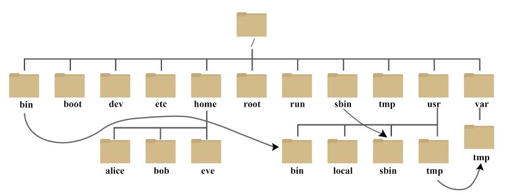

# 准备

## 插件

**[zsh-syntax-highlighting](https://github.com/zsh-users/zsh-syntax-highlighting/tree/master)**


**[zsh-autosuggestions](https://github.com/zsh-users/zsh-autosuggestions/tree/master)**


切换

chsh -s /bin/bash

```shell
# change shell

chsh -s /bin/bash # 原始shell
chsh -s /bin/zsh # zsh
```


# 环境

## wsl2

```shell
wsl --unregister ubuntu
wsl --install
```


# 配置代理

## wsl

wsl1可以直接使用windows的代理但是到了wsl2，linux就无法使用windows的代理了,

下面是wsl开启代理的方法。

1. 最简单的方法 clash

clash开启tun模式，创建一张虚拟网卡，从网络层接管所有的流量。

## linux

在无GUI的linux下使用机场订阅代理

# 命令提示符

```shell
sorceress@LAPTOP-DE5IT91I:~#

{用户名}@{hostname}:<~|/...><#|$>
```

## ~ 和 /...

`~` 和 `/` 都代表正在操作的目录

~	: 表示用户目录（又叫“用户家目录”），在linux下的真实位置在/home/sorceress

/	 : 表在系统的真实位置，`\` 表示更目录，`\home\sorceress` 表示的就是用户的sorceress的用户目录

## # 和 $

`#`， `$` 是一个提示符，表示用户的权限

`#`	: 说明目前的是用户是有超级权限的root用户

`$`	: 是一般用户的权限

# 开/关机

开机会启动许多程序。它们在Windowsl叫做"服务"(service),在Linux就叫做"守护进程"(daemon)。

```shell
sync	# 将数据由内存同步到硬盘中。
shutdown	# 关机指令，你可以man shutdown来看一下帮助文档。例如你可以运行如下命令关机：
shutdown -h 10	# 这个命令告诉大家，计算机将在10分钟后关机
shutdown -h now	# 立马关机
shutdown -h 20:25	# 系统会在今天20：25关机
shutdown -h +10	# 十分钟后关机
shutdown -r now	# 系统立马重启
shutdown -r +10	# 系统十分钟后重启
reboot	# 就是重启，等团于 shutdown-r noW
halt	# 关闭系统，等同于 shutdown -h now 和 poweroff
```

# 系统目录结构

> linux一切皆文件，没有盘符的概念，linux存储是以挂载的方式，相当于是树状的，源头就是”/“，也就是根目录,



- **bin**

  bin 是 Binaries (二进制文件) 的缩写, 这个目录存放着最经常使用的命令，放置的是在单用户模式维护模式下还能被操作的命令，/bin下命令可以被root和一般账号使用。如：cat、chmod、chown、mkdir、cp等
- **boot**

  放置开机会使用到的文件，包括liunx内核文件以及开机菜单与开机所需配置文件，包括一些连接文件以及镜像文件等。
- **dev**

  dev 是 Device(设备) 的缩写, 该目录下存放的是 Linux 的外部设备与接口设备文件，在 Linux 中访问设备的方式和访问文件的方式是相同的，只要通过访问这个目录下面的某个文件就相当于访问该设备。
- **etc**

  etc 是 Etcetera(等等) 的缩写，这个目录用来存放所有的系统管理所需要的配置文件和子目录。

  系统主要配置文件几乎都放置在这个目录内，如用户账号、密码、各种服务起始文件等、该目录下的文件普通用户可以查看，但只有root用户有权修改。FHS建议不要放置可执行文件（binary）在此目录。

  > **重要的文件**
  >

  - /etc/inittab
  - /etc/init.d/  所有服务的默认启动脚本都是放置在这里的。

    例如启动或关闭iptables命令为

    ```shell
    /etc/init.d/iptables start  #启动
    /etc/init.d/iptables stop   #关闭
    ```
  - /etc/modprobe.conf
  - /etc/X11/  与X Window 有关的各种配置文件放在这里，尤其是xorg.conf这个XServer的配置文件。
  - /etc/xinetd.d/  super daemon 管理的各项服务的配置文件目录。
  - /etc/fstab
  - /etc/sysconfig
- **home**

  系统默认用户的主文件夹，创建账户时会在该目录下自动生成这个用户的主文件夹，一般该目录名是以用户的账号命名的，如上图中的 alice、bob 和 eve。
- **root**

  系统管理员主文件夹，一般希望root的主文件夹与根目录放置在同一个分区中。
- **lib**

  lib 是 Library(库) 的缩写，放置的是在系统开机时用到的函数库以及系统最基本的动态连接共享库，几乎所有的应用程序都需要用到这些共享库。其作用类似于 Windows 里的 DLL 文件，在 `/bin`或 `/sbin`下面的命令会调用到的函数库也在 `/lib`内。

  `/lib/modules/`这个目录下放置内核相关的驱动程序。
- **media**

  `/media`下面放置的是可删除设备。linux 系统会自动识别一些设备，例如U盘、光驱等等，当识别后，Linux 会把识别的设备挂载到这个目录下。
- **mmt**

  与 `/media`功能相似，系统提供该目录是为了让用户临时挂载别的文件系统的，我们可以将光驱挂载在 `/mnt/` 上，然后进入该目录就可以查看光驱里的内容了。
- **opt**

  opt 是 optional(可选) 的缩写，这是给主机额外安装 第三方软件放置目录，比如你安装一个ORACLE数据库则就可以放到这个目录下，默认是空的。
- **proc**

  proc 是 Processes(进程) 的缩写，/proc 是一种伪文件系统（也即虚拟文件系统），存储的是当前内核运行状态的一系列特殊文件，这个目录是一个虚拟的目录，它是系统内存的映射，我们可以通过直接访问这个目录来获取系统信息。

  比如查看某个进程的信息：`ll /proc/pid`

  这个目录的内容不在硬盘上而是在内存里，我们也可以直接修改里面的某些文件，比如可以通过下面的命令来屏蔽主机的ping命令，使别人无法ping你的机器：
  `echo 1 > /proc/sys/net/ipv4/icmp_echo_ignore_all`
- **run**

  是一个临时文件系统，存储系统启动以来的信息。当系统重启时，这个目录下的文件应该被删掉或清除。如果你的系统上有 /var/run 目录，应该让它指向 run。
- **sbin**

  s 就是 Super User 的意思，是 Superuser Binaries (超级用户的二进制文件) 的缩写，这里存放的是系统管理员使用的系统管理程序，`/sbin`目录下的命令只有root用户能够使用，普通用户只有查询的权限。`/sbin`下包含开机、修复、还原系统所需要的命令。

  至于服务器软件程序命令，一般放置在 `/usr/sbin/`。

  本机自行安装的第三方软件产生的命令，则放置在 `/usr/local/sbin/`中。
- **tmp**

  一般用户或者正在执行的程序暂时放置文件的地方。这个目录是任何人可以访问的，需要定期清理。

  存放经常修改的数据，比如程序运行的日志文件（/var/log 目录下）。
- **sys**

  这是 Linux2.6 内核的一个很大的变化。该目录下安装了 2.6 内核中新出现的一个文件系统 sysfs
- **lost+found**

  这个目录一般情况下是空的，当系统非法关机后，这里就存放了一些文件。
- **selinux**

  这个目录是 Redhat/CentOS 所特有的目录，Selinux 是一个安全机制，类似于 windows 的防火墙，但是这套机制比较复杂，这个目录就是存放selinux相关的文件的。
- **srv**

  一些网络服务启动之后，这些服务所需要读取数据的目录。常见的服务例如WWW、FTP等，WWW服务需要的网页数据放置在 `/srv/www/`里面。
- **usr**

  用户的很多应用程序和文件都放在这个目录下，类似于windows下的program files目录。
- **var**

  存放经常修改的数据，比如程序运行的日志文件（/var/log 目录下）。

# 常用命令

## 命令参数

**--help**

命令的帮助文档


## 文件与目录操作

> 所有的linux命令可以组合使用

**ls**

- `-a`  显示全部文件，包括影藏文件
- `-l`   列出所有的文件，包含文件的同件和权限，设有隐燕文件

```shell
ls -a
ls -l
ls -al
ls -ll #文件名将不会被截断，而是会占据多行，使得长文件名更容易阅读。
```

**cd**

跳转

```shell
cd ~ # 回到当前用户所在的目录
```

**pwd**

获取当前所处在的目录

**mkdir / rmdir**

 创建/删除文件夹

```shell
mkdir dir1/dir2/dir3 # 创建多级目录

rmdir仅能删除空的目录，如果下面存在文件，需要先删除文件，递归删除多个目录-p参数即可
```

**cp**

 复制

```shell
cp filePat dirPath

# 覆盖 y/n yes/no
```

**rm**

移除

- **-f** 忽略不存在的文件, 不会出现警告，强制删除
- **-r** 递归删除
- **-i** 互动， 删除询问是否删除

```shell
rm -rf / # 从更目录删除所有的文件
```

**mv**

移动文件或目录 、重命名

- **-f** 强制
- **-u** 只替换已经更新过的文件

```shell
mv [选项] 源文件或目录 目标文件或目录

# 移动， 目录的结尾有一个/
mv file.txt /home/user/documents/

# 重命名
mv 老文件名 新文件名
mv 老文件夹名 新文件夹名

# 移动并重命名
mv file.txt new_folder/new_file.txt
```

**touch**

 创建文件

```shell
touch 文件名
```

**echo**

 输出字符串

```shell
# 把 hello world 插入的到tmp.txt文件的后面
echo "Hello world!" >> tmp.txt
```

## 文件属性的查看和修改

> 看懂文件属性

**ls -l**

使用 `ls -l`命令查看文件的详细属性，会显示下面类似的几行

```shell
-rw-r--r-- 1 用户(文件属于谁)  用户组 文件大小  日期/时间  文件名
```

具体解读如下：

- 第一个字符表示文件类型。常见的文件类型包括 `-`（普通文件）, `d`（目录）, `l`（符号链接）等。
- 接下来的三个字符表示文件所有者的权限。`r`表示读权限，`w`表示写权限，`x`表示执行权限。如果没有相应权限，则显示 `-`。
- 后三个字符表示与文件所有者同一组的用户的权限。
- 最后三个字符表示其他用户的权限。
- `1` 表示与文件相关的硬链接数。
- 用户列显示文件的所有者。
- 用户组列显示文件所属的组。
- 文件大小列显示文件的大小（以字节为单位）。
- 日期/时间列显示文件的最后修改日期和时间。
- 文件名列显示文件的名称。

> 修改文件属性


`-R` 参数在这些命令中具有相同的作用，表示递归操作，即应用操作到指定目录中的所有文件和子目录。这意味着命令将不仅操作指定的文件或目录，还会对其下所有子目录和文件执行相同的操作。

**chgrp**

 更改用户组

**chown**

更改所属用户

**chmod**

 更改9个属性

```shell
chmod [-R] xyz 文件或目录

# r:4    w:2    x:1
# 可读可写不可执行	6
# 可读可写可执行		 7

chmod 777 文件或目录 # 文件赋予所有用户可读可写可执行
```

## 文件查看命令

**cat**

从头开始显示

**tac**

从最后一行显示

**nl**

显示行号

**more**

more	一页一页的显示文件内容（空格代表向下翻页，enter代表向下看一行，）

**less**

空格翻页，上下键翻页

其他操作

- `q`  (quit) 退出
- `f`  行号
- `/`  当前位置向下查找字符串
-  `?`  当前向上查找字符串

**head/tail - n**

查看开头/结尾的n行

## 硬链接与软链接(符号链接)

llinux的链接分为两种：硬链接和软连接

> 硬链接与软链接的区别

**硬链接**

如果给一个源文件 `f1`创建一个硬链接 `f2`，当你把 `f1`删除后，`f2`依然可以正常访问。相当于把一个源文件设置了多个路径，删除时只是把路径删除了，

**软链接**

类似windows下的快挂方式，删除了 `f1`，`f2`的指向就不存在了，也就无法正常访问。

>创建链接

**ln**

```shell
ln 源文件 链接名 # 创建硬链接
ln -s 源文件 链接名 # 创建软链接
```

## Vim编辑器

**命令模式：**

vim 文件名 最先进入的就是命令模式，

- `i`  进入编辑模式
- `:`  进入底线命令模式
- `/`  查找

**编辑模式：**

- `ESC`  退出编辑模式进入命令模式

**底线命令模式：**

- `wq`  保存退出
- `w`  保存
- `q`  退出

## 账号管理

> 添加用户

只能root用户可以使用useradd 添加用户

```shell
useradd -选项 用户名
```

- 选项
  - `-m`  自动创建这个用户的主目录home/用户名
  - `-c`  comment指定一段注释性描述。
- 用户名
  - 账户的登录名

> 移除用户

```shell
userdel -选项 用户名
```

- 选项
  - `-r`  删除用户的文件夹 /home/用户名

> 修改用户

```shell
usermod -选项 修改值
```

- 选项
  - `-d`  修改用户的目录

> 切换用户

```shell
su 用户名
```

> 修改用户密码

**超级用户**

```shell
passwd 用户名
new password
re password
```

**普通用户**

```shel
passwd
current password
new password
re password
```

> 锁定/解锁账户

```shell
passwd -l 用户名 # lock 锁定
passwd -u 用户名 # 解锁
```

>添加用户组

## 磁盘管理


mount/umount

挂载/卸载


## 进程管理


> 查询进程

ps -aux

pstree -pu


> 结束进程

kill -9 进程id


提升用户

sudo su

# 包管理工具

## yum


## apt


