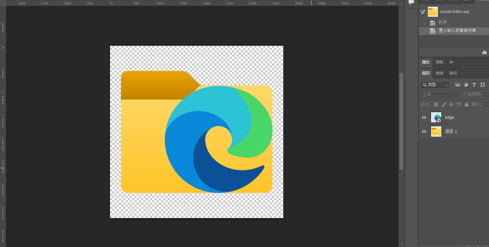

# 图标ICON制作

## 资源的获取

1. iconfont

网址：https://www.iconfont.cn/

资源多，但是杂乱，建议找到想要的图标后，然后找到图标所在的合集。这样能找到风格相近的图标。

2. icons8s

网址：https://icons8.com/

找特定风格的图标很方便。

推荐使用SVG资源。因为SVG可以无限放大。在编辑时会非常方便，而且文件体积小。

你也可以在ps对图标进行简单的编辑导出为PNG。

## 格式转换为ICO

ICON的尺寸有多种规格，推荐256 * 256的。
16 * 16
32 * 32
48 * 48
64 * 64
128 * 128
256 * 256
512 * 512

[图片转ICO图标](http://www.zuohaotu.com/image-to-ico.aspx)这个很专业可以设置尺寸。一般的转换网站无法设置尺寸。
