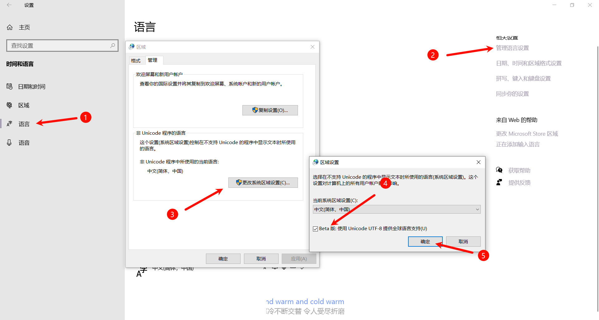
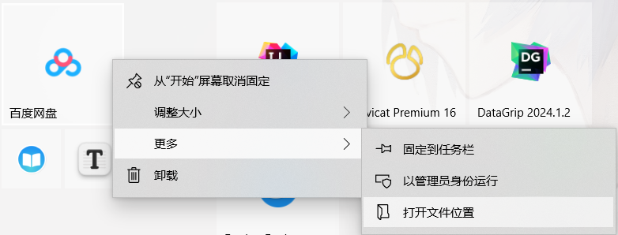
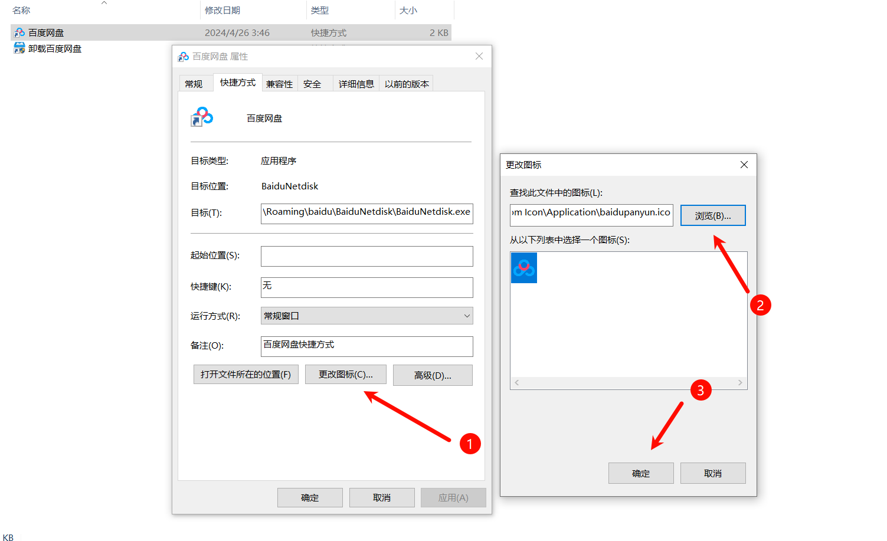
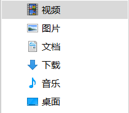
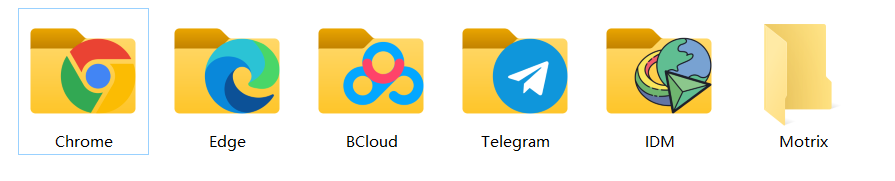
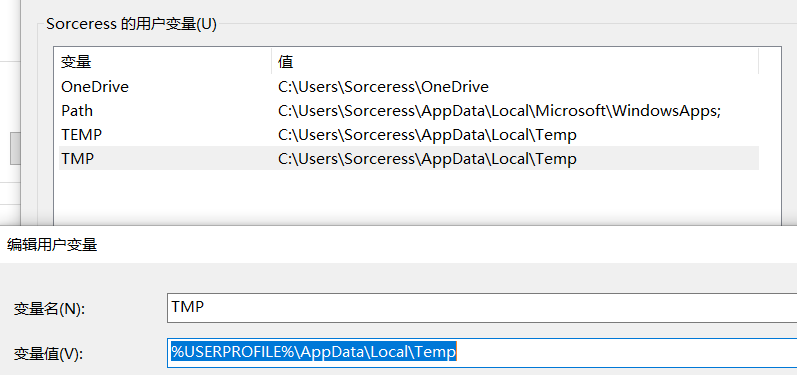
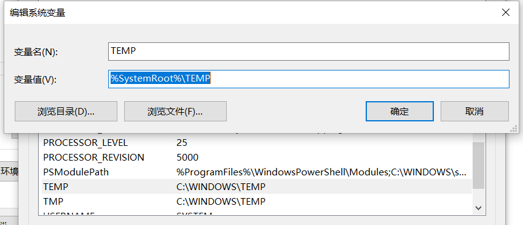

# Windows10 配置

快捷键用【Win + R】包裹

## 将电脑设置为UTF-8编码

【设置】>【时间和语言】>【语言】>【管理语言设置】>【更改系统区域设置】

勾选Beta 版：使用Unicode UTF-8 提供全球语言支持

> **注意**
>
> 如果先将电脑设置为UTF-8编码，再装一些GBK之类的其他编码的软件，会乱码。
>
> 现状其他编码的软件再把电脑设置为UTF-8编码就不会。

## 磁贴背景灰色解决

有些图标在添加到磁贴上，它的背景是灰色的。与其他的图标很冲突。这些图标外边缘颜色是与白色相近的浅色。磁贴为了避免颜色过于接近不好分辨所以自动匹配了灰色。所以我们只要替换图标就可以了。

1. 替换图标的制作：[图标ICON制作教程](../Other/图标ICON制作教程.md)
2. 图标的替换：

## 修改库和OneDirve的路径

修改的其他盘，系统重装恢复不在需要费劲的迁移数据。

## 统一下载路径

把所有软件的下载路径都是设置到Download库中。

## 更改临时数据保存位置

通过环境变量来修改用户临时数据和系统临时数据保存位置

