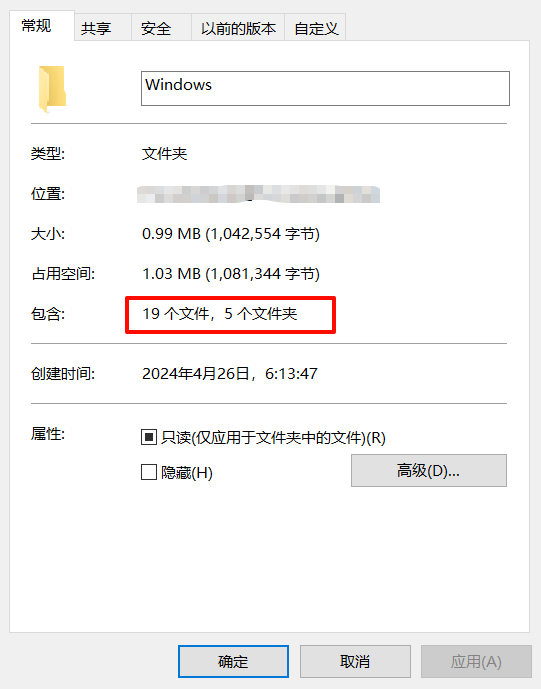
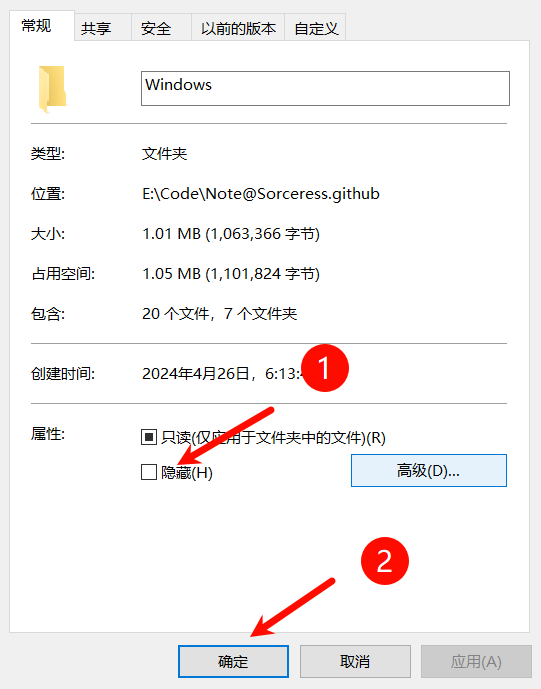
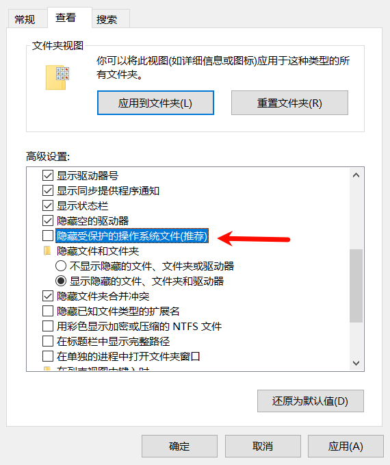

# WindowsInfo

## desktop.ini

## 隐藏文件

不管什么隐藏方法，查看被隐藏文件的父文件夹的属性时依然可以统计这些被隐藏文件。



### 普通隐藏法

选中要隐藏的文件或者文件夹，右键 → 属性 → 隐藏 → 确定。



**显示方法 1：**


**显示方法 2：**

查看 → 选项

然后进行下图操作


### 系统文件隐藏法

打开系统的终端，输入

```powershell
attrib +s +h +r D:\test\1.jpg
```

其中+s 附上系统文件属性 +h 附上隐藏属性 +r 附上只读属性

如果想去掉刚刚附上的属性，只需要将+换为-

```powershell
attrib -s -h -r D:\test\1.jpg
```

下面显示 python 的设置方法

```python
import win32api

win32api.SetFileAttributes(str(ini_file_path), 38)
```

**显示方法 1：**

把 `隐藏受保护的操作系统文件(推荐)` 取消勾选即可.



> 用途

比如 `desktop.ini` 文件就依靠这种方法隐藏

可以在文件夹隐藏自定义的 folder Icon 和 `desktop.ini` 来自定义文件夹.让该文件夹可以跟方便被辨识和查看.


