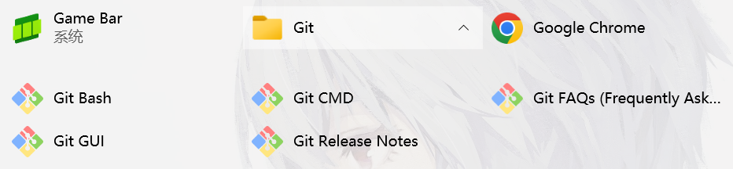
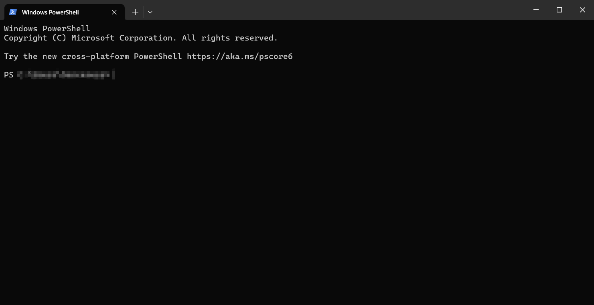
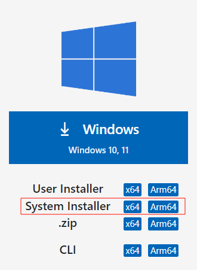
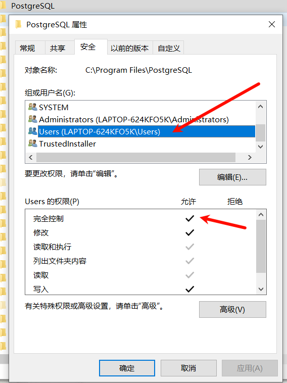
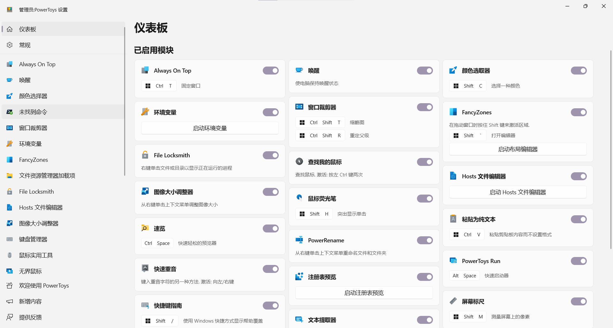
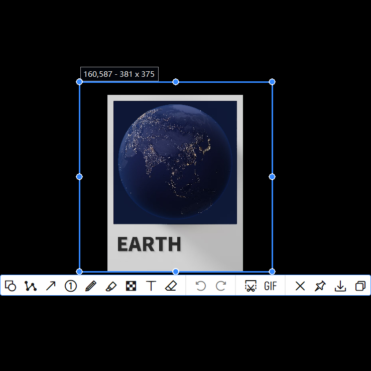
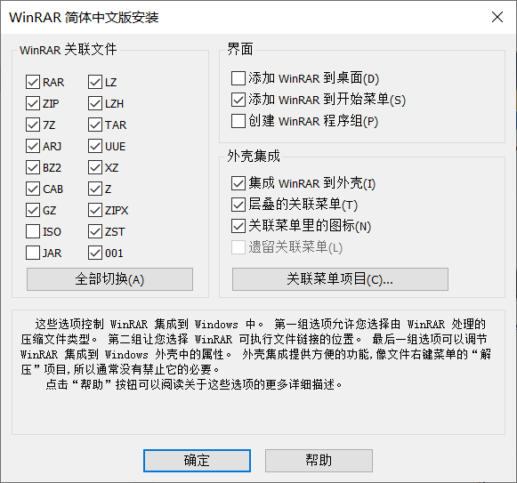

<link rel="stylesheet" href="../.style/auto-number-headers.css">
<link rel="stylesheet" href="../.style/reader-adapt.css">

<title>Windows 软件</title>

# Windows 软件

## 前言

个人软件安装目录。

讲述了安装时要注意的点，以节约个人时间。

参考文件更改日期。

## 必要知识

### 安装位置

无论是需要安装（Setup Executable/Setup.exe）的软件、不需要安装的绿色软件（Protable Software）或者 Microsoft Store 的软件我都安装在 C 盘。

游戏程序的体积很大，单独安装在游戏盘，不安装在系统盘。

系统盘安装路径有：`C:\Program Files`、 `C:\Program Files (x86)`、 `C:\Applications`

`C:\Program Files`和 `C:\Program Files (x86)`是很多软件默认的安装位置。 `C:\Program Files (x86)`是 32 位软件安装目录，Microsoft Store 软件的安装位置在 `C:\Program Files\WindowsApps`

`C:\Applications`，Applications 是一个自建文件夹，它用来存放无法安装在 `C:\Program Files`和 `C:\Program Files (x86)`目录下的软件和绿色软件（Protable Software）。比如 Tor Browsre 安装在 `C:\Program Files`就无法运行。

程序文件放在 C 盘但是软件的数据保存在数据盘，并且用 OndeDirve 去备份软件的配置文件。

### Setup Executable 安装的软件

需要安装的软件会在自动在注册表和 `C:\ProgramData\Microsoft\Windows\Start Menu\Programs`写入一些信息,用户通过【 Win + S 】搜索很方便的找到。

Windows 是多用户多任务的操作系统。因此 Windows 有两种软件安装的方式 `Machine wide` 、 `Per user`


> Machine wide 为使用这台电脑的任何人安装

安装在 `C:\Program Files` 目录下。安装时会要求获取管理员权限。

> Per user 仅为我安装

这种安装程序不需要管理员权限。

他们的安装位置通常在用户目录下，例如：

1. VscodeUserSetup: `C:\Users\\%username%\AppData\Local\Programs`
2. 百度网盘：`C:\Users\%username%\AppData\Roaming\baidu\BaiduNetdisk`

如果你想强制安装在 `C:\Program Files`目录下（不建议这样做），你可以以管理权限运行安装文件，然后更改安装目录到 `C:\Program Files`安装（但是有些 Setup.exe 会识别目录，不给你安装，说你呢百度网盘！）。这样做有些软件可能无法正常运行。

“仅为我安装”，那么安装完成后，软件只能安装软件的这个用户使用，其他用户的开始菜单和桌面上没有这个应用；

“为使用这台电脑的任何人安装”，那么安装完成后，所有用户的开始菜单中都会有这个应用，都可以使用。

细致一点的解释是：

1. 如果选择仅为我安装，那么
   1. 用户不需要提供管理员权限，因为所有可能修改的目录**预期均为用户所有**
   2. 应用的相关资源会被解包到 `%APPDATA%`目录
   3. 应用的开始菜单快捷方式会被创建在 `%APPDATA%\Microsoft\Windows\Start Menu\Programs`中
   4. 应用的相关注册表项会写在 `Computer\HKEY_CURRENT_USER`位置
2. 如果选择为所有用户安装，那么
3. 用户需要提供管理员权限
4. 应用相关的资源会被解包到 `%PROGRAMFILES%`或者 `%PROGRAMFILES(X86)%` 文件夹中
5. 应用的开始菜单快捷方式会被创建在 `%PROGRAMDATA%\Microsoft\Windows\Start Menu\Programs` 中
6. 应用可能在 `%PROGRAMDATA%`中写入一些与用户无关的配置文件
7. 应用相关的注册表项会写在 `Computer\HKEY_LOCAL_MACHINE`位置

如果应用开发符合微软的规范，无论选择那种安装，应用都会将一些与用户相关的配置文件、日志、缓存等写入 `%APPDATA%` ，以实现不同用户使用相互隔离。

### Portable software / unpacked

是一种设计为无需更改其他文件或需要安装其他软件即可运行的程序。也被称为绿色软件

### 程序组

就是在开始页添加一个文件夹，然后在你们加入多个点击选项。



### Emoji 含义

| Emoji | 含义                                                                                                   |
| :---: | :----------------------------------------------------------------------------------------------------- |
|  💲   | 收费                                                                                                   |
|  👿   | 有过恶意行为的软件，比如捆绑安装，更改电脑设置的操作。安装时要保持警惕，仔细观察安装界面的每一个地方。 |

## 📃 Windows 运行库

### VC++库

### Direct X

### .Net Framework

有些软件需要的.net 版本没有可以去[微软官网](https://dotnet.microsoft.com/zh-cn/download/dotnet)下载。

### CUDA Nvidia

> 介绍

Nvidia 没有默认安装。

## 📃 Windows 内置元件

### AVI Video Extension

## 📃 Code 软件

### PowerShell5.1

> 介绍

PowerShell 是一个 `跨平台`（Windows、Linux 和 macOS）自动化和配置工具/框架。你可以在一个平台操作其他平台的 Shell。

Windows 系统应该是自带的。我第一次接触 PowerShell 是大一学 C/C++安装 Visual Studio 时候。

### PowerShell7

> 介绍

PowerShell 7 是专为云、本地和混合环境设计的，它包含增强功能和新功能。可以和 PowerShell5.1 并存。比 PowerShell5 好用。

> 安装

```powershell
winget install --id Microsoft.Powershell --source winget
```

### Windows Terminal

> 介绍

新的 Windows 终端，告别 CMD 和 PowerShell 原本的丑陋外观。它可以集成多个终端，包括 Git、PowerShell、WSL-Ubuntu 等等。



win11 应该是自带的，win10 要自己安装。推荐用 Microsoft Stores 安装，这样方便更新。

### Git

### Microsoft Visual Studio

> 介绍

宇宙第一 ide

大一学 c++用的

### Microsoft Visual Studio Code

> 介绍

一个很好的编辑器。插件多，好玩。

> 安装

官网上大大的下载按钮下载的是 `User Installer`版本,就是只为当前用户安装。如果想要为使用这台电脑的任何人安装的版本（**System Installer**）就要打开下面的[Insiders edition](https://code.visualstudio.com/insiders), or [other platforms](https://code.visualstudio.com/#alt-downloads)页面，



### Navicat Premium 16 💲

> 介绍

老牌的数据库客户端

### JetBrains IntelliJ IDEA 💲

### JetBrains DataGrips 💲

### Fiddler Classic

> 介绍

抓包用的，相较于 Wireshark，Fiddler 有对 https 进行解密的功能，对移动端抓包也很方便。

### APIPost

> 介绍

API 设计对接工具。

### Docker

### JDK 8/11/17

> 安装

8、11、17 各装一个。

分别配置环境变量 JAVA17_HOME

JAVA_HOME=%JAVA17_HOME%

### Nodejs

> 安装

别点那个 Python 环境！

### Python3

> 安装

如果是一路点确认是只给当前用户安装。要点击自定义安装，点击 ALl user install. 如果安装目录变成了 `C:\Program File\Python`就表示成功。

### MSYS2

### MySQL83

> 介绍

关系型数据库，57 被淘汰，80 和 83 的默认端口都是一样的。没有太大差别。

> 安装

选择 Typical 安装方式。

要注意，MySQL 目前有 mysql57、mysql80、mysql83 三种服务名。

关闭开机自启服务。用手动的方式启动

```powershell
# 启动
net start mysql83
# 关闭
net stop mysql83
```

### PostgreSQL15

> 介绍

数据库

> 安装

安装搞半天！

把 `C:\Program Files\PostgreSQL\15\bin`添加到环境变量

PowerShell 运行

```powershell
pg_ctl start
```

去数据保存位置的 `log`目录中看启动报错日志。慢慢的去解决吧。

要给当前用户对 PostgreSQL 文件夹完全控制权限。



### WSL2

> 介绍

Windows Subsystem for Linux，WSL2 的所有网络服务 Windows 也是可以访问到的。

> 安装

```powershell
wsl --install
```

> 配置

修改默认

```powershell
ubuntu config --default-user 用户名
```

## 📃 Tool 软件

### Clash

> 介绍

一个代理

> 安装

官方的 Github 仓库已经删库了。

> 配置

记得下载 Service Mode，开启 Tun 模式。

### V2rayN

> 介绍

代理软件，也支持 tun 模式，但是它的操作逻辑我真不喜欢。反人类。Clash 下位替代品。

> 安装

[Github](https://github.com/2dust/v2rayN)

目前最新版要.Net8 框架

### SSR(ShadowsocksR)

> 介绍

代理软件

> 安装

[Github](https://github.com/shadowsocksrr/shadowsocksr-csharp)

### Microsoft PowerToys

> 介绍

Microsoft PowerToys 是一组实用程序，供高级用户调整和简化其 Windows 体验以提高工作效率。也就是一个工具集合。



> 安装

**文档**

[官方文档网址](https://learn.microsoft.com/en-us/windows/powertoys/)

**Microsoft Store**

[Microsoft Store&#39;s PowerToys page](https://apps.microsoft.com/detail/xp89dcgq3k6vld?hl=zh-cn&gl=HK)

**GitHub**

[microsoft / PowerToys](https://github.com/microsoft/PowerToys)

**PowerShell**

```powershell
winget install Microsoft.PowerToys --source winget
```

推荐 GitHub 安装，可以很方便的自定义安装位置和升级。

> 配置

**粘贴为纯文本功能**

建议把快捷键改为 Win + Ctrl + V， 表示 PowerToys 的粘贴功能

**文本提取**

一个 OCR 功能。支持多个语言。如何添加查看官方文档。

### PixPin

> 介绍

目前只有 Windows 平台的。

一个很好的截图软件，个人觉得比 Snipaste 好用，拥有 Snipaste 所有功能还支持长截图、文字识别等功能。

但是长截图的功能是靠识别屏幕内容来拼接的。有些屏幕内容很像时长截图可能会截取失败。



> 安装

[官网](https://pixpinapp.com/)

### WinRAR 💲

> 介绍

老牌的压缩软件，我也很喜欢，但是只支持 zip 和 rar 格式的压缩。

> 安装

WinRAR 通常有多个版本：中国特供免费版，开发版（rrlb）、正式版（wrr）

第一种有弹出广告，推荐下载正式版（wrr）然后下载破解密钥复制到安装目录。

这里推荐去百度贴吧的[WinRAR 吧](https://tieba.baidu.com/f?kw=winrar&ie=utf-8)去获取资源，吾爱破解的资源可能落后于 WinRAR 吧。

**安装配置**



### 7-Zip

> 介绍

7-Zip 算法的压缩软件。

> 安装

[官网](https://www.7-zip.org)

### Typora 💲

> 介绍

一个 Markdown 阅读软件，但是觉得不如 vscode 里的 Office viewer 插件好用，就是颜值高一点。另一个非常著名的软件是[Obsidian](https://obsidian.md/)但是它图片地址解析的方式我真不喜欢。对其他软件编写的 md 文件的兼容性极差，很封闭，low 的一。我不知道为什么很多人吹。

最后就是，Typora 和 Obsidian 都不支持在文件内引入 css 文件。本文件就引入 css 文件。这里推荐一下 Chrome 的[Markdown Reader](https://chromewebstore.google.com/detail/markdown-reader/medapdbncneneejhbgcjceippjlfkmkg)插件，和 vscode 的[Office Viewer(Markdown Editor)](https://marketplace.visualstudio.com/items?itemName=cweijan.vscode-office)

### Microsoft ToDo

> 介绍

一个任务清单

> 安装

建议在 Microsoft Store 里下载安装。

### Microsoft 便笺

### Microsoft Whiteboard

> 介绍

一个画板，Win + W 右下角就会出现打开按钮。

> 安装

Microsoft Store

### Microsoft Office

### Google Chrome

> 介绍

世界第一浏览器，和 edge 比就是内存占用高

### Microsoft Edge

> 介绍

需要在同一个网站同时登陆两个账号时用，早期 new bing 的 ai 只能在 edge 上用。

习惯使用 Chrome，Edge 的操作我有些不习惯。不过 Edge 的有些功能我挺喜欢的。

### Tor Browser

> 介绍

基于 Foxfair 开发的隐私浏览器，可以访问一下深网之类的，有时候代理被封的时候也可以用 Tor 来访问。

> 安装

好像没有办法安装在 `C:\Program Files`文件夹下,安装了也打不开。

这里推荐安装在 `C:\Applications\Tor Browser`

### IDM 💲(Internet Download Manager)

> 介绍

高速下载器，经常用来高速下载百度网盘的文件。

> 安装

收费

> 配置

把下载目录定向到下载目录的 IDM 下。

### Motrix

> 介绍

功能齐全的下载管理器
支持 HTTP、FTP、BitTorrent、Magnet 等下载。下载软件。

> 安装

[官网](https://motrix.app/)

[Github](https://github.com/agalwood/Motrix)

> 配置

### jijiDown 👿

> 介绍

bilibili 视频下载工具。

> 安装

注意捆绑安装！注意捆绑安装！注意捆绑安装！

### CyberLink PowerDVD 23 💲

> 介绍

很好用的视频播放器，比 Pot Player 颜值高，有些 Pot Player 的小功能它没有。还有就是 PowerDVD 不能给 ISO 镜像文件的影视外挂字幕。

### Pot Player

> 介绍

目前我见过功能最齐全的视频播放器了。但是我建议改一下界面和操作逻辑。

> 安装

[官网](https://potplayer.daum.net/)

### DAEMON Tools Ultra

> 介绍

虚拟光驱软件。上古神器。现在 Pot Player 和 PowerDVD 对光驱的支持也很好，这个软件我也几乎没用过了。

### Gridplayer

> 介绍

网格播放器，可以在一个窗口同时播放多个视频。

> 安装

[vzhd1701 / gridplayer](https://github.com/vzhd1701/gridplayer)

### 百度网盘

> 介绍

PC 端的软件写的是真的烂，只能安装在用户目录。百度网盘也烂，但是百度毕竟是老牌的公司、储存空间也大，大文件和要长时间存储的冷数据文件我还是用百度网盘的。

一坨屎还要在你电脑上的遍地涂抹。

> 配置

关闭同步空间

关闭在文件资源管理器显示

关闭桌面悬浮窗。

### OneDrive

> 介绍

windows 自带的 OneDrive 版本太老，能打开都是一个问题，建议去官网下载最新的 OneDrive 安装

> 安装

[官网下载页](https://support.microsoft.com/zh-cn/office/onedrive-%E5%8F%91%E8%A1%8C%E8%AF%B4%E6%98%8E-845dcf18-f921-435e-bf28-4e24b95e5fc0?ui=zh-cn&rs=zh-cn&ad=cn)

> 配置

注意把数据保存到数据盘。

### Google Drive

> 介绍

Google 的云盘。

### MusicBee

> 介绍

一个音乐管理软件，

### OBS Studio

> 介绍

直播推流，录屏工具

> 安装

[官网](https://obsproject.com/)

### NeatReader

> 介绍

电子书阅读器。支持 PDF、ePub。官方还给了免费的电子书格式转化接口

> 安装

[官网](https://www.neat-reader.cn/)

[官方转化工具](https://www.neat-reader.cn/downloads/converter)

### Stellarium

> 介绍

Stellarium 是一个适用于您的计算机的免费开源天文馆。它以 3D 方式显示真实的天空，就像您用肉眼、双筒望远镜或望远镜看到的一样。

> 安装

[官网](https://stellarium.org/)

### 博客录播助手 BKliveREC

> 介绍

直播录屏软件，支持中国大部分的直播平台。

> 安装

[官网](https://bklivedown.club/)

### uTinyRipper

Unlity 解包工具

### ToDesk

> 介绍

远程控制软件,蛮好用的。

### Adobe Acrobat DC

### Adobe Photoshop

### Adobe After Effects

### Adobe Audition

### Adobe Media Encoder

经常把文件编码成跟适合编辑的格式。

### Topaz Gigapixel AI

图标无损放大

### Topaz Mask AI

抠图

### Topaz Video Enhance AI

视频智能修复软件

### Topaz Adjust AI

智能图像色彩阴影处理

### 邦宁同传

本地免费的同声传译软件。

[官网](https://tongchuan.isyour.love/)

## 📃 Manage Software

### ContextMenuManager

> 介绍

一个右键菜单管理工具。

这里再次批评一下百度网盘的 windows 客户端，不单单界面模糊，而且每次更新我都要去重新关闭他的右键菜单选项。

> 安装

**Github**

[BluePointLilac / ContextMenuManager](https://github.com/BluePointLilac/ContextMenuManager)

### IObitUninstaller 💲

> 介绍

软件卸载软件。

### TotalUninstall 💲

> 介绍

软件卸载软件。IObitUninstalller 不行就是用它。你可自己添加已经安装的软件。他会去分析注册表和「开始」菜单。去删除软件。和[Geek Uninstaller](https://geekuninstaller.com/download)相比没有那么危险。

Geek 会删除软件安装目录下的全部数据。

### Dism++

> 介绍

管理电脑的工具集，我经常用来清理数据。他的系统恢复也挺有用的。

> 安装

[Github](https://github.com/Chuyu-Team/Dism-Multi-language)

### DiskGenius

> 介绍

硬盘检测工具

### Spacesniffer

> 介绍

让您了解文件夹和文件在磁盘上的结构。通过使用 树形图 可视化布局，您可以立即了解大文件夹和文件在设备上的放置位置。让你很方便的清理磁盘。

> 安装

[官网](http://www.uderzo.it/main_products/space_sniffer/index.html)

[官网指向的下载站](https://sourceforge.net/projects/spacesniffer/)

### TrafficMonitor

> 介绍

可以在桌面悬浮窗或者在任务栏显示当前网速和 CPU 及内存利用率等信息的软件。

> 安装

[zhongyang219 / TrafficMonitor]()

### TranslucentTB

> 介绍

使你的任务栏变透明

> 安装

有 Github 仓库，但是建议在 Microsoft Store 安装。

### Western Digital SSD Dashboard

> 介绍

西数硬盘的管理面板。

> 安装

在[西数软件下载页](https://support-en.wd.com/app/products/downloads/softwaredownloads)找到 Western Digital Dashboard 下载

### Lenovo Legion Accessory Central

> 介绍

联系鼠标的管理工具

> 安装

[Lenovo](https://support.lenovo.com/hk/en/downloads/ds539788-legion-accessory-central-for-windows-7-10-64-bit?cid=hk:sem:3hkzcf&gad_source=1&gclid=CjwKCAjwuJ2xBhA3EiwAMVjkVFduwoHnT85iYPZRpzslEmvv_8fKUeXU936erpCHYyMq3PJ8yXW7ihoCHDwQAvD_BwE)

## 📃 Life Sofeware

### QQ 音乐

> 配置

修改缓存位置

### 微信

### 企业微信

### TIM

> 介绍

个人觉得比 QQ 好用。

### Telegram

> 安装

注意，无论是官网还是 Github 都只提供了单用户安装版，默认安装位置为 `C:\Users\Sorceress\AppData\Roaming\Telegram Desktop`。建议改到 `C:\Applications\Telegram Desktop`

## 📃 Game

### 雷神加速器

> 介绍

老牌便宜。

### CustomCrosshair

> 介绍

外置准星。Microsoft Store 下载

### Steam

> 介绍

该死的 G 胖。

### EA

> 介绍

美国腾讯。

### Epic

> 介绍

+1

### Locale Emulator

> 介绍

转区工具

### CreamInstaller

> 介绍

Steam 游戏 DLC 破解，他只能让你可以使用 DLC，不能够提供 DLC 文件给你。所有通常只能破解 DLC 和游戏本体一起下载的游戏。
