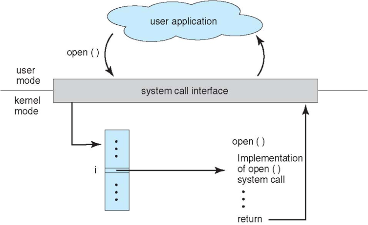
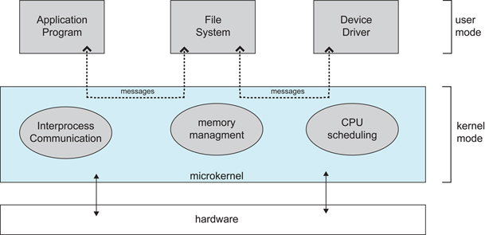
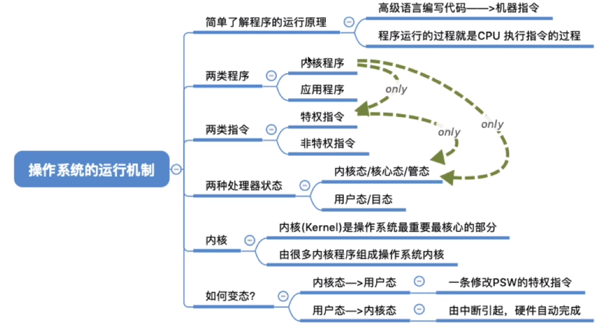
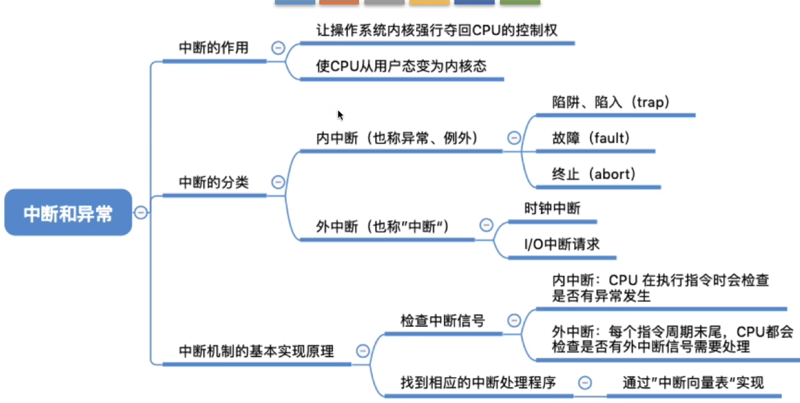

# 计算机操作系统 - 概述

## 基本特征

### 1. 并发

并发是指宏观上在一段时间内能同时运行多个程序，而并行则指同一时刻能运行多个指令。

并行需要硬件支持，如多流水线、多核处理器或者分布式计算系统。

操作系统通过引入进程和线程，使得程序能够并发运行。

**并发和并行的区别**

并行是在同一时刻同时处理两个任务，都是多核处理器才能实现

并发是任务一和任务二交替运行，在宏观上就是同时进行的。

### 2. 共享

共享是指系统中的资源可以被多个并发进程共同使用。

有两种共享方式：互斥共享和同时共享。

**互斥共享**的资源称为临界资源，例如打印机等，在同一时刻只允许一个进程访问，需要用同步机制来实现互斥访问。

使用 QQ 和微信视频。同一时间段内摄像头只能分配给其中一个进程．

**同时共享**允许一个时间段内由多个进程“同时”对它们进行访问。

> 同时是宏观的，即并发

使用 QQ 和微信发送文件 A ，同时使用微信发送文件 B 。宏观上看，两边都在同时读取并发送文件，说明两个进程都在访问硬盘资源，从中读取数据。微观上看，两个进程是交替着访问硬盘的。

### 3. 虚拟

虚拟技术把一个物理实体转换为多个逻辑实体。

主要有两种虚拟技术：时（时间）分复用技术和空（空间）分复用技术。

多个进程能在同一个处理器上并发执行使用了时分复用技术，让每个进程轮流占用处理器，每次只执行一小个时间片并快速切换。

虚拟内存使用了空分复用技术，它将物理内存抽象为地址空间，每个进程都有各自的地址空间。地址空间的页被映射到物理内存，地址空间的页并不需要全部在物理内存中，当使用到一个没有在物理内存的页时，执行页面置换算法，将该页置换到内存中。

### 4. 异步

异步指进程不是一次性执行完毕，而是走走停停，以不可知的速度向前推进。

## 基本功能

### 1. 进程管理

进程控制、进程同步、进程通信、死锁处理、处理机调度等。

### 2. 内存管理

内存分配、地址映射、内存保护与共享、虚拟内存等。

### 3. 文件管理

文件存储空间的管理、目录管理、文件读写管理和保护等。

### 4. 设备管理

完成用户的 I/O 请求，方便用户使用各种设备，并提高设备的利用率。

主要包括缓冲管理、设备分配、设备处理、虛拟设备等。

## 系统调用

如果一个进程在用户态需要使用内核态的功能，就进行系统调用从而陷入内核，由操作系统代为完成。

Linux 的系统调用主要有以下这些：

| Task     | Commands                    |
| -------- | --------------------------- |
| 进程控制 | fork(); exit(); wait();     |
| 进程通信 | pipe(); shmget(); mmap();   |
| 文件操作 | open(); read(); write();    |
| 设备操作 | ioctl(); read(); write();   |
| 信息维护 | getpid(); alarm(); sleep(); |
| 安全     | chmod(); umask(); chown();  |

## 宏内核和微内核

### 1. 宏内核

宏内核是将操作系统功能作为一个紧密结合的整体放到内核。

由于各模块共享信息，因此有很高的性能。

### 2. 微内核

由于操作系统不断复杂，因此将一部分操作系统功能移出内核，从而降低内核的复杂性。移出的部分根据分层的原则划分成若干服务，相互独立。

在微内核结构下，操作系统被划分成小的、定义良好的模块，只有微内核这一个模块运行在内核态，其余模块运行在用户态。

因为需要频繁地在用户态和核心态之间进行切换，所以会有一定的性能损失。

## 处理机的执行状态

cpu 有两种状态，“内核态（管态，系统态）”和“用户态（目态）”处于内核态时，说明此时正在运行的是内核程序，此时可以执行**特权指令**处于用户态时，说明此时正在运行的是应用程序，此时只能执行**非特权指令**。

### 特权指令

系统资源的分配

### 非特权指令

计算加减乘除

> 如果在用户态执行了特权指令会触发中断。

## 中断

在合适的情况下，操作系统内核会把 cpu 的使用权主动让给应用程序“中断”是让操作系统内核夺回 CPU 使用权的唯一途径。让cpu成为内核态。

### 1. 外中断

由 CPU 执行指令以外的事件引起，如 I/O 完成中断，表示设备输入/输出处理已经完成，处理器能够发送下一个输入/输出请求。此外还有时钟中断、控制台中断等。

### 2. 异常（内中断）

由 CPU 执行指令的内部事件引起，如非法操作码、地址越界、算术溢出等。

### 3. 陷入

在用户程序中使用系统调用。

## 系统调用

## 系统引导

系统启动是要运行的程序
