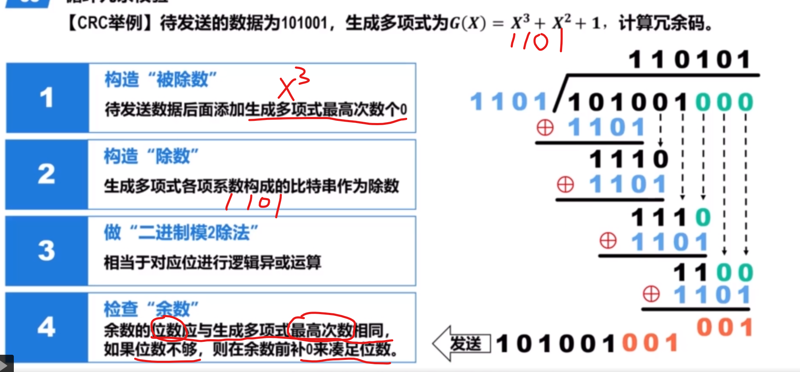
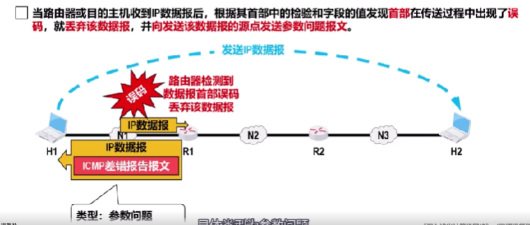
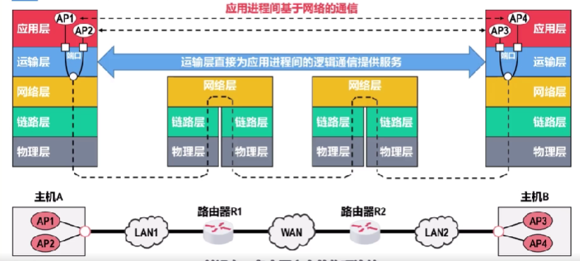

# 计算机网络概述

## 网络的分类

### 法的

* 公共网
* 私用网

### 交换方式

* 电路交换
* 报文交换
* 分组交换

### 覆盖范围

* WAN 广域网
* MAN 城域网
* LAN 局域网
* PAN 个域网

### 拓扑结构

## 网络性能指标

### 速率

要注意B和b是不一样的，1B = 8b(bit)

### 带宽

带宽是线路的传输速率

### 吞吐量

下载速率+上传速率

### 时延

delay = d处理 + d排队+ d传输 + d传播

处理：把数据分组

排队：数据量太大，要排队无法准确测量

传输：把分组从机器传到线路

传播：分组在线路中传播的时间

> 每一个交换网要受到一个分组后储存，它才会向下一个交换网转发。又不考虑排队延迟和处理延迟，所以每交换一次，终点就慢一次分组发送的延时。所以d延时=所有分组的发送延时+一个分组发送延时*2

### 时延带宽积

时延带宽积=传播时延* 带宽

### RTT 往返时间

### 利用率

$$
D = D_0 / 1-U
$$

利用率越高延时越高

### 丢包率

造成丢包的两种情况

1. 误码，交换机会丢弃误码的分组
2. 交换机的输入缓存到达阈值，交换机丢弃分组

## 计算机网络体系结构

### 三种结构

### tcp/ip结构

## 网络设备

### 主机（Host）

主机是计算机网络中的末端设备，如个人电脑、服务器、智能手机等。主机通常运行应用程序，产生和消费网络数据。主机通过网络设备（如路由器和交换机）进行数据的发送和接收。

### 路由器（Router）

路由器是一种网络设备，用于在不同网络之间转发数据包。它连接多个网络，并根据数据包的目标IP地址来确定最佳路径将数据包从源网络传输到目标网络。路由器使用路由表和路由协议来进行数据包的转发和路由决策。路由器在网络层（第3层）操作，例如IP路由。

### 交换机（Switch）

交换机也是一种网络设备，用于在同一网络内转发数据帧。它连接多个主机或其他网络设备，并根据数据帧的目标MAC地址来将数据帧从源设备转发到目标设备。交换机通过学习和维护MAC地址表来确定数据帧的目标设备所在的端口，以实现数据的快速和准确转发。交换机在数据链路层（第2层）操作，例如以太网交换。

# 物理层

## 波

wifi是微波

## 编码与调制

就是把数据编码把它变成一种可以传播的信息

### 不归零编码

### 归零编码

每次都归零，1:由上到下归零，0由下到上归零。

### 曼切斯特编码

向下跳代表1，向上跳代表0;

### 差分曼切斯特编码

每一个码元的中间都跳变一次，代表时钟信号，不表示信息。

数据标识在每一码元开始时是否跳变，无跳变表示1，由跳变表示0

## 香农定理

$$
C= Wlog_2(1-S/N)
$$

$C b/s WHz S/N dB $

## 信道复用技术

### CDMA 码分多址

* 一个站发送数据

* 如果多个站同时发送数据

> 有多个站点时，给个个站点分配的码片序列是伪随机的服从规格化内积为0的规则。 

与自己的规格化为1，与自己的逆规格化为-1

就把个个码片叠加

> 结果为1 发送的是1
>
> 结果为-1 发送的是0
>
> 结果为0 没有发送

# 数据链路层

## 帧frame

### 帧的结构

链路层相当于拆箱和装箱，

每到一个地方就把包装帧（frame）拆开，得到里面的东西（网络层数据）后再封装帧（frame），写上类型，源地址，目的地，发往下一个地方。

### 帧尾、首的作用

1. 帧尾和帧首包含了重要的控制**信息**，
2. 作为帧的**定界**，用作分割一个个的帧

ppp帧的首尾就包含01111110的帧定界标志

以太网V2的Mac帧就没有帧定界标志

## 透明传输

透明传输是指数据链路层对上层交付下来的协议数据单元PDU没有任何限制，就好像数据链路层不存在一样。

### 为什么需要透明传输？

因为帧包裹的数据单元（载荷）有可能 **包含和帧标识符一样的数据** ，这就会导致帧在传输的过程中出错。

### 如何解决？

在传输前，对帧的物理载荷进行扫描，如果包含帧标识符就在前面插入转义字符，接收方在遇到转义字符时，就知道后面的帧标识符不用停。

如果即包含真标识符又包含转义字符，就在转义字符前加转义字符

## 差错检测

### 误码

帧在传输的过程中1有可能会传成0，这就是误码，为了检测出误码就可以更具帧尾中的检错码FCS检查帧中是否有误码

ppp 2字节检错码

### 奇偶校验

### CRC循环冗余校验

* 生成多项式

* 发送方数据处理

* 接收方数据处理

## 可靠传输

如果是不可靠传输，接收方在检查出误码时，会直接丢弃帧，

如果是可靠传输，接收方会向发送方发送重新发送的帧

### 停止等待协议

* 超时重传

如果接收方超时，发送方就重新发送，知道，接收方发送确认帧。

* 重复分组

发送方会发送重复分组

* 重复确认帧

接收方会发送重复的确认帧

### 回退N

### 选择重传

## 点对点ppp协议

### 透明传输

ppp采用字节填充来实现透明传输

## 共享式以太网

现在是交换式以太网

## 网络适配器 网卡

### MAC地址

每一块网卡都有自己唯一的mac地址，用来区分数据是不是传输给你的。

一般设备都有两个网卡，wifi网卡，以太网卡

mac地址就是主机的硬件地址，物理地址（数据链路层）

## 虚拟局域网VLAN

virtual local area network

解决广播风暴

### 实现机制

在帧的首部添加vlan标签

# 网络层

## ipv4

ipv4地址由32bit构成

### ipv4 分类编址方法

> ipv4由32bit构成，有$2^{32 - 固定位长度}$种地址

### A类地址

网络号范围0~127

> 1. 由于A类网络号的0和127很特殊不能指派网络号
> 2. 因为A类地址的网络号的第一位必须是0，所以网络数量是$2^{8-1}$个
> 3. 环回测试地址127.0.0.1~127.255.255.254。我们通常在设置代理时，比如shadowsock默认的地址就是127.0.0.1:1080，为什么浏览器可以直接走代理，而node,cmd,git不能直接直接走代理，而是需要配置的原因。

### B类地址

网络号范围128.0~191.255

### C类地址

网络号范围192.0.0~223.255.255

### 总结

* 不使用的特殊ipv4地址

> 0是源，不能作为目的地址。

### 地址分配

> 注意的是，一个网络不单单主机要分配ip地址，链接主机的路由器接口也要分配一个ip地址。所以ip需求是 主机数+1。所以缺点也就显示出来了，这种分配会造成大量的ip地址的浪费。后面的划分子网就会解决这个问题。

## 划分子网

### 子网掩码

> 如果按上面的子网掩码划分网络的化，192.168.0.4与上面三个ip地址不属于同一个网络。

把子网掩码有多种表示形式

1. CIDR写法：通过1的个数表示

前面是ip地址的种类，后面是1的个数，例如上面的子网掩码可以表示为192.168.0.0/30。

2. 转化成10进制

255.255.255.252

### 划分 FLSM

网络号和子网号组成新的网络号。网络号后面都是主机号。

### 默认子网掩码

## 无分类编址方法 VLSM

正在使用的方法。

子网掩码的1部分直接作为网络号。0部分直接作为主机号

然后主机号0000 ->1111就是主机好的区间，然后按

> 要注意广播地址，和网络地址。几个不能发出，一个不能接收。

### 应用规划

无分类编址（可边长的子网掩码）

> 以网络1为例：
>
> 218.75.230.32/28变成二进制，再第28位分割成网络地址，和主机地址。
>
> 11011010,01001011,11100110,0010   0000
>
> 主机号范围0000~1111，16个ip地址，去除网络地址和广播地址，14个可以地址。

## ip地址与mac地址

### 保存位置

### ip、mac地址变化情况

> mac地址会改变，IP地址不会改变，可是如何通过ip地址找出对应的mac地址呢？--- 地址解析协议ARP

> 要对应接口

### 数据如果再路由器直接传递的

仅使用mac地址，那么每一台服务器的路由表就必须记录所有主机和路由器的各接口的mac地址。这些路由表的构建，更新，存储，查询带来巨大的开销。

因特网的网际层使用P地址进行寻址，就可使因特网中各路由器的路由表中的路由记录的数量大大减少，因为只需记录部分网络的网络地址，而不是记录每个网络中各通信设备的各接口的MAC地址。

> 路由器再接收到帧，先解帧得到网络层数据负载。通过网层数据负载得到**ip地址**，通过地址解析协议ARP对ip地址进行解析。得到下跳路由器的mac地址。然后把自己的mac地址和目的mac地址封装成帧发送

### ARP地址解析协议

1. 发送ARP请求：当路由器收到一个数据包，需要将其转发到目标主机时，它会检查自己的路由表来确定下一跳路由器。**如果下一跳是同一局域网上的主机**，路由器会创建一个ARP请求数据包，其中包含目标主机的IP地址。
2. 广播ARP请求：路由器将ARP请求数据包广播到局域网上的所有主机。广播意味着将数据包发送给局域网上的所有设备，而不仅仅是目标主机。
3. 目标主机响应：如果目标主机在局域网上并且处于活动状态，它将接收到ARP请求并发送一个ARP响应。ARP响应包含目标主机的MAC地址。
4. 路由器获得MAC地址：当路由器收到ARP响应时，它将提取目标主机的MAC地址。该MAC地址将被用于创建转发表项，以便将数据包准确地发送到目标主机。
5. 转发数据包：一旦路由器获取到目标主机的MAC地址，它就可以使用该地址将原始数据包转发到目标主机所在的局域网。

注意：

> arp协议被用来解决同一个局域网上的主机或路由器的ip地址和mac地址的映射问题，不能跨网络使用。

## ip数据报的发送和转发过程

### 网关

就是主机在进行跨网络通信时，应该把数据发送的那个路由器就是网关。网关路由器就会把数据跨网络发送出去

> 1.源主机发送数据 2.判断目的主机是否在同一个网络。在则直接交付；若不在同一个网络，则属于间接交付。发送给主机所在网络的默认网关（路由器），由默认网关帮忙转发。3.网关在收到数据帧后，会去更改目的网络和地址掩码来匹配。如果找到就进行转发。找不到就丢弃ip数据，向源主机报告差错。

### ipv4数据报首部格式。

* 片偏移量
* TTL生存时间

Time To Live,指ICMP包的转发次数（跳数）,该字段指定IP包被路由器丢弃之前允许通过的最大网段数量,TTL的最大值是255，TTL的一个推荐值是64.

每次跳跃，ttl都会减一，当TTL为0时，ICMP包自动销毁，根据协议原路返回，告诉发送者，销毁，通过这个特性可以测出传输延时。

为什么需要TTL？防止被错误路由的ipv4数据报无限制在路由器间兜圈。

* 协议

长度8bit，指明ipv4数据载荷是何种协议的数据单元PDU

* 首部检验和

检测首部的

### ip数据封片

## 路由选择

### RIP 内部网络协议

Rip会每30秒通过相邻的路由器，更换路由表信息。

得到到达个个网络的跳数。

15跳限制的原因，因为rip的错误传递十分缓慢

### OSPF 内部网络

### BGP边界网关协议

不同的自治系统。

### 路由器工作原理

## ICMP报文

为了更有效地转发IP数据报以及提高IP数据报交付成功的机会，TCP/IP体系结构的网际层使用了网际控制报文协i议

### 差错报告报文

* 终点不可达

* 源点抑制

> 注意主机h2也有可能因为拥塞丢弃该ip数据报文向h1发送ICMP差错报告。

* 时间超时

* 参数问题

* 改变路由

### 询问报文

* 分组探测

PING是TCP/IP体系结构的应用层直接使用网际层ICMP的一个例子，它并不使用运输层的TCP或UDP。
PING应用所使用的CMP报文类型为回送请求和回答。

* 跟踪路由

tracert跟踪路由

通过ttl的可跳跃数来得到跳跃到不同路由的往返时间。

## VPN虚拟专用网

## NAT技术 网络地址转换

## ip多播 D类地址

## 移动ip技术

## ipv6

### ipv6首部

### 环回地址

最低比特为1，其余127个比特为“全0”，即0：0：0：0：0：0：0：1，可缩写为：1。
该地址的作用与Pv4的环回地址相同。
Pv6的环回地址只有一个，

### 多播地址

最高8比特为“全1”的地址，可记为FF00:8。
Pv6多播地址的功能与Pv4多播地址相同。
这类地址占Pv6地址空间的1/256

### 全球单播地址

### ICMPv6

## SDN

# 运输层

应用进程到应用进程，端到端。

## TCP传输控制协议

* 传输控制协议(Transmission Control Protocol,TCP)为其上层提供的是面向连接的**可靠**的数据传输服务。
* 使用TCP通信的双方，在传送数据之前**必须首先建立TCP连接**（逻辑连接，而非物理连接）。数据传输结束后**必须要释放TCP连接**。
* TCP为了实现可靠传输，就必须使用很多措施，列如TCP连接管理、确认机制、超时重传、流量控制以及拥塞控制等。
* TCP的实现复杂，TCP报文段的**首部比较大**，**占用处理机资源比较多**。

TCP只支持单播

### 首部格式

* 源端口号

源主机进程端口号

* 目的端口号

目的主机进程端口号。

* 序号

用来指出本TCP报文段数据载荷的第一个字节的序号。

* 确认号

期望收到放下一个TCP报文段的数据载荷的第一个字节序号，同时也是对收到的所有数据的确认。

发送确认的确认号 	= 	接收序号 + 接收数据载荷的长度 + 1。

发送确认的 的序号	=	接收确认号

> 第二段数据丢失导致第三段数据对不上，所以主机乙发送对第一段数据的确认数据，所以第一段的确认号为900-400

* 偏移字段

偏移到荷载的位置

* 检验和
* ACK

### TCP链接 三报文握手

* 使TCP双方能够确知对方的存在。
* 使TCP双方能够协商一些参数（例如最大报文段长度、最大窗口大小、时间戳选项等）。
* 使TCP双方能够对运输实体资源进行分配和初始化。运输实体资源包括缓存大小。各状态变量、连接表中的项目等。

2. 建立链接2次够了，为什么主机甲还要继续发送一次确认报文?

为了在不可靠信道上建立可靠的链接

### TCP释放 四报文挥手

1. 过程

2. 为什么TCP客户端要等待而不直接关闭。

### 保活计时器

## UDP 用户数据报协议

* 用户数据报协议(User Datagram Protocol,UDP)为其上层提供的是**无连接的不可靠**的数据传输服务。
* 使用UDP通信的双方，在传送数据之前**不需要建立连接**。
* UDP**不需要实现可靠传输**，因此不需要使用实现可靠传输的各种机制。
* UDP的实现简单，UDP用户数据报的**首部比较小**。

UDP支持单播，多播，广播

### UDP首部

## 运输层端口号

运行在计算机上的进程是使用**进程标识符**(Process ldentification,PID)来标识的。

然而，因特网上的计算机并不是使用统一的操作系统，而**不同操作系统**(Windows、Linux、MacOs)又**使用不同格式的进程标识符**。

为了使运行不同操作系统的计算机的应用进程之间能够基于网络进行通信，就必须使用**统一的方法对TCP/IP体系的应用进程进行标识**。

TCPP体系结构的运输层使用**端口号**来标识和区分应用层的不同应用进程。端口号的**长度为16比特，取值范围是0-65535**.

端口号只具有**本地意义**，不同计算机的相同端口号没有关系，相互独立，此外，**TCP和UDP端口号之间也没有关系**。

### 分类

## 发送复用接收分用

发送复用：

发送方不管是UDP还是TCP协议**都是通过ip协议封装**的**IP数据报**只不过数据报**首部的协议字段值不一样**，UDP是17,TCP是6

接受分用

接收方通过**ip数据报首部的协议字段值来判断**协议，分发给UDP和TCP,让UDP和TCP通过目的端口号给相应的进程

# 应用层

## C/S 、P2P

## DHCP 动态主机配置

1. 作用

自动获取网络配置信息，无需手动配置。

2. 工作原理
3. 中继DHCP

## DNS系统

用UDP协议封装，运输层端口号为53

### 顶级域名

1. 国家顶级域名nTLD

采用IS03166的规定。如cn表示中国，us表示美国，uk表示英国、等等。

2. 通用顶级域名gTLD

最常见的通用顶级域名有七个，即：com(公司企业)、net(网络服务机构)、org(非营利性组织)、int(国际组织)、edu(美国教育结构)、gov(美国政府部门)、mil(美国军事部门)。

3. 反向域arpa

用于反向域名解析，即川P地址反向解析为域名。

## FTP 文件传送协议

TCP协议封装，运输层端口号21

FTP客户和服务器之间要建立以下两个并行的TCP连接：

1. 控制连接，在整个会话期间一直保持打开，用于传送FTP相关控制命令。
2. 数据连接，用于文件传输，在每次文件传输时才建立，传输结束就关闭。

## 电子邮件

### SMTP邮件发送协议

TCP,端口143

### POP邮件读取协议

TCP,端口110

## 万维网http

TCP 80

### 持续链接

### 请求报文

### cookie

状态记录
